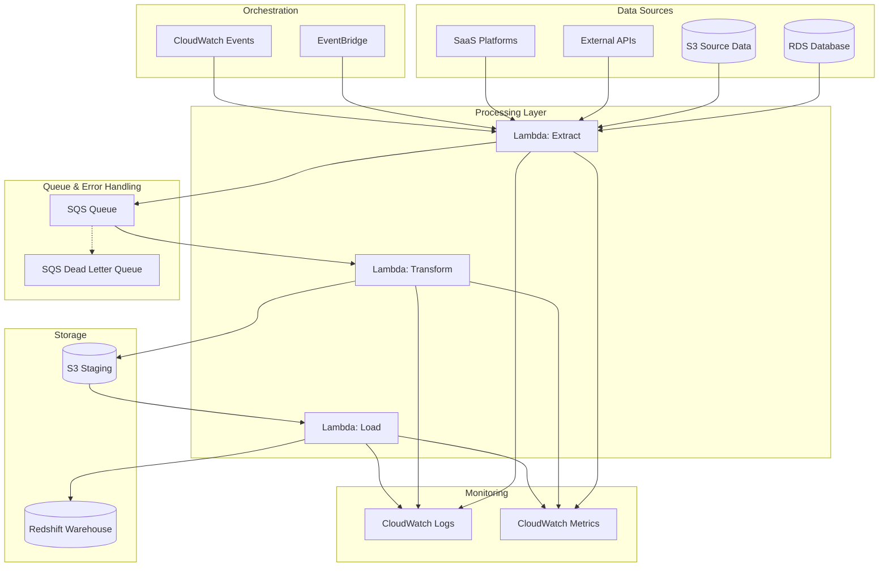
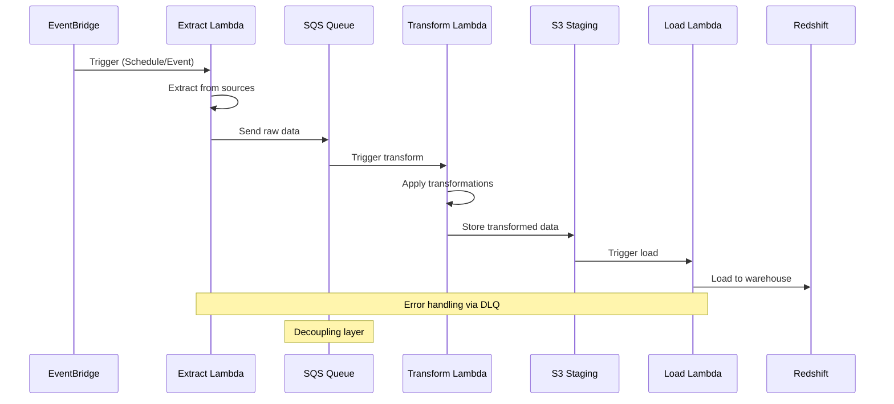

# Architecture 1: Serverless ETL with Lambda - Architecture Overview

## High-Level Architecture Diagram

## Data Flow Diagram

## Component Details

### EventBridge Rules
- **Schedule-based**: Daily/hourly data extraction
- **Event-based**: File upload triggers
- **Cross-account**: Multi-tenant data sources

### Lambda Functions
- **Extract Lambda**: 
  - Connects to multiple data sources
  - Handles authentication
  - Implements retry logic
  - Sends to SQS for decoupling

- **Transform Lambda**:
  - Data cleaning and validation
  - Business logic transformations
  - Schema mapping
  - Quality checks

- **Load Lambda**:
  - Bulk data loading to Redshift
  - Incremental updates
  - Data type conversions
  - Error handling and rollback

### SQS Configuration
- **Standard Queue**: For normal processing
- **Dead Letter Queue**: For failed messages
- **Visibility Timeout**: Based on Lambda timeout
- **Message Retention**: 14 days default

### Storage Strategy
- **S3 Staging**: 
  - Partitioned by date/source
  - Compressed format (Parquet)
  - Lifecycle policies for cost optimization
  
- **Redshift**:
  - Columnar storage
  - Distribution keys for performance
  - Sort keys for query optimization
