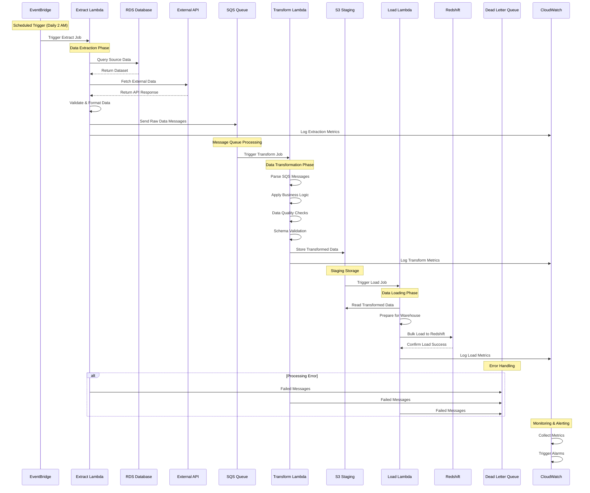
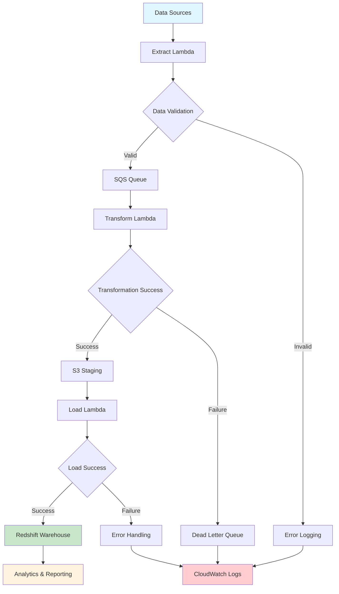
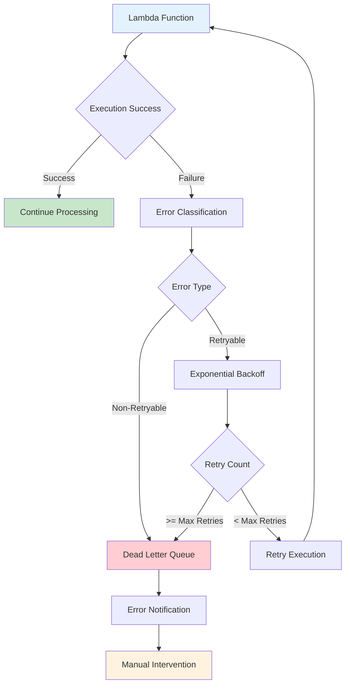
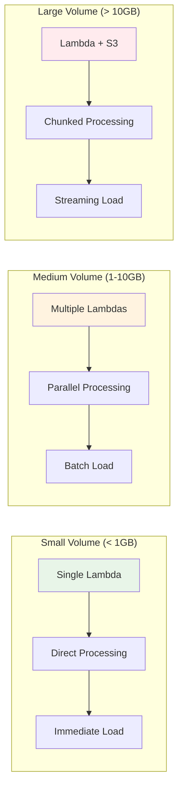
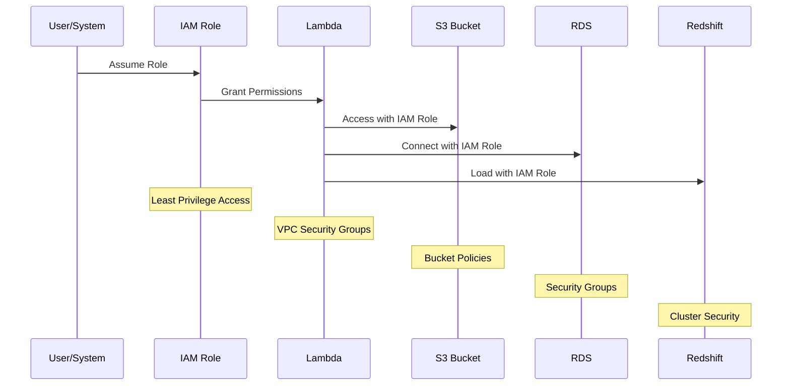
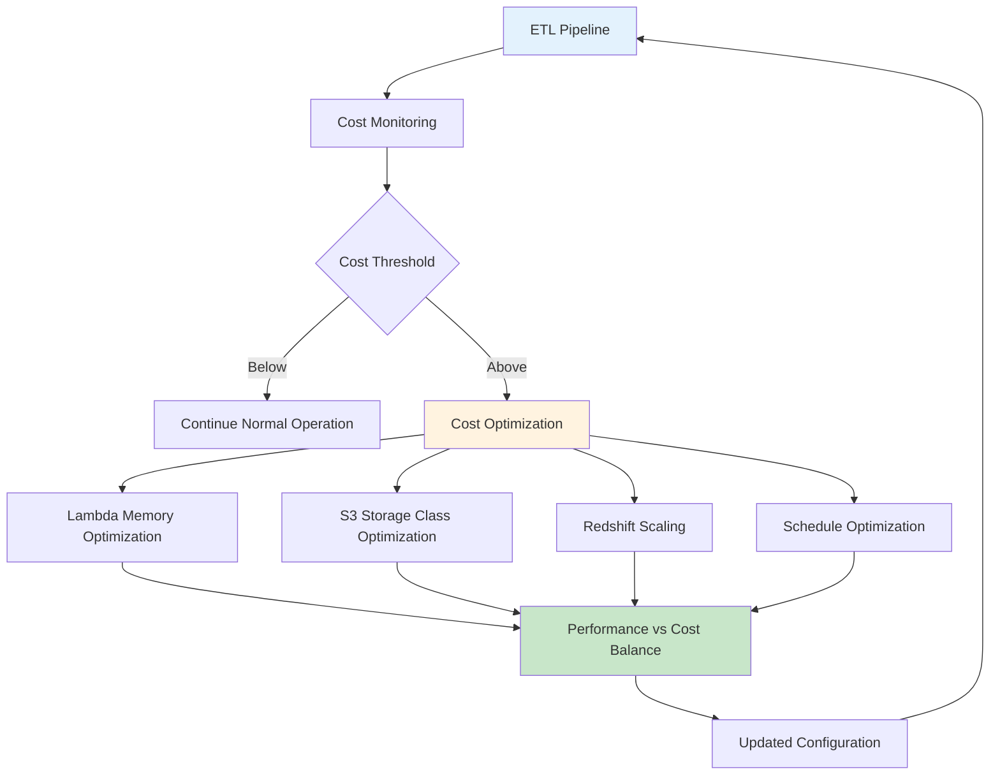
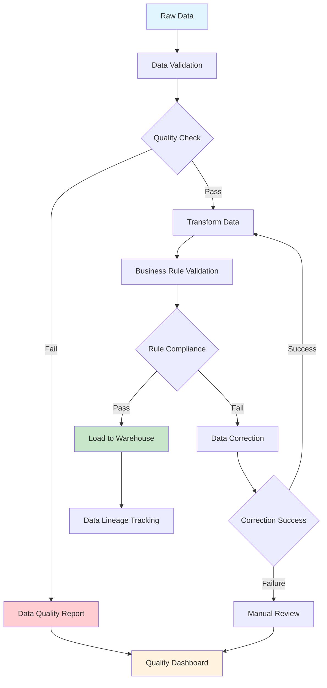
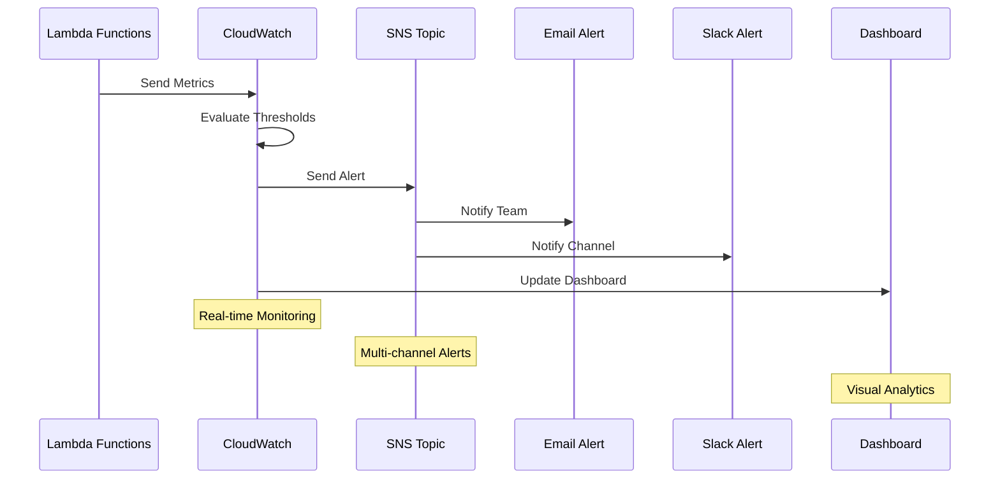
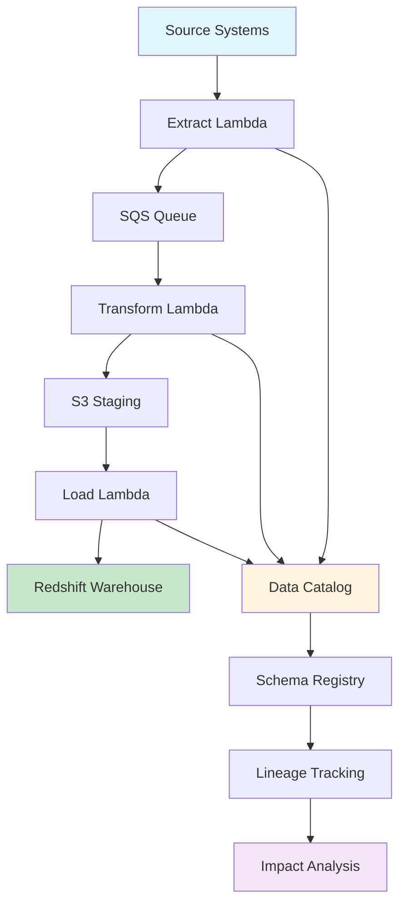

# Architecture 1: Serverless ETL with Lambda - Data Flow Diagram

## Detailed Data Flow Sequence

## Data Processing Flow

## Error Handling Flow

## Data Volume and Performance Flow

## Security and Access Flow

## Cost Optimization Flow

## Data Quality Flow

## Monitoring and Alerting Flow

## Data Lineage Flow

This data flow documentation provides comprehensive coverage of all aspects of the serverless ETL pipeline, including processing flows, error handling, security, cost optimization, data quality, monitoring, and data lineage tracking.
