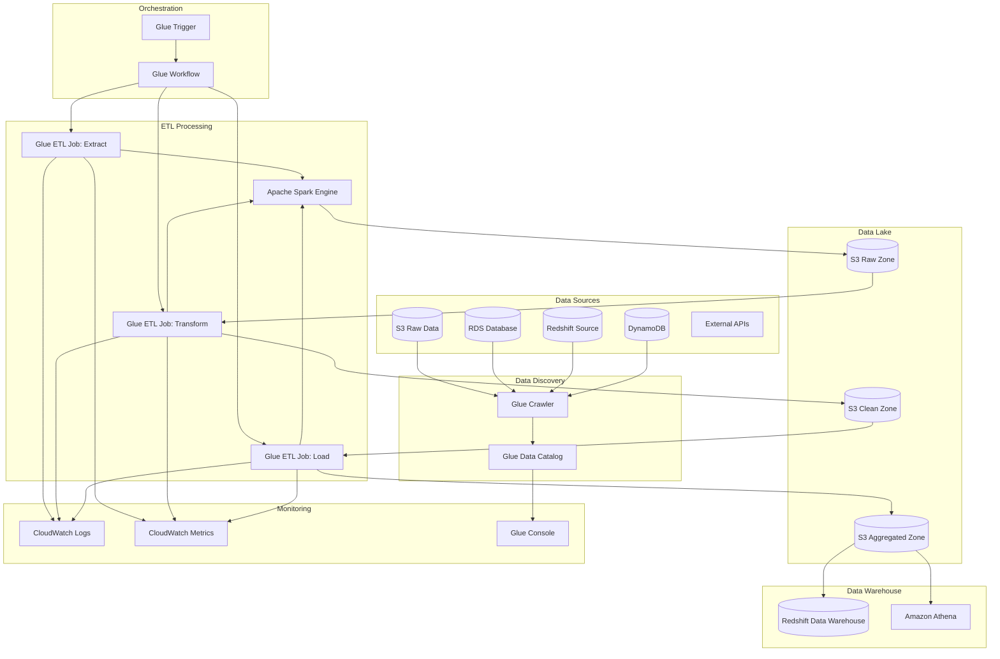
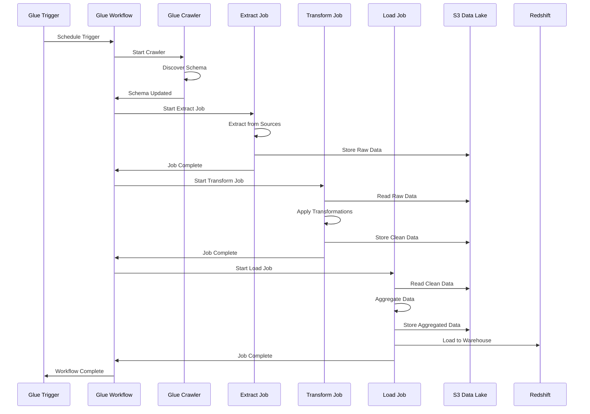

# Architecture 2: AWS Glue ETL Pipeline - Architecture Overview

## High-Level Architecture Diagram



## Data Flow Diagram



## Component Details

### Glue Crawler
- **Purpose**: Automatically discover data sources and schema
- **Configuration**:
  - Data sources: S3, RDS, Redshift, DynamoDB
  - Schedule: Daily or on-demand
  - Output: Glue Data Catalog tables
  - Schema evolution: Automatic detection

### Glue ETL Jobs
- **Extract Job**:
  - Reads from multiple data sources
  - Handles different file formats (JSON, CSV, Parquet)
  - Implements data validation
  - Outputs to S3 raw zone

- **Transform Job**:
  - Data cleaning and standardization
  - Business logic transformations
  - Data quality checks
  - Schema mapping and validation
  - Outputs to S3 clean zone

- **Load Job**:
  - Data aggregation and summarization
  - Final data preparation
  - Load to data warehouse
  - Outputs to S3 aggregated zone

### Glue Workflow
- **Orchestration**: Coordinates job execution
- **Dependencies**: Manages job dependencies
- **Error Handling**: Retry logic and failure handling
- **Monitoring**: Tracks job status and metrics

### Data Lake Architecture
- **Raw Zone**: Original data from sources
- **Clean Zone**: Processed and validated data
- **Aggregated Zone**: Business-ready data
- **Partitioning**: By date, region, business unit

### Storage Formats
- **Input**: JSON, CSV, Parquet, Avro
- **Processing**: Parquet for performance
- **Output**: Parquet, ORC for analytics
- **Compression**: Snappy, Gzip for efficiency

## Performance Optimization

### Glue Job Configuration
```python
# Job parameters for optimization
job_parameters = {
    '--job-language': 'python',
    '--job-bookmark-option': 'job-bookmark-enable',
    '--enable-metrics': 'true',
    '--enable-continuous-cloudwatch-log': 'true',
    '--enable-spark-ui': 'true',
    '--spark-event-logs-path': 's3://etl-logs/spark-logs/',
    '--TempDir': 's3://etl-temp/',
    '--enable-glue-datacatalog': 'true'
}
```

### Spark Configuration
```python
# Spark configuration for performance
spark_conf = {
    'spark.sql.adaptive.enabled': 'true',
    'spark.sql.adaptive.coalescePartitions.enabled': 'true',
    'spark.sql.adaptive.skewJoin.enabled': 'true',
    'spark.serializer': 'org.apache.spark.serializer.KryoSerializer',
    'spark.sql.parquet.compression.codec': 'snappy',
    'spark.sql.parquet.mergeSchema': 'false'
}
```

### Data Partitioning Strategy
```python
# Partition data for optimal query performance
def partition_data(df, partition_columns):
    return df.write \
        .mode('overwrite') \
        .partitionBy(partition_columns) \
        .parquet('s3://etl-clean-zone/partitioned-data/')
```

## Security Configuration

### IAM Roles
```json
{
    "Version": "2012-10-17",
    "Statement": [
        {
            "Effect": "Allow",
            "Action": [
                "s3:GetObject",
                "s3:PutObject",
                "s3:DeleteObject",
                "s3:ListBucket"
            ],
            "Resource": [
                "arn:aws:s3:::etl-data-lake/*",
                "arn:aws:s3:::etl-data-lake"
            ]
        },
        {
            "Effect": "Allow",
            "Action": [
                "glue:GetTable",
                "glue:GetDatabase",
                "glue:GetPartitions"
            ],
            "Resource": "*"
        }
    ]
}
```

### VPC Configuration
- Deploy Glue jobs in private subnets
- Use VPC endpoints for S3 access
- Configure security groups for database access
- Enable VPC flow logs for monitoring

## Monitoring and Alerting

### Key Metrics
- **Job Execution Time**: Monitor job duration
- **Job Success Rate**: Track job failures
- **Data Quality Metrics**: Validate data integrity
- **Resource Utilization**: Monitor DPU usage
- **Cost Metrics**: Track spending per job

### CloudWatch Alarms
```yaml
alarms:
  - name: "Glue-Job-Failure-Rate"
    metric: "glue.job.failure_rate"
    threshold: 0.1
    comparison: "GreaterThanThreshold"
  
  - name: "Glue-Job-Duration-High"
    metric: "glue.job.duration"
    threshold: 3600  # 1 hour
    comparison: "GreaterThanThreshold"
  
  - name: "Glue-DPU-Usage-High"
    metric: "glue.dpu.usage"
    threshold: 100
    comparison: "GreaterThanThreshold"
```

## Cost Optimization

### DPU Optimization
- Right-size DPU allocation based on data volume
- Use job bookmarks to avoid reprocessing
- Implement incremental processing
- Monitor and optimize job performance

### Storage Optimization
- Use appropriate S3 storage classes
- Implement lifecycle policies
- Compress data with efficient formats
- Partition data for query optimization

### Scheduling Optimization
- Run jobs during off-peak hours
- Batch multiple operations
- Use spot instances for non-critical jobs
- Implement cost-aware scheduling
