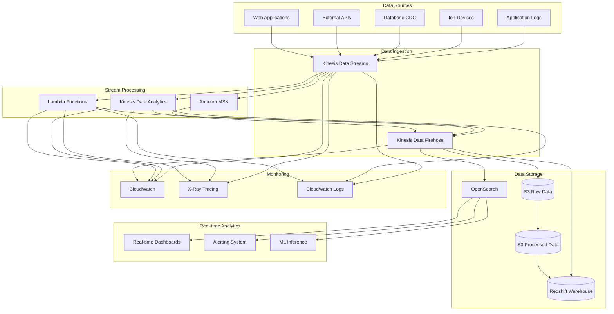
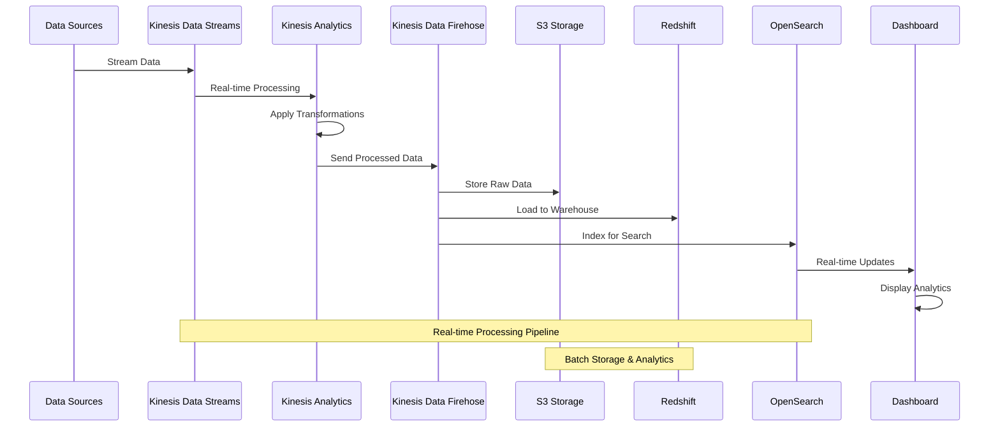

# Architecture 3: Kinesis Streaming ETL - Architecture Overview

## High-Level Architecture Diagram



## Data Flow Diagram



## Component Details

### Kinesis Data Streams
- **Purpose**: Real-time data ingestion and buffering
- **Configuration**:
  - Shard count based on throughput requirements
  - Retention period: 24 hours to 365 days
  - Encryption: Server-side encryption with KMS
  - Monitoring: CloudWatch metrics and alarms

### Kinesis Data Analytics
- **Purpose**: Real-time stream processing with SQL
- **Configuration**:
  - Application type: SQL or Apache Flink
  - Parallelism: Auto-scaling based on throughput
  - Checkpointing: Automatic state management
  - Monitoring: Application metrics and logs

### Kinesis Data Firehose
- **Purpose**: Data delivery to destinations
- **Configuration**:
  - Delivery streams for different destinations
  - Data transformation with Lambda
  - Buffering and compression
  - Error handling and retry logic

### Data Destinations
- **S3**: Raw data storage with partitioning
- **Redshift**: Data warehouse for analytics
- **OpenSearch**: Real-time search and analytics
- **Elasticsearch**: Alternative search engine

## Stream Processing Patterns

### Real-time Aggregation
```sql
-- Kinesis Analytics SQL example
CREATE STREAM "processed_events" (
    user_id VARCHAR(64),
    event_type VARCHAR(32),
    timestamp TIMESTAMP,
    value DOUBLE
);

CREATE PUMP "aggregation_pump" AS
INSERT INTO "processed_events"
SELECT 
    user_id,
    event_type,
    ROWTIME,
    AVG(value) OVER (
        PARTITION BY user_id, event_type 
        ROWS BETWEEN 10 PRECEDING AND CURRENT ROW
    ) as avg_value
FROM "input_stream";
```

### Anomaly Detection
```sql
-- Anomaly detection with Kinesis Analytics
CREATE STREAM "anomaly_detection" AS
SELECT 
    user_id,
    event_type,
    value,
    ROWTIME,
    CASE 
        WHEN ABS(value - AVG(value) OVER (
            PARTITION BY user_id, event_type 
            ROWS BETWEEN 100 PRECEDING AND 1 PRECEDING
        )) > 3 * STDDEV(value) OVER (
            PARTITION BY user_id, event_type 
            ROWS BETWEEN 100 PRECEDING AND 1 PRECEDING
        ) THEN 'ANOMALY'
        ELSE 'NORMAL'
    END as anomaly_status
FROM "input_stream";
```

## Performance Optimization

### Shard Management
```python
# Auto-scaling shards based on metrics
def scale_kinesis_stream(stream_name, target_utilization=70):
    """
    Scale Kinesis stream based on utilization
    """
    client = boto3.client('kinesis')
    
    # Get current metrics
    response = client.describe_stream(StreamName=stream_name)
    current_shards = len(response['StreamDescription']['Shards'])
    
    # Get CloudWatch metrics
    cloudwatch = boto3.client('cloudwatch')
    metrics = cloudwatch.get_metric_statistics(
        Namespace='AWS/Kinesis',
        MetricName='IncomingRecords',
        Dimensions=[
            {'Name': 'StreamName', 'Value': stream_name}
        ],
        StartTime=datetime.utcnow() - timedelta(minutes=5),
        EndTime=datetime.utcnow(),
        Period=300,
        Statistics=['Average']
    )
    
    # Calculate target shards
    if metrics['Datapoints']:
        avg_records = metrics['Datapoints'][0]['Average']
        target_shards = math.ceil(avg_records / 1000)  # 1000 records per shard
        
        if target_shards != current_shards:
            # Update shard count
            client.update_shard_count(
                StreamName=stream_name,
                TargetShardCount=target_shards,
                ScalingType='UNIFORM_SCALING'
            )
```

### Data Compression
```python
# Compress data before sending to Kinesis
import gzip
import json

def compress_and_send_data(stream_name, data):
    """
    Compress data and send to Kinesis
    """
    kinesis = boto3.client('kinesis')
    
    # Compress data
    compressed_data = gzip.compress(
        json.dumps(data).encode('utf-8')
    )
    
    # Send to Kinesis
    response = kinesis.put_record(
        StreamName=stream_name,
        Data=compressed_data,
        PartitionKey=data['partition_key']
    )
    
    return response
```

## Security Configuration

### IAM Roles and Policies
```json
{
    "Version": "2012-10-17",
    "Statement": [
        {
            "Effect": "Allow",
            "Action": [
                "kinesis:PutRecord",
                "kinesis:PutRecords"
            ],
            "Resource": "arn:aws:kinesis:region:account:stream/stream-name"
        },
        {
            "Effect": "Allow",
            "Action": [
                "kinesis:GetRecords",
                "kinesis:GetShardIterator",
                "kinesis:DescribeStream"
            ],
            "Resource": "arn:aws:kinesis:region:account:stream/stream-name"
        }
    ]
}
```

### VPC Configuration
- Deploy Kinesis Analytics in VPC
- Use VPC endpoints for S3 access
- Configure security groups for network isolation
- Enable VPC flow logs for monitoring

## Monitoring and Alerting

### Key Metrics
- **Kinesis Data Streams**: IncomingRecords, OutgoingRecords, WriteProvisionedThroughputExceeded
- **Kinesis Analytics**: CPUUtilization, HeapMemoryUtilization, CheckpointSize
- **Kinesis Data Firehose**: DeliveryToS3Success, DeliveryToS3DataFreshness, DeliveryToS3Errors

### CloudWatch Alarms
```yaml
alarms:
  - name: "Kinesis-Stream-Throttling"
    metric: "WriteProvisionedThroughputExceeded"
    threshold: 1
    comparison: "GreaterThanThreshold"
  
  - name: "Kinesis-Analytics-CPU-High"
    metric: "CPUUtilization"
    threshold: 80
    comparison: "GreaterThanThreshold"
  
  - name: "Kinesis-Firehose-Delivery-Failures"
    metric: "DeliveryToS3Errors"
    threshold: 5
    comparison: "GreaterThanThreshold"
```

## Cost Optimization

### Shard Optimization
- Right-size shard count based on throughput
- Use enhanced fan-out for multiple consumers
- Implement shard-level monitoring
- Auto-scale based on utilization

### Data Retention
- Optimize retention periods
- Use S3 for long-term storage
- Implement data lifecycle policies
- Compress data before storage

### Analytics Optimization
- Use appropriate parallelism
- Optimize SQL queries
- Implement checkpointing strategies
- Monitor resource utilization
