# Architecture 3: Kinesis Streaming ETL - Data Flow Diagram

## Real-time Data Processing Flow

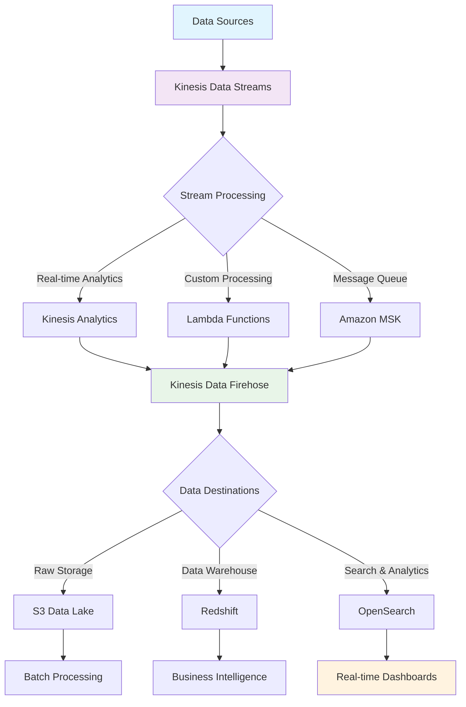

## Stream Processing Patterns

### Pattern 1: Real-time Aggregation
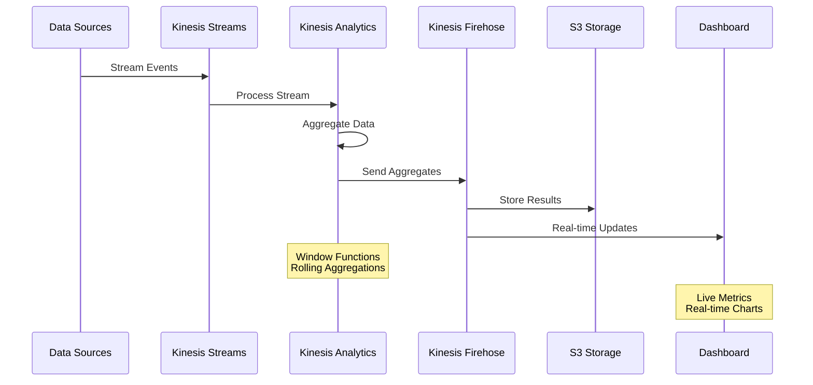

### Pattern 2: Anomaly Detection
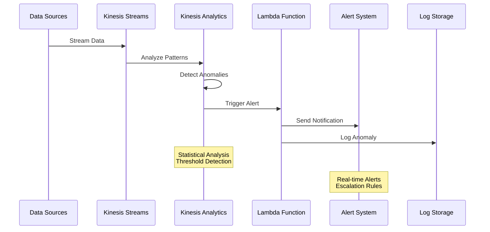

### Pattern 3: Data Enrichment
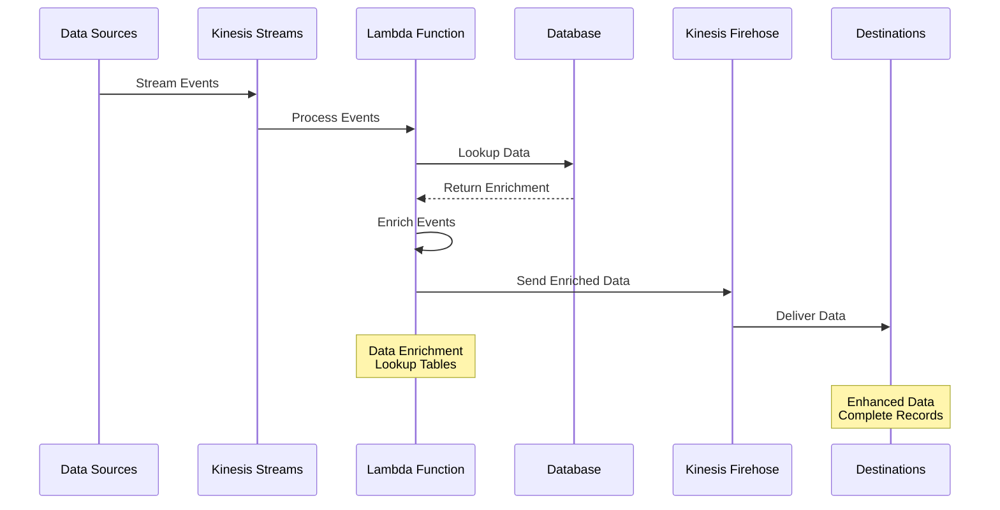

## Error Handling and Recovery

### Error Handling Flow
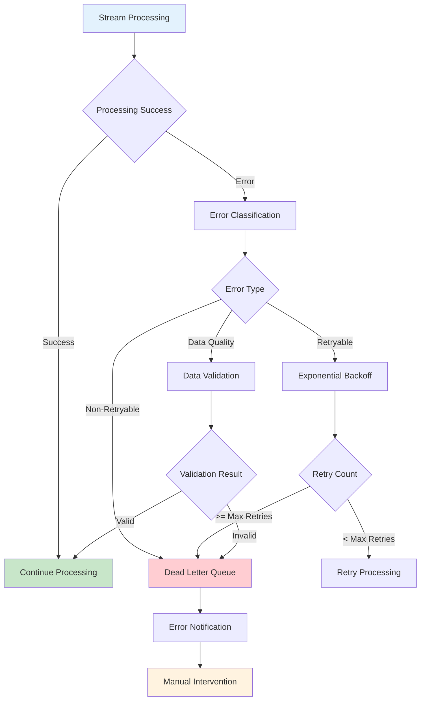

### Checkpointing and Recovery
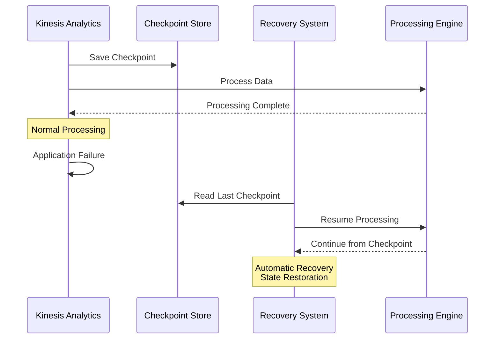

## Data Quality and Validation

### Data Quality Flow
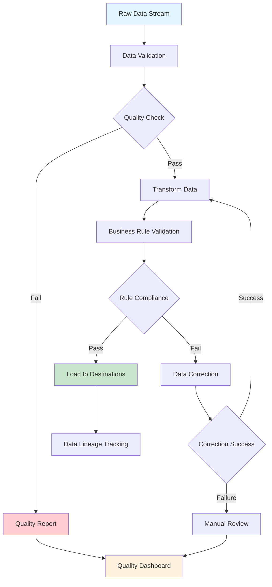

### Real-time Data Quality Metrics
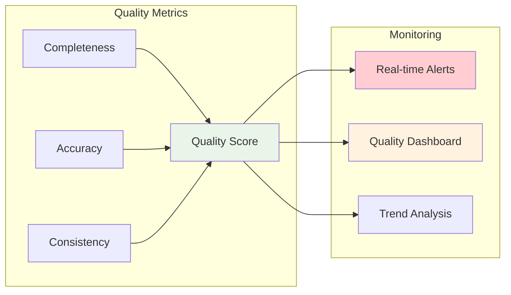

## Performance and Scaling

### Auto-scaling Flow
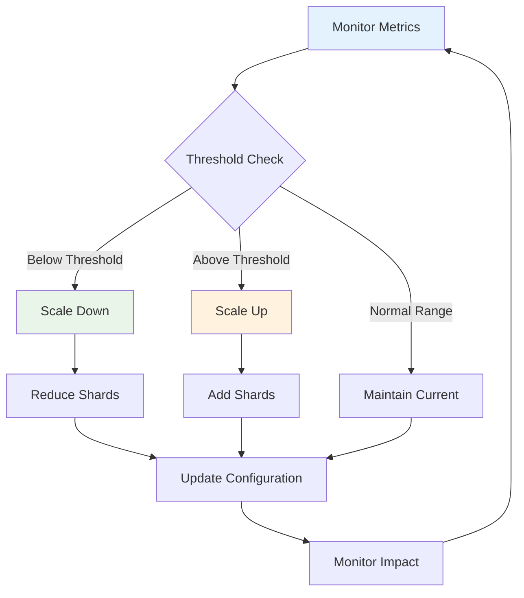

### Throughput Optimization
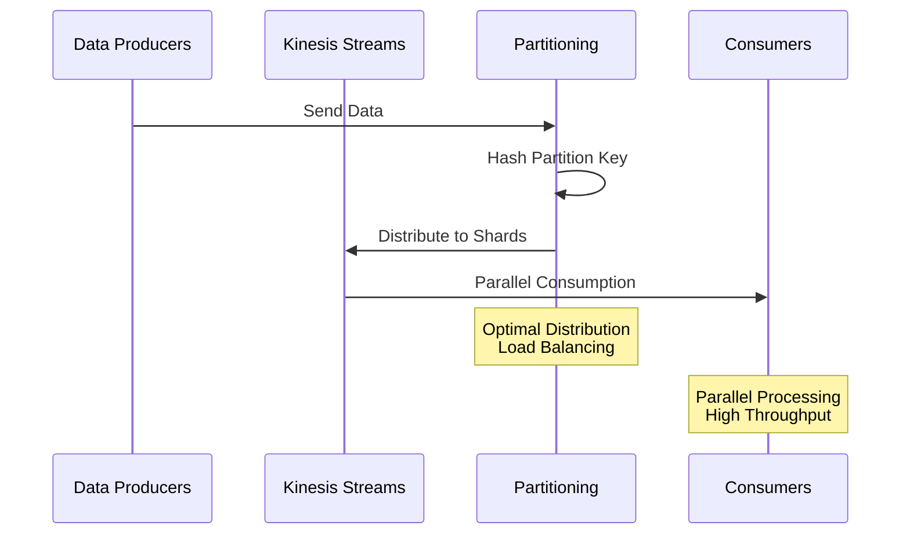

## Security and Compliance

### Data Encryption Flow
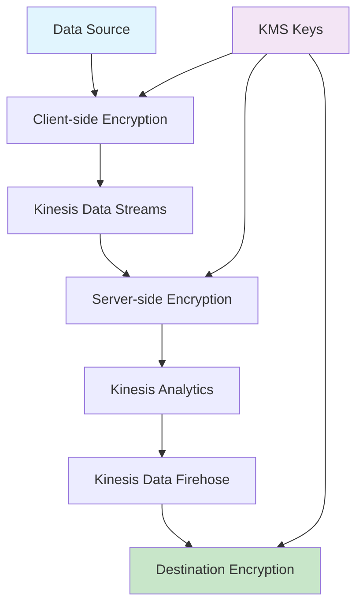

### Access Control Flow
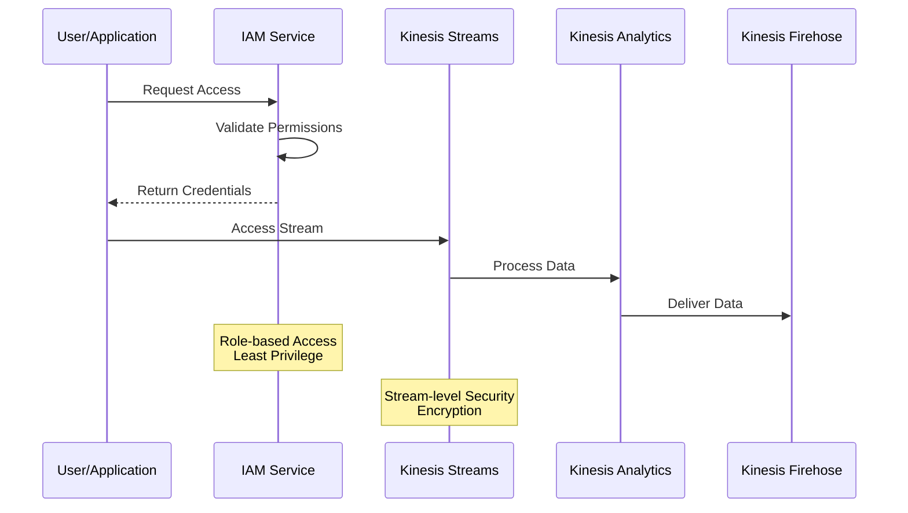

## Cost Optimization Flow

### Cost Monitoring and Optimization
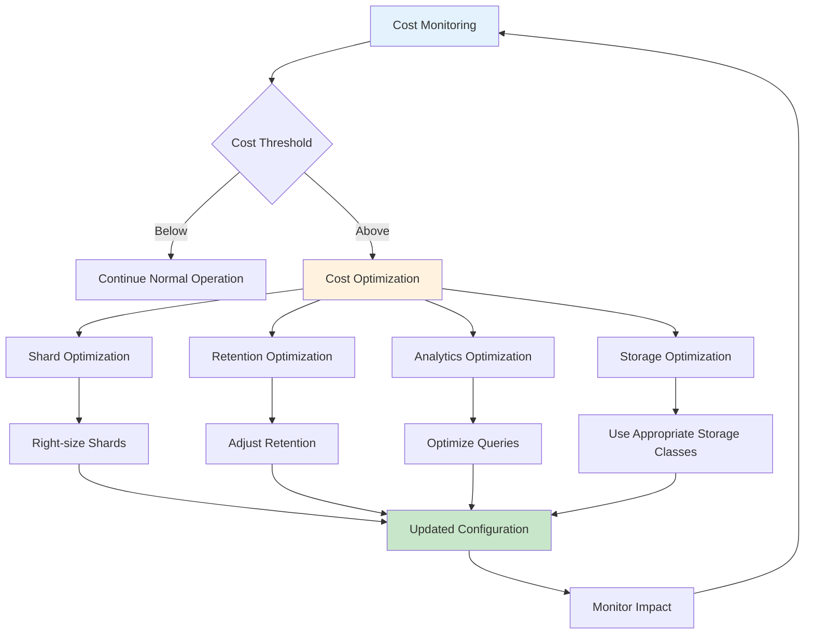

This comprehensive data flow documentation covers all aspects of the Kinesis streaming ETL architecture, including real-time processing patterns, error handling, data quality, performance optimization, security, and cost management.
