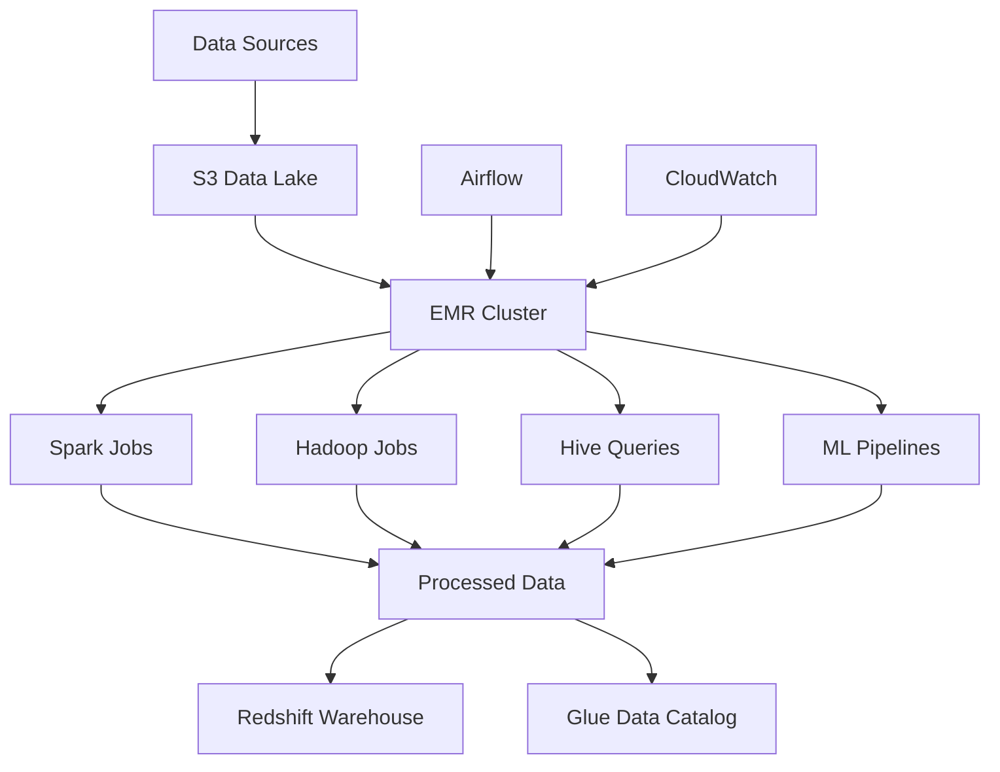

# Architecture 4: EMR Batch ETL

## Overview

Architecture 4 implements a **Big Data Batch ETL Pipeline** using **Amazon EMR (Elastic MapReduce)** for large-scale data processing. This architecture is designed for processing massive datasets that require distributed computing power and can tolerate batch processing delays.

## Architecture Components

### Core Services
- **Amazon EMR**: Managed big data platform for running Apache Spark, Hadoop, Hive, and other distributed frameworks
- **Amazon S3**: Data lake for storing raw, processed, and aggregated data
- **Amazon VPC**: Network isolation and security
- **AWS Glue**: Data catalog and ETL jobs
- **Amazon Redshift**: Data warehouse for analytics
- **Apache Airflow** (Optional): Workflow orchestration

### Processing Engines
- **Apache Spark**: Fast, general-purpose cluster computing
- **Apache Hadoop**: Distributed storage and processing
- **Apache Hive**: Data warehouse software for querying
- **Apache Pig**: High-level platform for data analysis

## Architecture Flow



## Key Features

### 🚀 **Scalability**
- Auto-scaling EMR clusters
- Spot instance support for cost optimization
- Dynamic resource allocation

### 🔧 **Processing Capabilities**
- Large-scale batch processing
- Machine learning pipelines
- Complex data transformations
- Data quality validation

### 📊 **Data Management**
- Data lake architecture
- Data cataloging with Glue
- Data lineage tracking
- Version control

### 🔒 **Security**
- VPC network isolation
- IAM role-based access
- Encryption at rest and in transit
- Audit logging

## Use Cases

### ✅ **Ideal For**
- **Large-scale batch processing** (TB to PB datasets)
- **Complex data transformations** requiring distributed computing
- **Machine learning model training** on big data
- **Data warehousing** and analytics
- **ETL pipelines** with heavy computational requirements
- **Data lake processing** and cataloging

### ❌ **Not Ideal For**
- **Real-time processing** requirements
- **Small datasets** (< 1GB)
- **Simple transformations** that don't require distributed computing
- **Low-latency** applications
- **Cost-sensitive** small-scale operations

## Data Processing Patterns

### 1. **Batch Processing**
- Process large datasets in scheduled batches
- Handle complex transformations
- Support for multiple data formats

### 2. **Incremental Processing**
- Process only new or changed data
- Maintain processing checkpoints
- Optimize resource usage

### 3. **Machine Learning Pipeline**
- Feature engineering
- Model training and evaluation
- Batch predictions

### 4. **Data Quality Validation**
- Schema validation
- Data completeness checks
- Anomaly detection

## Performance Characteristics

### **Throughput**
- **High**: Can process TB to PB of data
- **Scalable**: Auto-scaling based on workload
- **Parallel**: Distributed processing across multiple nodes

### **Latency**
- **High**: Batch processing with delays
- **Variable**: Depends on data size and cluster configuration
- **Scheduled**: Typically runs on schedule (hourly/daily)

### **Cost**
- **Variable**: Based on cluster size and runtime
- **Optimizable**: Spot instances and auto-scaling
- **Pay-per-use**: Only pay when cluster is running

## Implementation Status

### ✅ **Completed**
- [x] Architecture diagrams and documentation
- [x] Terraform infrastructure code
- [x] EMR cluster configuration
- [x] Spark data processing jobs
- [x] ML pipeline implementation
- [x] Auto-scaling configuration
- [x] Monitoring and alerting setup
- [x] Security configurations
- [x] Cost optimization strategies

### 🔄 **In Progress**
- [ ] Sample data generation
- [ ] Performance benchmarking
- [ ] Advanced ML models
- [ ] Data quality frameworks

### 📋 **Planned**
- [ ] Airflow integration
- [ ] Advanced monitoring dashboards
- [ ] Cost optimization automation
- [ ] Disaster recovery procedures

## Quick Start

### 1. **Prerequisites**
```bash
# Install required tools
brew install terraform awscli

# Configure AWS CLI
aws configure
```

### 2. **Deploy Infrastructure**
```bash
cd terraform
terraform init
terraform plan
terraform apply
```

### 3. **Submit Spark Job**
```bash
aws emr add-steps \
    --cluster-id j-XXXXXXXXXX \
    --steps Type=Spark,Name="Data Processing Job",ActionOnFailure=CONTINUE,Args=[--class,org.apache.spark.deploy.SparkSubmit,--master,yarn,--deploy-mode,cluster,s3://your-bucket/scripts/data_processing_job.py]
```

### 4. **Monitor Progress**
```bash
# Check cluster status
aws emr describe-cluster --cluster-id j-XXXXXXXXXX

# View Spark UI
# http://your-master-node:4040
```

## Configuration

### **EMR Cluster Settings**
```hcl
# Instance types
master_instance_type = "m5.xlarge"
core_instance_type   = "m5.large"
core_instance_count  = 2
task_instance_type   = "m5.large"
task_instance_count  = 0

# Auto-scaling
enable_auto_scaling = true
min_capacity        = 0
max_capacity        = 20

# Spot instances
enable_spot_instances = true
spot_bid_price        = "0.10"
```

### **Spark Configuration**
```python
# Optimize Spark for EMR
spark.conf.set("spark.sql.adaptive.enabled", "true")
spark.conf.set("spark.sql.adaptive.coalescePartitions.enabled", "true")
spark.conf.set("spark.serializer", "org.apache.spark.serializer.KryoSerializer")
```

## Monitoring

### **Key Metrics**
- **Cluster Health**: Node status, job success rate
- **Resource Utilization**: CPU, memory, disk usage
- **Job Performance**: Execution time, throughput
- **Cost Metrics**: Instance hours, data transfer costs

### **CloudWatch Alarms**
- EMR cluster node failures
- Job failure rate
- Resource utilization thresholds
- Cost budget alerts

## Cost Estimation

### **Monthly Costs (Estimated)**
- **EMR Cluster**: $400-800 USD
  - Master node: $150-300
  - Core nodes: $200-400
  - Task nodes: $100-200 (if used)
- **S3 Storage**: $2.30 per 100GB
- **Redshift**: $180 (dc2.large)
- **Total**: ~$600-1000 USD per month

### **Cost Optimization**
- Use spot instances for task nodes
- Enable auto-scaling
- Terminate clusters when not in use
- Optimize data partitioning

## Security

### **Network Security**
- VPC with private subnets
- Security groups for network isolation
- VPC endpoints for S3 access

### **Access Control**
- IAM roles with least privilege
- Service-linked roles for EMR
- Cross-account access policies

### **Data Protection**
- Encryption at rest (S3, EMR)
- Encryption in transit
- KMS key management

## Troubleshooting

### **Common Issues**
1. **Cluster Launch Failures**
   - Check IAM permissions
   - Verify VPC configuration
   - Review security group rules

2. **Job Failures**
   - Check Spark logs
   - Verify data formats
   - Review resource constraints

3. **Performance Issues**
   - Optimize Spark configuration
   - Check data partitioning
   - Review cluster sizing

### **Debugging Commands**
```bash
# Check cluster status
aws emr describe-cluster --cluster-id j-XXXXXXXXXX

# View step logs
aws emr describe-step --cluster-id j-XXXXXXXXXX --step-id s-XXXXXXXXXX

# Access Spark UI
# http://your-master-node:4040
```

## Documentation

- [Deployment Guide](docs/deployment-guide.md)
- [Architecture Overview](diagrams/architecture-overview.md)
- [Data Flow Diagram](diagrams/data-flow.md)
- [Troubleshooting Guide](docs/troubleshooting.md)
- [Performance Optimization](docs/performance-optimization.md)
- [Cost Analysis](docs/cost-analysis.md)

## Support

For issues and questions:
1. Check the troubleshooting guide
2. Review AWS EMR documentation
3. Consult the deployment guide
4. Check CloudWatch logs and metrics

## Next Steps

1. **Deploy the infrastructure** using Terraform
2. **Configure data sources** and destinations
3. **Set up monitoring** and alerting
4. **Optimize performance** based on your workload
5. **Implement cost optimization** strategies
6. **Set up disaster recovery** procedures

---

**Architecture 4: EMR Batch ETL** provides a robust, scalable solution for big data processing with comprehensive monitoring, security, and cost optimization features.