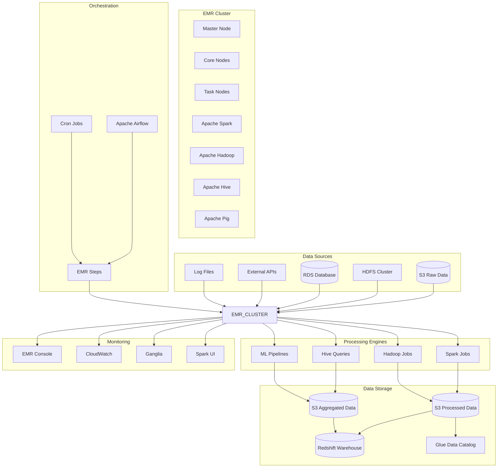
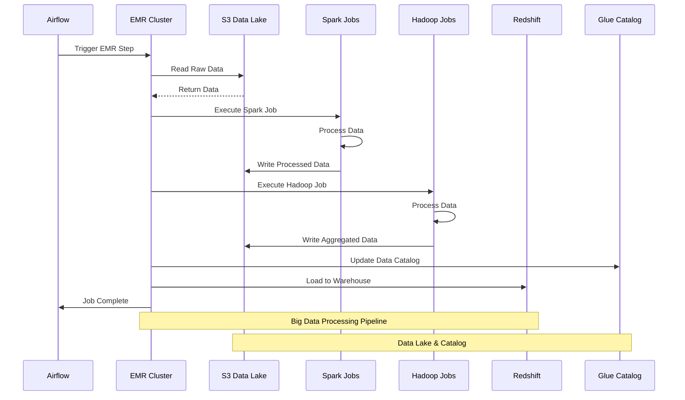
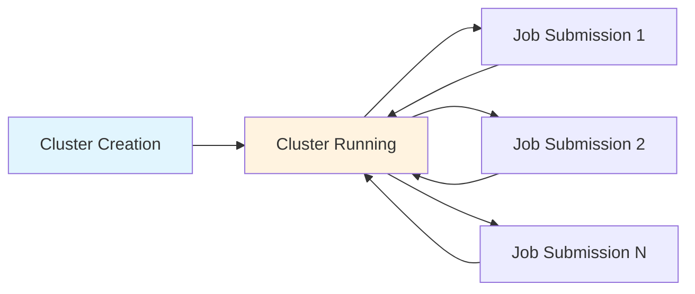
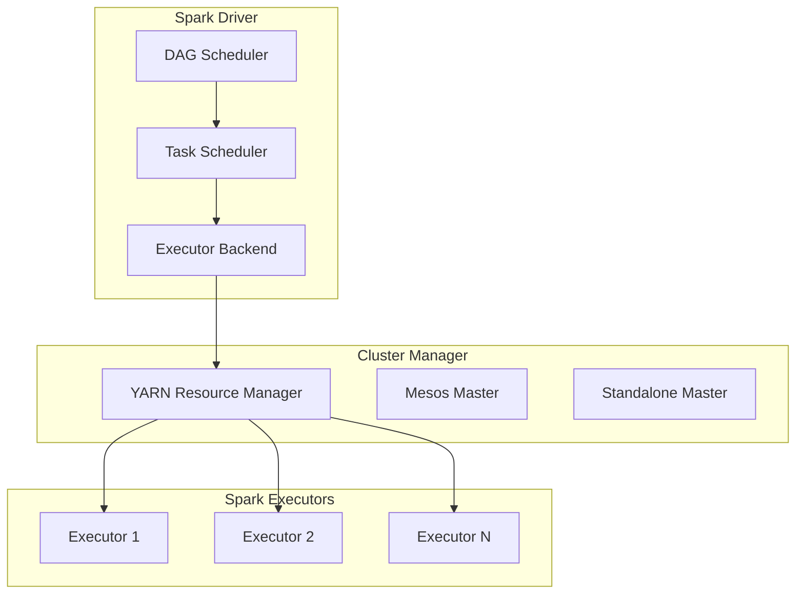
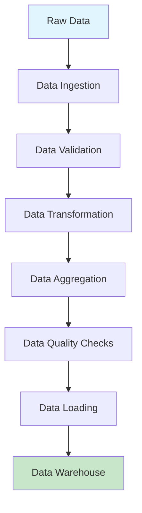
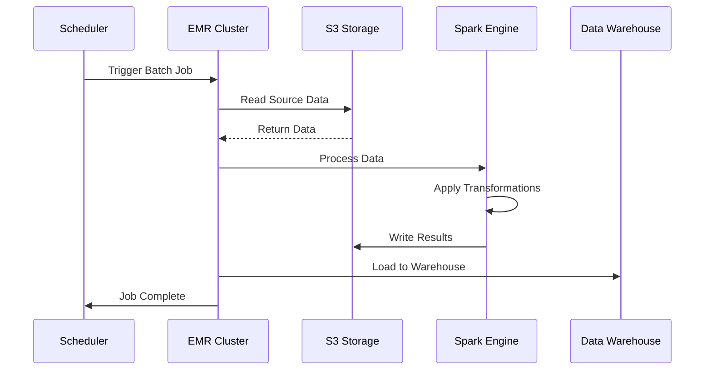
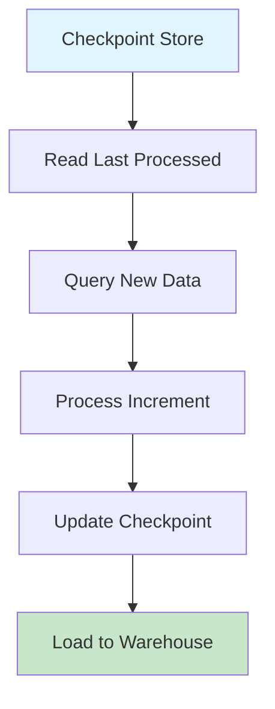

# Architecture 4: EMR Batch ETL - Architecture Overview

## High-Level Architecture Diagram



## Data Flow Diagram



## Component Details

### EMR Cluster Configuration
- **Master Node**: Cluster management and job coordination
- **Core Nodes**: Persistent storage and processing
- **Task Nodes**: Auto-scaling compute capacity
- **Applications**: Spark, Hadoop, Hive, Pig, HBase

### Processing Engines
- **Apache Spark**: Fast, general-purpose cluster computing
- **Apache Hadoop**: Distributed storage and processing
- **Apache Hive**: Data warehouse software for querying
- **Apache Pig**: High-level platform for data analysis

### Orchestration Options
- **Apache Airflow**: Workflow orchestration and scheduling
- **EMR Steps**: Native EMR job execution
- **Cron Jobs**: Simple scheduling for batch jobs
- **AWS Step Functions**: Serverless workflow orchestration

## EMR Cluster Types

### Transient Clusters


### Persistent Clusters


## Spark Job Architecture

### Spark Application Structure


### Spark Processing Pipeline


## Performance Optimization

### Auto-scaling Configuration
```python
# EMR auto-scaling configuration
auto_scaling_config = {
    "AutoScalingPolicy": {
        "Constraints": {
            "MinCapacity": 2,
            "MaxCapacity": 20
        },
        "Rules": [
            {
                "Name": "ScaleOutMemoryPercentage",
                "Description": "Scale out based on memory usage",
                "Action": {
                    "SimpleScalingPolicyConfiguration": {
                        "AdjustmentType": "CHANGE_IN_CAPACITY",
                        "ScalingAdjustment": 2,
                        "CoolDown": 300
                    }
                },
                "Trigger": {
                    "CloudWatchAlarmDefinition": {
                        "ComparisonOperator": "GREATER_THAN",
                        "EvaluationPeriods": 2,
                        "MetricName": "MemoryPercentage",
                        "Namespace": "AWS/ElasticMapReduce",
                        "Period": 300,
                        "Statistic": "AVERAGE",
                        "Threshold": 75.0
                    }
                }
            }
        ]
    }
}
```

### Spot Instance Configuration
```python
# Spot instance configuration for cost optimization
spot_config = {
    "Instances": {
        "InstanceGroups": [
            {
                "Name": "Task",
                "Market": "SPOT",
                "InstanceRole": "TASK",
                "InstanceType": "m5.xlarge",
                "InstanceCount": 10,
                "BidPrice": "0.10"
            }
        ]
    }
}
```

## Data Processing Patterns

### Batch Processing Pattern


### Incremental Processing Pattern


## Security Configuration

### IAM Roles and Policies
```json
{
    "Version": "2012-10-17",
    "Statement": [
        {
            "Effect": "Allow",
            "Action": [
                "s3:GetObject",
                "s3:PutObject",
                "s3:DeleteObject",
                "s3:ListBucket"
            ],
            "Resource": [
                "arn:aws:s3:::data-lake-bucket/*",
                "arn:aws:s3:::data-lake-bucket"
            ]
        },
        {
            "Effect": "Allow",
            "Action": [
                "glue:GetTable",
                "glue:GetDatabase",
                "glue:GetPartitions"
            ],
            "Resource": "*"
        }
    ]
}
```

### VPC Configuration
- Deploy EMR cluster in private subnets
- Use VPC endpoints for S3 access
- Configure security groups for network isolation
- Enable VPC flow logs for monitoring

## Monitoring and Alerting

### Key Metrics
- **Cluster Health**: Node status, job success rate
- **Resource Utilization**: CPU, memory, disk usage
- **Job Performance**: Execution time, throughput
- **Cost Metrics**: Instance hours, data transfer costs

### CloudWatch Alarms
```yaml
alarms:
  - name: "EMR-Cluster-Node-Failure"
    metric: "IsIdle"
    threshold: 0
    comparison: "LessThanThreshold"
  
  - name: "EMR-Job-Failure-Rate"
    metric: "JobsFailed"
    threshold: 5
    comparison: "GreaterThanThreshold"
  
  - name: "EMR-HDFS-Utilization"
    metric: "HDFSUtilization"
    threshold: 80
    comparison: "GreaterThanThreshold"
```

## Cost Optimization

### Instance Type Selection
```python
# Instance type recommendations based on workload
instance_recommendations = {
    "memory_intensive": {
        "master": "m5.2xlarge",
        "core": "r5.xlarge",
        "task": "r5.large"
    },
    "compute_intensive": {
        "master": "c5.2xlarge",
        "core": "c5.xlarge",
        "task": "c5.large"
    },
    "storage_intensive": {
        "master": "i3.2xlarge",
        "core": "i3.xlarge",
        "task": "i3.large"
    }
}
```

### Spot Instance Strategy
```python
# Spot instance allocation strategy
spot_allocation = {
    "core_nodes": "0%",  # Use On-Demand for core nodes
    "task_nodes": "100%",  # Use Spot for task nodes
    "fallback": "On-Demand"  # Fallback to On-Demand if Spot unavailable
}
```

This comprehensive architecture overview provides the foundation for implementing a robust EMR-based batch ETL pipeline with proper scaling, monitoring, and cost optimization strategies.
