# Architecture 4: EMR Batch ETL - Data Flow Diagram

## Big Data Processing Flow

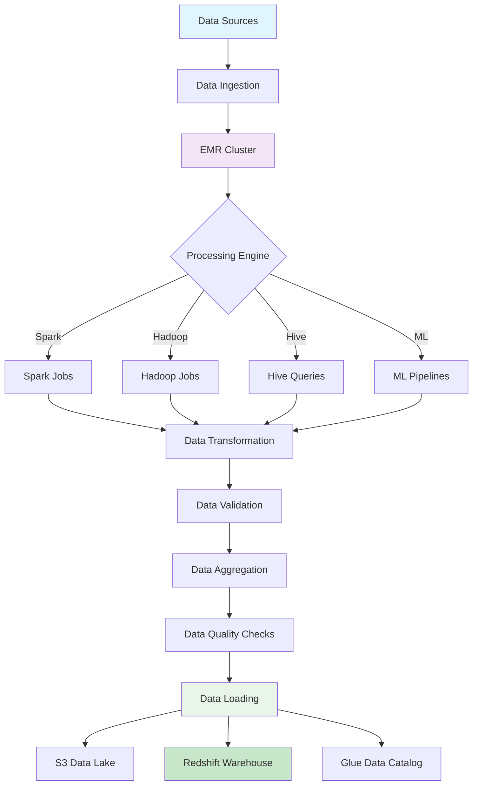

## EMR Job Execution Flow

### Job Submission and Execution
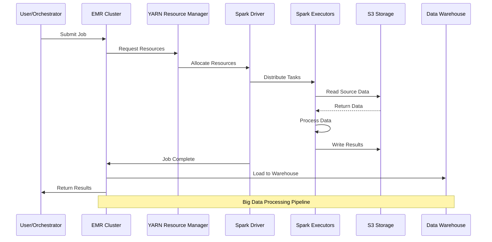

### Auto-scaling Flow
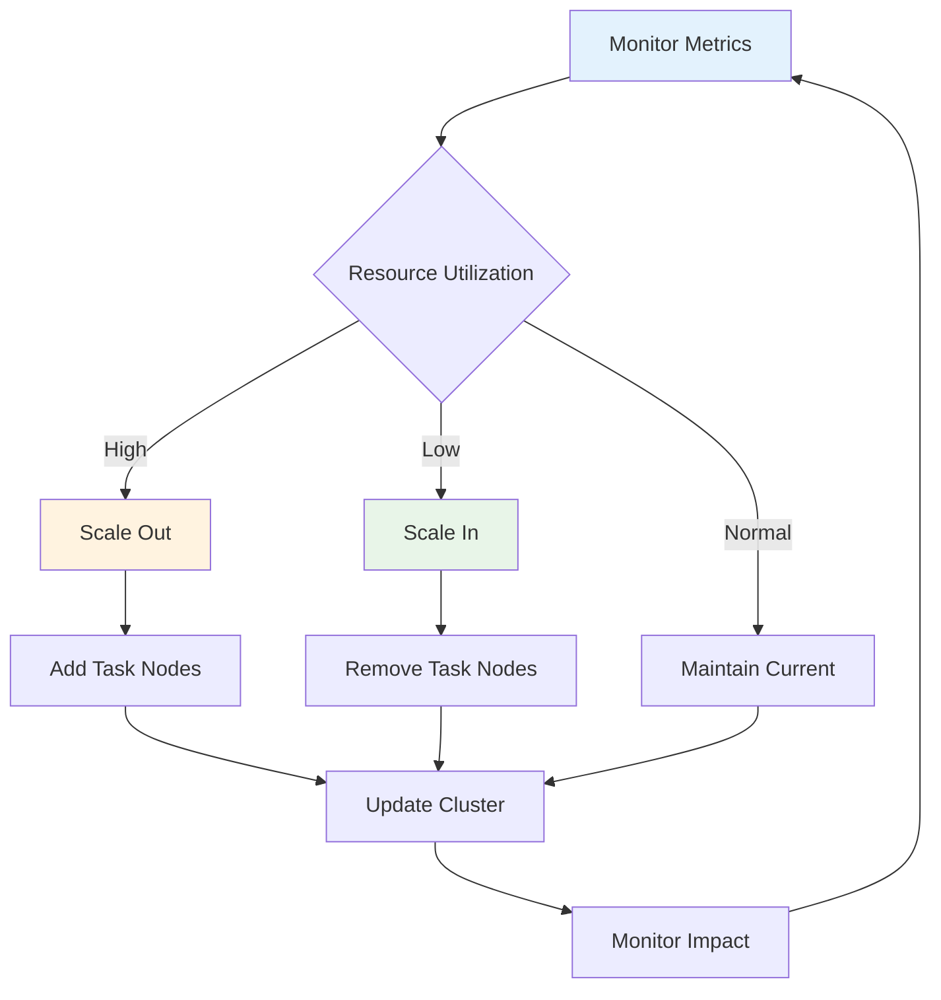

## Data Processing Patterns

### Pattern 1: Batch Processing
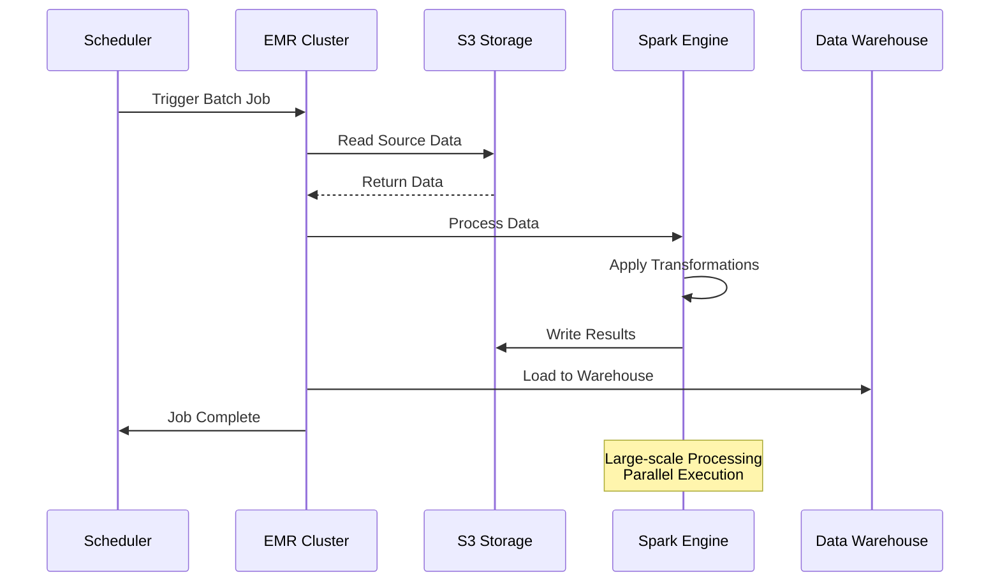

### Pattern 2: Incremental Processing
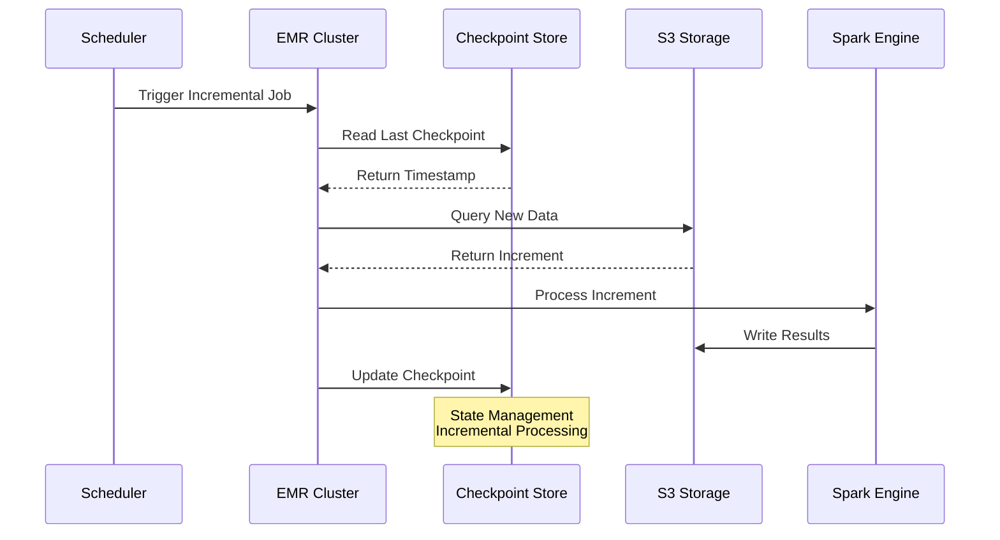

### Pattern 3: Machine Learning Pipeline
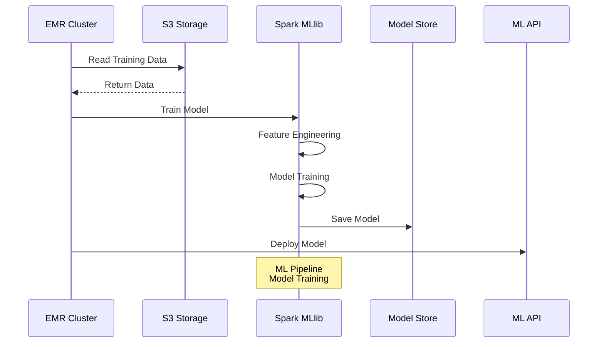

## Error Handling and Recovery

### Job Failure Recovery
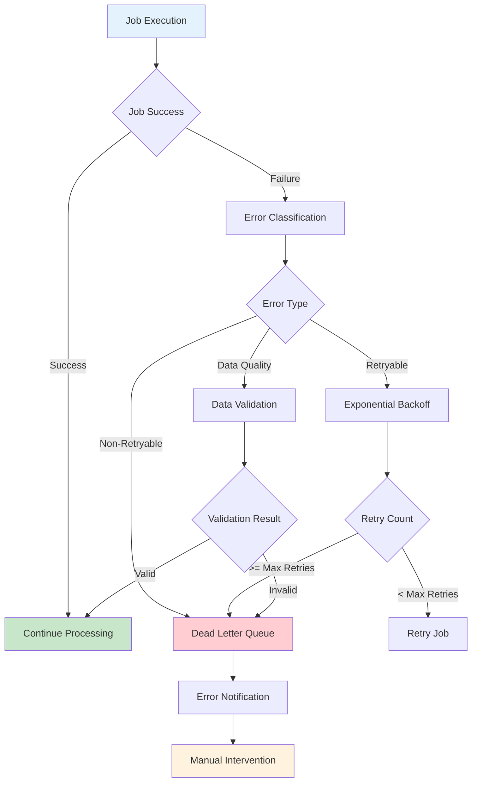

### Checkpoint and Recovery
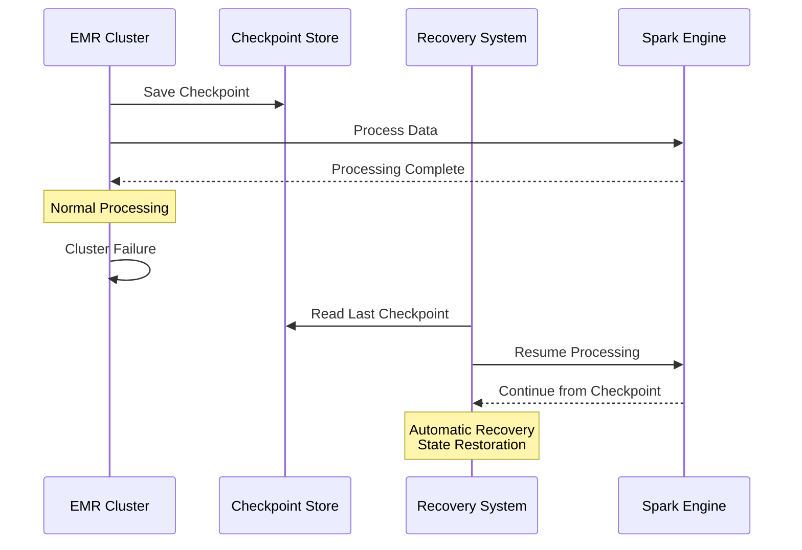

## Data Quality and Validation

### Data Quality Flow
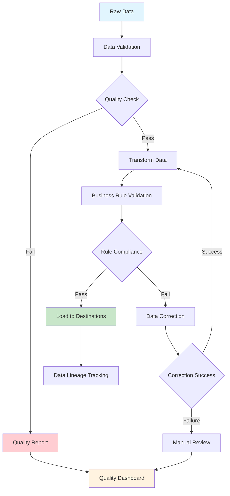

### Data Validation Pipeline
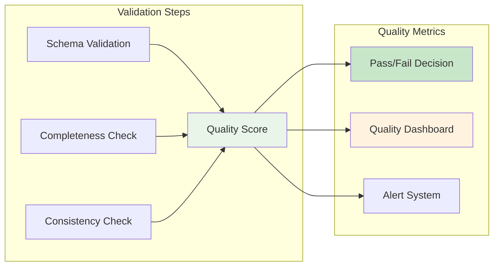

## Performance and Scaling

### Resource Allocation Flow
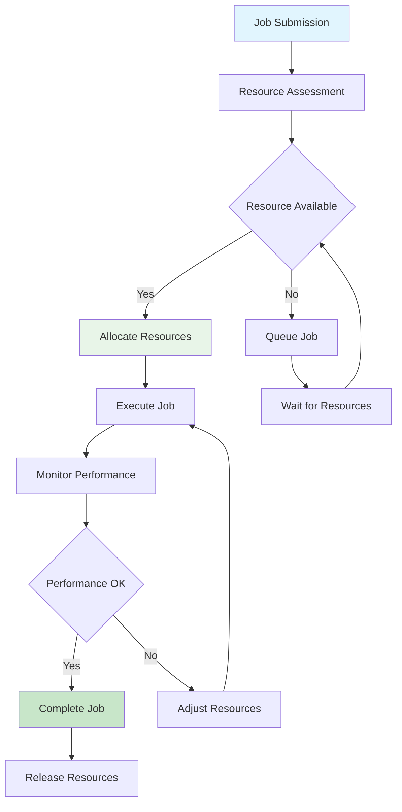

### Auto-scaling Decision Tree
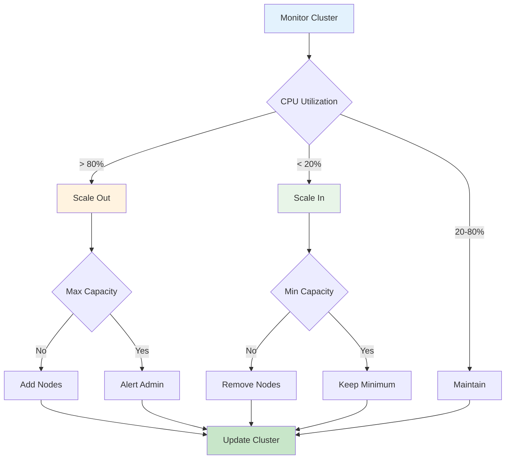

## Cost Optimization Flow

### Cost Monitoring and Optimization
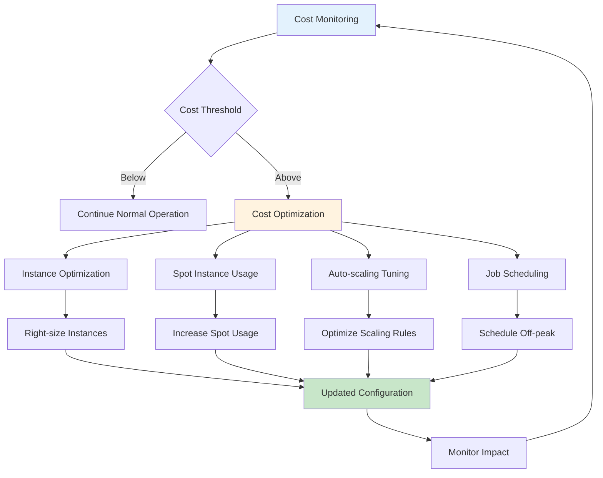

### Spot Instance Management
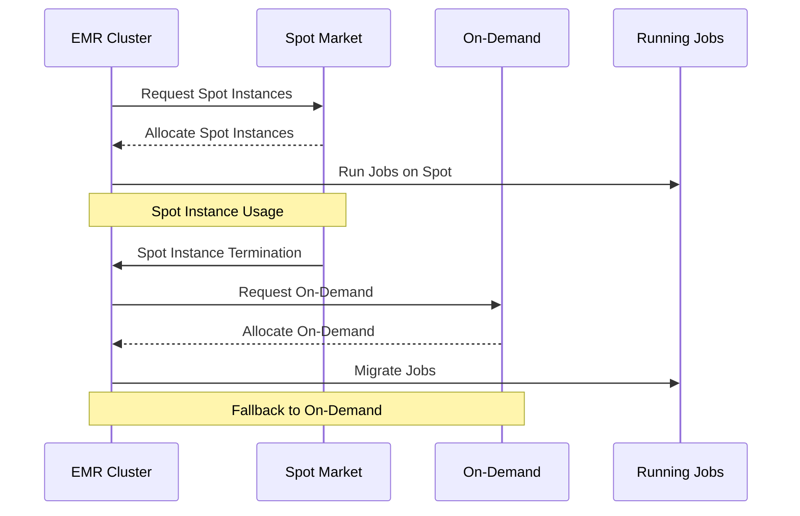

## Security and Compliance

### Data Encryption Flow
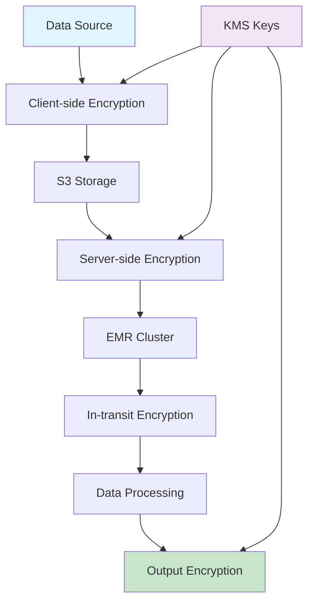

### Access Control Flow
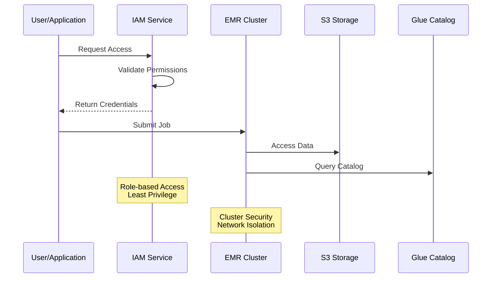

This comprehensive data flow documentation covers all aspects of the EMR batch ETL architecture, including job execution, auto-scaling, error handling, data quality, performance optimization, cost management, and security.
