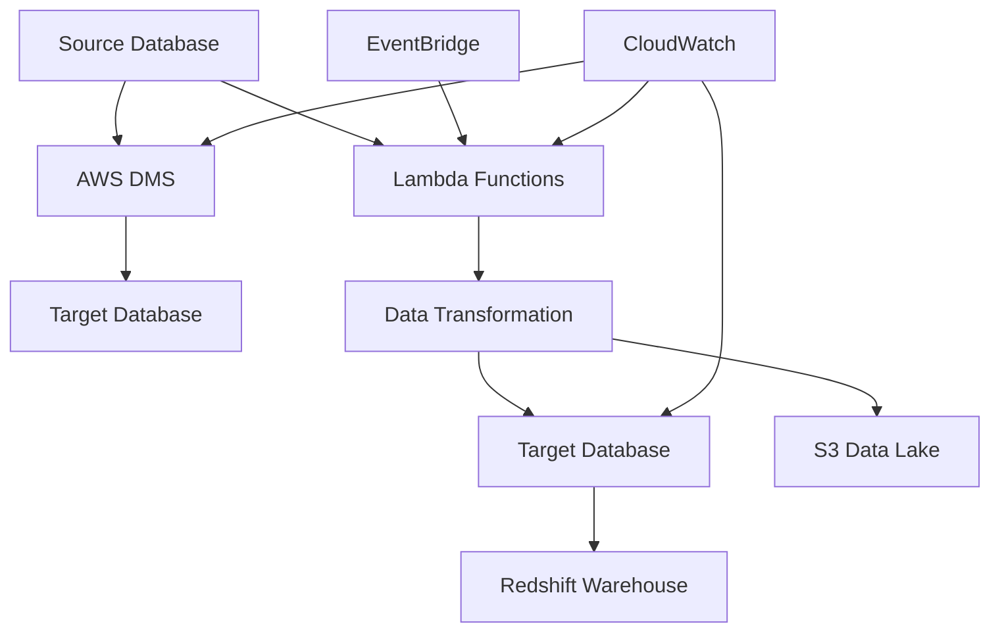

# Architecture 5: RDS Database ETL

## Overview

Architecture 5 implements a **Database-Centric ETL Pipeline** using **Amazon RDS** and **AWS DMS (Database Migration Service)** for SQL-heavy transformations and database-to-database data processing. This architecture is designed for organizations that prefer database-native ETL operations and require strong ACID compliance.

## Architecture Components

### Core Services
- **Amazon RDS**: Managed relational database service for source and target databases
- **Amazon Aurora**: High-performance database engine (optional)
- **AWS DMS**: Database migration and replication service
- **AWS Lambda**: Serverless compute for lightweight transformations
- **AWS Glue**: Managed ETL service for complex transformations
- **Amazon S3**: Data lake for unstructured data storage
- **Amazon Redshift**: Data warehouse for analytics (optional)

### Database Engines
- **PostgreSQL**: Primary database engine
- **MySQL**: Alternative database engine
- **Aurora**: High-performance database engine
- **Multi-engine Support**: Cross-database operations

## Architecture Flow



## Key Features

### 🗄️ **Database-Centric Processing**
- Native SQL transformations
- Stored procedure-based ETL
- Database triggers for real-time processing
- ACID compliance guarantees

### 🔄 **Real-time Replication**
- Change Data Capture (CDC)
- Continuous data synchronization
- Minimal latency data replication
- Transactional consistency

### 🔧 **Flexible Processing**
- Lambda-based transformations
- Glue job integration
- Custom SQL logic
- Multi-database support

### 📊 **Data Management**
- Database-to-database migration
- Data lake integration
- Data warehouse loading
- Cross-database operations

## Use Cases

### ✅ **Ideal For**
- **SQL-heavy transformations** requiring complex joins and aggregations
- **Database migrations** and modernizations
- **Real-time data synchronization** between databases
- **ACID-compliant** data processing
- **Legacy system integration** with modern databases
- **Data warehouse loading** from operational databases

### ❌ **Not Ideal For**
- **Unstructured data** processing (JSON, XML, etc.)
- **Large-scale batch processing** (> 1TB datasets)
- **Real-time streaming** with sub-second latency
- **Complex data transformations** requiring distributed computing
- **Machine learning** data preparation

## Data Processing Patterns

### 1. **Database Replication**
- Real-time data synchronization
- Change Data Capture (CDC)
- Transactional consistency
- Minimal downtime migrations

### 2. **Stored Procedure ETL**
- SQL-based transformations
- Database-native processing
- ACID compliance
- Performance optimization

### 3. **Lambda-Based ETL**
- Lightweight transformations
- Event-driven processing
- Custom business logic
- S3 integration

### 4. **Cross-Database Operations**
- Multi-database queries
- Data federation
- Heterogeneous migrations
- Data consolidation

## Performance Characteristics

### **Throughput**
- **Medium**: Suitable for moderate data volumes
- **Database-dependent**: Performance varies by engine
- **Optimized**: For SQL operations and joins

### **Latency**
- **Low**: Real-time replication capabilities
- **Variable**: Depends on transformation complexity
- **Consistent**: ACID compliance guarantees

### **Cost**
- **Predictable**: Based on instance sizes
- **Optimizable**: Right-sizing and reserved instances
- **Pay-per-use**: Lambda and Glue pricing

## Implementation Status

### ✅ **Completed**
- [x] Architecture diagrams and documentation
- [x] Terraform infrastructure code
- [x] RDS and Aurora configurations
- [x] DMS replication setup
- [x] Lambda ETL functions
- [x] Database connection management
- [x] Monitoring and alerting setup
- [x] Security configurations
- [x] Cost optimization strategies

### 🔄 **In Progress**
- [ ] Sample database schemas
- [ ] Performance benchmarking
- [ ] Advanced DMS configurations
- [ ] Cross-database migration patterns

### 📋 **Planned**
- [ ] Aurora Serverless integration
- [ ] Advanced monitoring dashboards
- [ ] Automated backup and recovery
- [ ] Disaster recovery procedures

## Quick Start

### 1. **Prerequisites**
```bash
# Install required tools
brew install terraform awscli postgresql

# Configure AWS CLI
aws configure
```

### 2. **Deploy Infrastructure**
```bash
cd terraform
terraform init
terraform plan
terraform apply
```

### 3. **Set Up Databases**
```bash
# Connect to source database
psql -h your-source-endpoint -p 5432 -U admin -d sourcedb

# Create sample tables and data
CREATE TABLE customers (id SERIAL PRIMARY KEY, name VARCHAR(100), email VARCHAR(100));
INSERT INTO customers (name, email) VALUES ('John Doe', 'john@example.com');
```

### 4. **Configure DMS Replication**
```bash
# Create replication task
aws dms create-replication-task \
    --replication-task-identifier "full-load-and-cdc" \
    --source-endpoint-arn "arn:aws:dms:region:account:endpoint/source" \
    --target-endpoint-arn "arn:aws:dms:region:account:endpoint/target" \
    --replication-instance-arn "arn:aws:dms:region:account:rep:instance" \
    --migration-type "full-load-and-cdc"
```

### 5. **Monitor Progress**
```bash
# Check replication status
aws dms describe-replication-tasks \
    --query 'ReplicationTasks[*].[ReplicationTaskIdentifier,Status]' \
    --output table
```

## Configuration

### **RDS Configuration**
```hcl
# Source database
source_instance_class = "db.t3.micro"
source_allocated_storage = 20
source_engine = "postgres"
source_engine_version = "13.7"

# Target database
target_instance_class = "db.t3.micro"
target_allocated_storage = 20
target_engine = "postgres"
target_engine_version = "13.7"
```

### **DMS Configuration**
```hcl
# DMS replication instance
dms_instance_class = "dms.t3.micro"
dms_allocated_storage = 50

# Replication tasks
dms_replication_tasks = [
  {
    task_id        = "full-load-and-cdc"
    migration_type = "full-load-and-cdc"
    table_mappings = "{\"rules\":[{\"rule-type\":\"selection\",\"rule-id\":\"1\",\"rule-name\":\"1\",\"object-locator\":{\"schema-name\":\"public\",\"table-name\":\"%\"},\"rule-action\":\"include\"}]}"
  }
]
```

### **Lambda Configuration**
```python
# ETL processor function
functions = {
  "etl-processor" = {
    name         = "rds-database-etl-dev-etl-processor"
    handler      = "etl_processor.lambda_handler"
    runtime      = "python3.9"
    timeout      = 300
    memory_size  = 512
  }
}
```

## Monitoring

### **Key Metrics**
- **Database Performance**: CPU, memory, storage utilization
- **Replication Lag**: DMS replication delay
- **ETL Job Status**: Success/failure rates
- **Data Quality**: Validation metrics

### **CloudWatch Alarms**
- RDS instance performance
- DMS replication task status
- Lambda function errors
- Database connection failures

## Cost Estimation

### **Monthly Costs (Estimated)**
- **RDS Instances**: $30-100 USD
  - Source: $15-50
  - Target: $15-50
- **DMS Replication**: $50-150 USD
- **Lambda Functions**: $5-20 USD
- **S3 Storage**: $2.30 per 100GB
- **Redshift** (optional): $180 USD
- **Total**: ~$100-500 USD per month

### **Cost Optimization**
- Use reserved instances for RDS
- Right-size DMS replication instances
- Optimize Lambda memory allocation
- Implement data lifecycle policies

## Security

### **Database Security**
- Encryption at rest and in transit
- VPC network isolation
- Security groups for access control
- Secrets Manager for credentials

### **Access Control**
- IAM roles with least privilege
- Database user management
- Cross-account access policies
- Audit logging

### **Data Protection**
- Automated backups
- Point-in-time recovery
- Cross-region replication
- Data encryption

## Troubleshooting

### **Common Issues**
1. **Database Connection Failures**
   - Check security group rules
   - Verify VPC configuration
   - Review IAM permissions

2. **DMS Replication Issues**
   - Check replication task status
   - Review table mappings
   - Verify endpoint connectivity

3. **Lambda Function Errors**
   - Check function logs
   - Verify database credentials
   - Review timeout settings

### **Debugging Commands**
```bash
# Check database connectivity
psql -h your-endpoint -p 5432 -U admin -d database

# Monitor DMS replication
aws dms describe-replication-tasks --replication-task-arn "arn:aws:dms:region:account:task:task-id"

# Check Lambda logs
aws logs get-log-events --log-group-name "/aws/lambda/function-name"
```

## Documentation

- [Deployment Guide](docs/deployment-guide.md)
- [Architecture Overview](diagrams/architecture-overview.md)
- [Data Flow Diagram](diagrams/data-flow.md)
- [Troubleshooting Guide](docs/troubleshooting.md)
- [Performance Optimization](docs/performance-optimization.md)
- [Cost Analysis](docs/cost-analysis.md)

## Support

For issues and questions:
1. Check the troubleshooting guide
2. Review AWS RDS and DMS documentation
3. Consult the deployment guide
4. Check CloudWatch logs and metrics

## Next Steps

1. **Deploy the infrastructure** using Terraform
2. **Set up database schemas** and sample data
3. **Configure DMS replication** tasks
4. **Set up monitoring** and alerting
5. **Optimize performance** based on your workload
6. **Implement security** best practices
7. **Set up disaster recovery** procedures

---

**Architecture 5: RDS Database ETL** provides a robust, database-centric solution for SQL-heavy transformations with comprehensive monitoring, security, and cost optimization features.