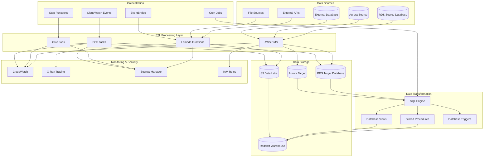
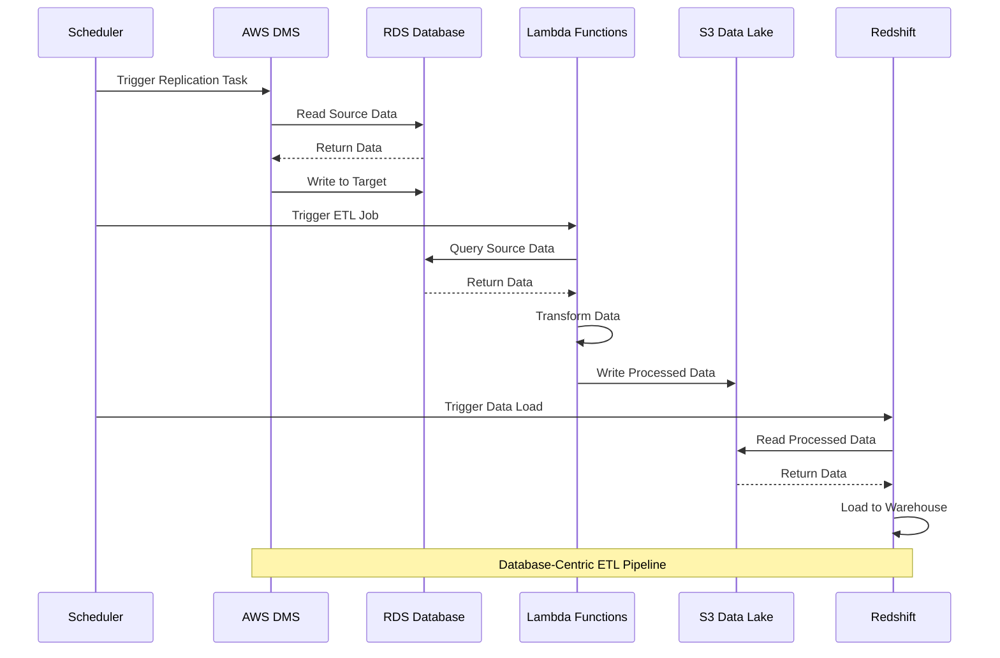
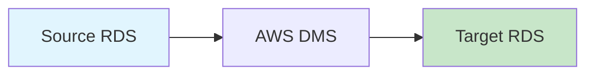
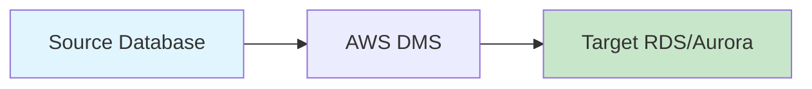
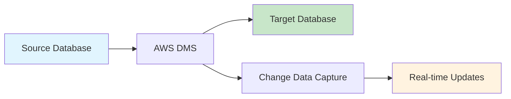
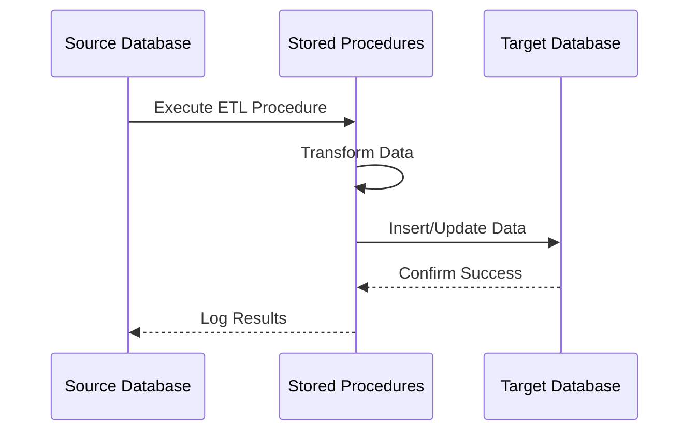
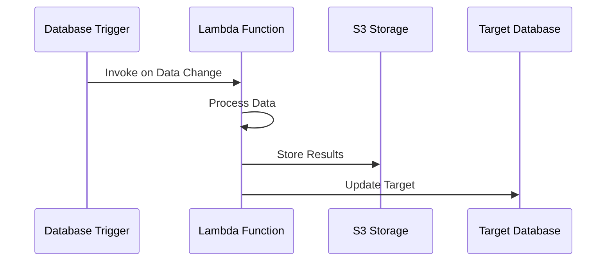
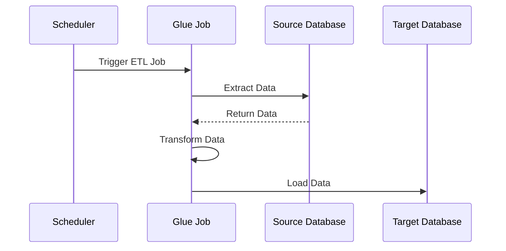

# Architecture 5: RDS Database ETL - Architecture Overview

## High-Level Architecture Diagram



## Database-Centric ETL Flow



## Component Details

### Database Services
- **Amazon RDS**: Managed relational database service
- **Amazon Aurora**: High-performance database engine
- **AWS DMS**: Database migration and replication service
- **Amazon Redshift**: Data warehouse service

### ETL Processing Options
- **AWS Lambda**: Serverless compute for lightweight transformations
- **AWS Glue**: Managed ETL service for complex transformations
- **Amazon ECS**: Containerized processing for custom logic
- **Database Stored Procedures**: SQL-based transformations

### Data Storage Patterns
- **Database Replication**: Real-time data synchronization
- **Data Lake Integration**: S3 for unstructured data
- **Data Warehouse**: Redshift for analytics
- **Multi-Database Support**: Cross-database operations

## Database Migration Patterns

### Pattern 1: Homogeneous Migration


### Pattern 2: Heterogeneous Migration


### Pattern 3: Continuous Replication


## ETL Processing Patterns

### Pattern 1: Database-Centric ETL


### Pattern 2: Lambda-Based ETL


### Pattern 3: Glue-Based ETL


## Data Transformation Strategies

### SQL-Based Transformations
```sql
-- Example: Data aggregation and cleansing
CREATE OR REPLACE PROCEDURE etl_customer_data()
LANGUAGE plpgsql
AS $$
BEGIN
    -- Clean and aggregate customer data
    INSERT INTO analytics.customers_clean
    SELECT 
        customer_id,
        UPPER(TRIM(first_name)) as first_name,
        UPPER(TRIM(last_name)) as last_name,
        CASE 
            WHEN email ~* '^[A-Za-z0-9._%+-]+@[A-Za-z0-9.-]+\.[A-Za-z]{2,}$' 
            THEN email 
            ELSE NULL 
        END as email,
        CURRENT_TIMESTAMP as processed_at
    FROM raw.customers
    WHERE customer_id IS NOT NULL;
    
    -- Update statistics
    ANALYZE analytics.customers_clean;
END;
$$;
```

### Lambda-Based Transformations
```python
# Example: Data validation and enrichment
import json
import boto3
import psycopg2

def lambda_handler(event, context):
    # Connect to source database
    source_conn = psycopg2.connect(
        host=event['source_host'],
        database=event['source_db'],
        user=event['source_user'],
        password=get_secret(event['source_password_secret'])
    )
    
    # Connect to target database
    target_conn = psycopg2.connect(
        host=event['target_host'],
        database=event['target_db'],
        user=event['target_user'],
        password=get_secret(event['target_password_secret'])
    )
    
    # Extract and transform data
    with source_conn.cursor() as source_cur:
        source_cur.execute("SELECT * FROM raw_data WHERE processed = false")
        data = source_cur.fetchall()
        
        # Transform data
        transformed_data = transform_data(data)
        
        # Load to target
        with target_conn.cursor() as target_cur:
            for record in transformed_data:
                target_cur.execute(
                    "INSERT INTO processed_data VALUES (%s, %s, %s, %s)",
                    record
                )
            target_conn.commit()
    
    return {"statusCode": 200, "body": "ETL completed successfully"}
```

## Performance Optimization

### Database Optimization
```sql
-- Index optimization
CREATE INDEX CONCURRENTLY idx_customers_email 
ON customers(email) 
WHERE email IS NOT NULL;

-- Partitioning
CREATE TABLE sales_data (
    id SERIAL,
    sale_date DATE,
    amount DECIMAL(10,2),
    customer_id INTEGER
) PARTITION BY RANGE (sale_date);

-- Create partitions
CREATE TABLE sales_data_2023 PARTITION OF sales_data
FOR VALUES FROM ('2023-01-01') TO ('2024-01-01');
```

### Connection Pooling
```python
# Example: Connection pooling with RDS Proxy
import psycopg2
from psycopg2 import pool

# Create connection pool
connection_pool = psycopg2.pool.SimpleConnectionPool(
    1, 20,  # min and max connections
    host="your-rds-proxy-endpoint",
    database="your_database",
    user="your_username",
    password="your_password"
)

def get_connection():
    return connection_pool.getconn()

def return_connection(connection):
    connection_pool.putconn(connection)
```

## Security Configuration

### Database Security
```yaml
# RDS security configuration
rds_security:
  encryption_at_rest: true
  encryption_in_transit: true
  backup_encryption: true
  deletion_protection: true
  multi_az: true
  publicly_accessible: false
  
# Network security
network_security:
  vpc_only: true
  security_groups:
    - allow_ec2_to_rds
    - allow_lambda_to_rds
    - allow_dms_to_rds
```

### IAM Policies
```json
{
    "Version": "2012-10-17",
    "Statement": [
        {
            "Effect": "Allow",
            "Action": [
                "rds:DescribeDBInstances",
                "rds:DescribeDBClusters",
                "rds:DescribeDBSubnetGroups"
            ],
            "Resource": "*"
        },
        {
            "Effect": "Allow",
            "Action": [
                "dms:DescribeReplicationTasks",
                "dms:StartReplicationTask",
                "dms:StopReplicationTask"
            ],
            "Resource": "arn:aws:dms:*:*:replication-task/*"
        }
    ]
}
```

## Monitoring and Alerting

### Database Metrics
```yaml
cloudwatch_alarms:
  - name: "RDS-CPU-Utilization"
    metric: "CPUUtilization"
    threshold: 80
    comparison: "GreaterThanThreshold"
    
  - name: "RDS-Database-Connections"
    metric: "DatabaseConnections"
    threshold: 100
    comparison: "GreaterThanThreshold"
    
  - name: "RDS-Free-Storage-Space"
    metric: "FreeStorageSpace"
    threshold: 1000000000  # 1GB
    comparison: "LessThanThreshold"
```

### ETL Monitoring
```python
# Example: ETL job monitoring
import boto3
import json

def monitor_etl_job(job_name, start_time, end_time, status):
    cloudwatch = boto3.client('cloudwatch')
    
    # Send custom metrics
    cloudwatch.put_metric_data(
        Namespace='ETL/Jobs',
        MetricData=[
            {
                'MetricName': 'JobDuration',
                'Value': (end_time - start_time).total_seconds(),
                'Unit': 'Seconds',
                'Dimensions': [
                    {
                        'Name': 'JobName',
                        'Value': job_name
                    }
                ]
            },
            {
                'MetricName': 'JobStatus',
                'Value': 1 if status == 'SUCCESS' else 0,
                'Unit': 'Count',
                'Dimensions': [
                    {
                        'Name': 'JobName',
                        'Value': job_name
                    }
                ]
            }
        ]
    )
```

## Cost Optimization

### Database Cost Optimization
```yaml
cost_optimization:
  rds_optimization:
    - use_reserved_instances: true
    - enable_auto_scaling: true
    - use_aurora_serverless: true
    - optimize_storage: true
    
  dms_optimization:
    - use_spot_instances: true
    - optimize_replication_tasks: true
    - schedule_off_peak: true
```

### Resource Right-Sizing
```python
# Example: Auto-scaling based on metrics
import boto3

def auto_scale_rds():
    rds = boto3.client('rds')
    cloudwatch = boto3.client('cloudwatch')
    
    # Get CPU utilization
    response = cloudwatch.get_metric_statistics(
        Namespace='AWS/RDS',
        MetricName='CPUUtilization',
        Dimensions=[
            {
                'Name': 'DBInstanceIdentifier',
                'Value': 'your-db-instance'
            }
        ],
        StartTime=datetime.utcnow() - timedelta(minutes=5),
        EndTime=datetime.utcnow(),
        Period=300,
        Statistics=['Average']
    )
    
    avg_cpu = response['Datapoints'][0]['Average']
    
    if avg_cpu > 80:
        # Scale up
        rds.modify_db_instance(
            DBInstanceIdentifier='your-db-instance',
            DBInstanceClass='db.r5.xlarge'
        )
    elif avg_cpu < 20:
        # Scale down
        rds.modify_db_instance(
            DBInstanceIdentifier='your-db-instance',
            DBInstanceClass='db.r5.large'
        )
```

This comprehensive architecture overview provides the foundation for implementing a robust database-centric ETL pipeline with proper security, monitoring, and cost optimization strategies.
