# Architecture 5: RDS Database ETL - Data Flow Diagram

## Database-Centric ETL Flow

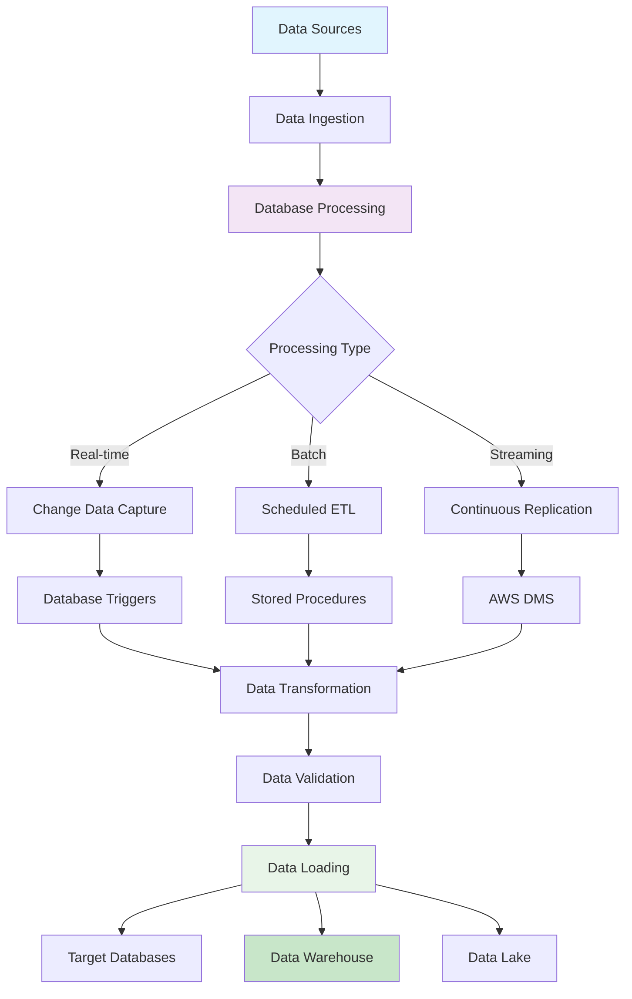

## Real-time Data Replication Flow

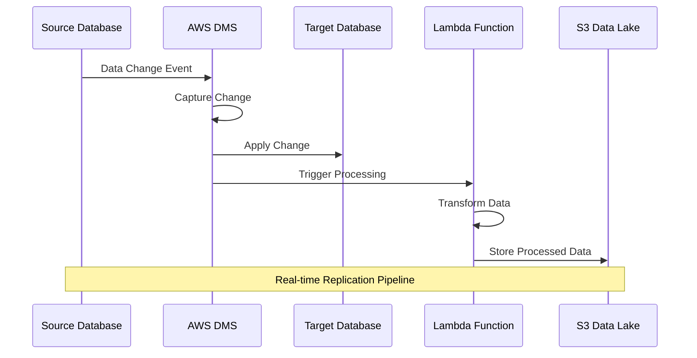

## Batch ETL Processing Flow

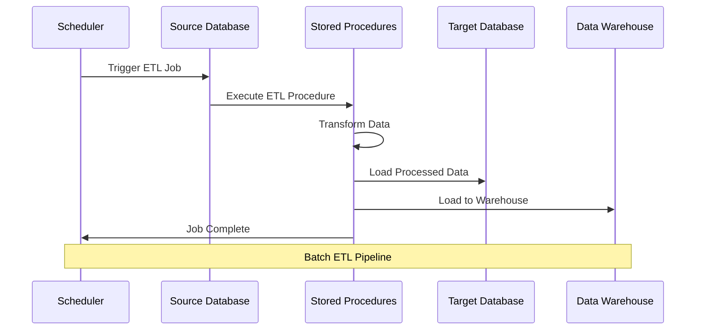

## Data Migration Flow

### Homogeneous Migration
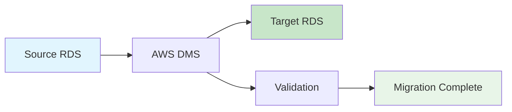

### Heterogeneous Migration
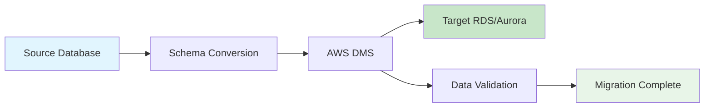

## Change Data Capture (CDC) Flow

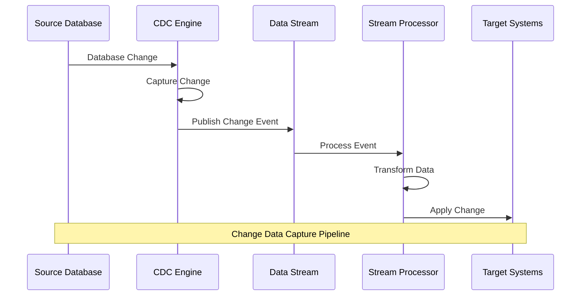

## Database Transformation Patterns

### Pattern 1: Stored Procedure ETL
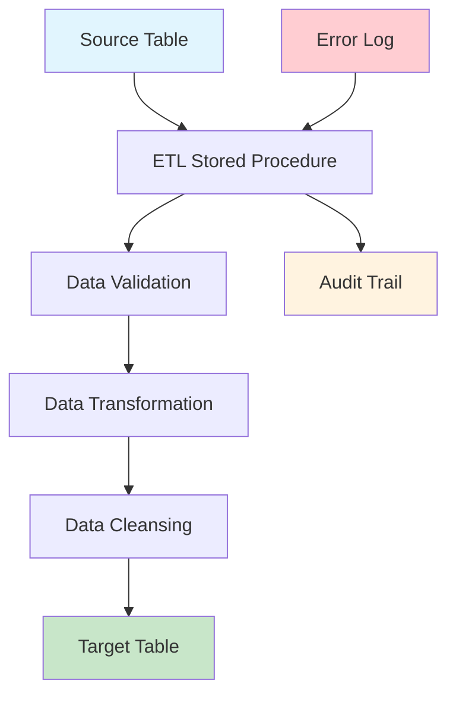

### Pattern 2: Lambda-Based ETL
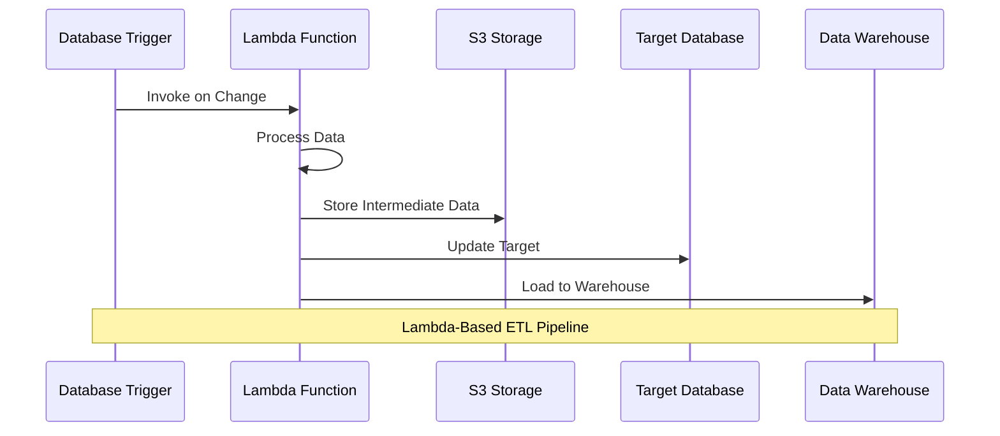

### Pattern 3: Glue-Based ETL
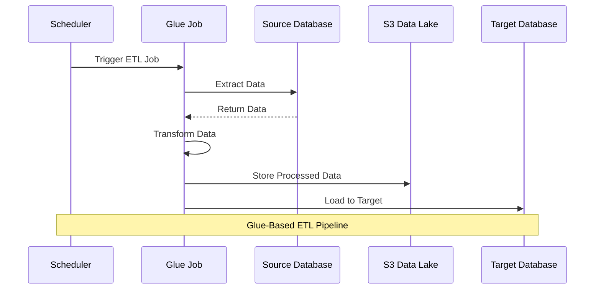

## Data Quality and Validation Flow

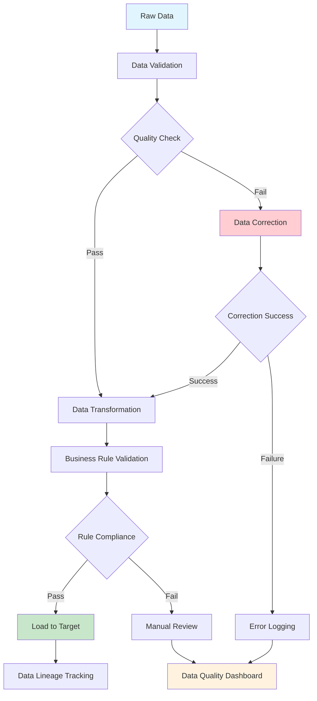

## Database Performance Optimization Flow

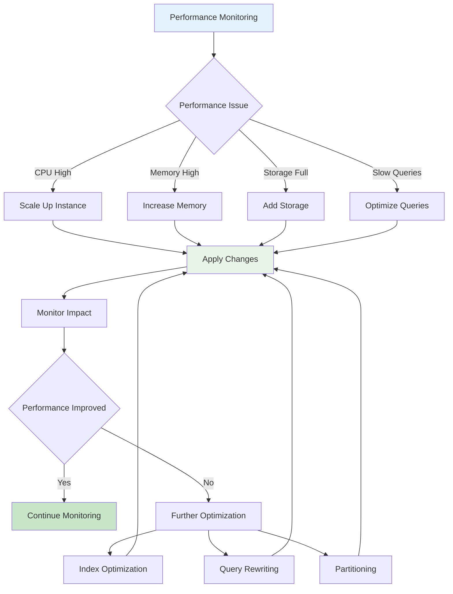

## Error Handling and Recovery Flow

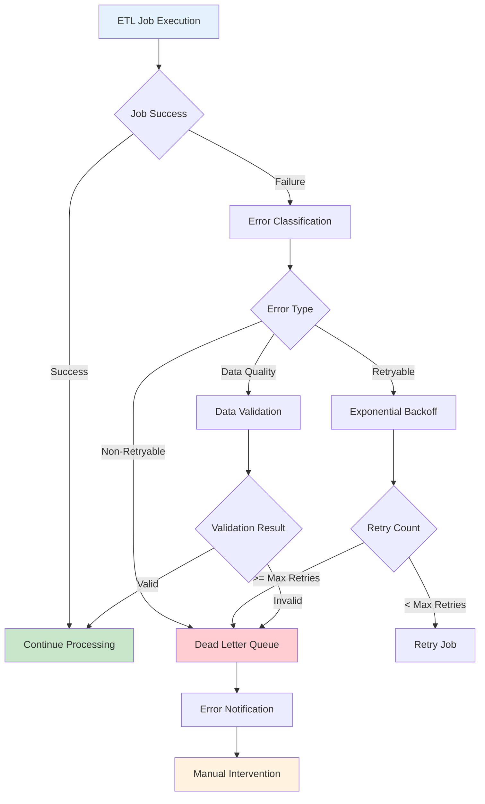

## Database Backup and Recovery Flow

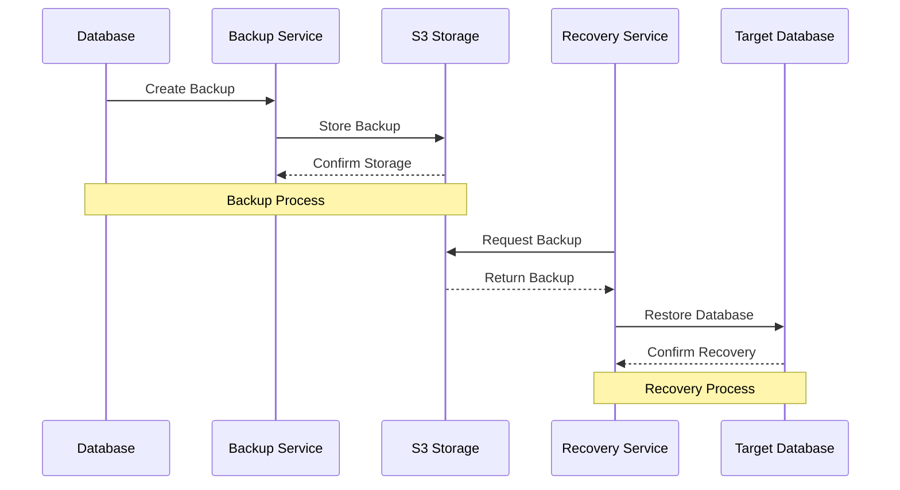

## Multi-Database Integration Flow

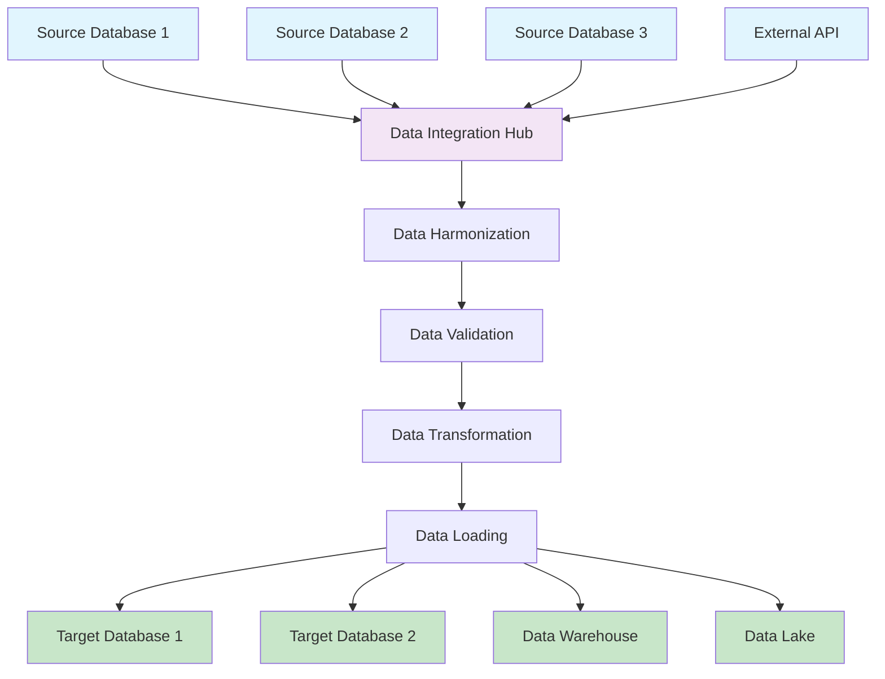

## Database Security and Compliance Flow

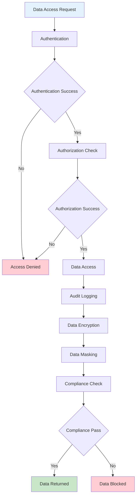

## Cost Optimization Flow

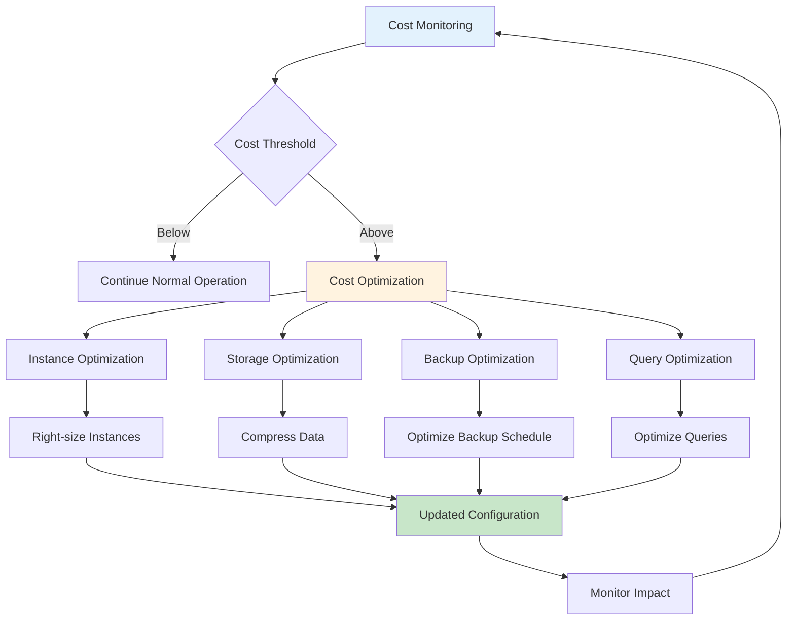

This comprehensive data flow documentation covers all aspects of the RDS database ETL architecture, including real-time replication, batch processing, data migration, change data capture, performance optimization, error handling, backup and recovery, multi-database integration, security, and cost optimization.
