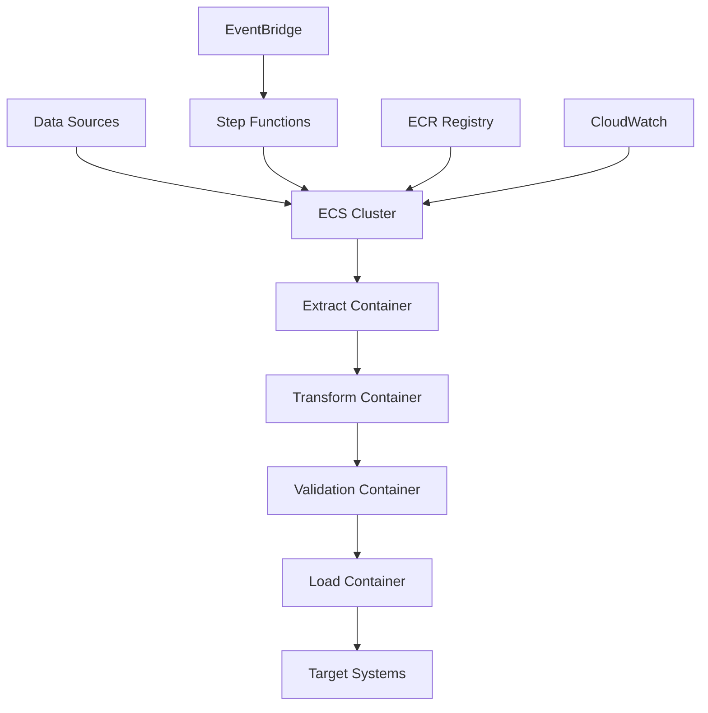

# Architecture 6: Containerized ETL with ECS

## Overview

Architecture 6 implements a **Containerized ETL Pipeline** using **Amazon ECS (Elastic Container Service)** for flexible, scalable data processing with custom logic and container orchestration. This architecture is designed for organizations that need custom processing logic, want to use their existing containerized applications, or require fine-grained control over their ETL processes.

## Architecture Components

### Core Services
- **Amazon ECS**: Container orchestration service
- **Amazon ECR**: Container image registry
- **Amazon S3**: Data lake for storage
- **AWS Step Functions**: Workflow orchestration
- **Amazon EventBridge**: Event-driven scheduling
- **Amazon Redshift**: Data warehouse (optional)

### Container Types
- **Extract Container**: Data extraction from various sources
- **Transform Container**: Data transformation and processing
- **Load Container**: Data loading to destinations
- **Validation Container**: Data quality validation

### Processing Engines
- **Custom Python**: Flexible data processing
- **Apache Spark**: Distributed data processing
- **Pandas**: Data manipulation and analysis
- **Machine Learning**: ML model training and inference

## Architecture Flow



## Key Features

### 🐳 **Container Orchestration**
- ECS Fargate for serverless containers
- ECS EC2 for persistent containers
- Auto-scaling based on demand
- Load balancing and distribution

### 🔧 **Flexible Processing**
- Custom container logic
- Multiple processing engines
- Language-agnostic containers
- Microservices architecture

### 📊 **Data Management**
- Multi-source data extraction
- Complex data transformations
- Data quality validation
- Multiple destination support

### 🔒 **Security**
- Container image scanning
- Network isolation
- IAM role-based access
- Secrets management

## Use Cases

### ✅ **Ideal For**
- **Custom processing logic** requiring specific libraries or frameworks
- **Microservices architecture** with containerized components
- **Multi-language ETL** pipelines
- **Machine learning** data processing
- **Legacy system integration** with containerized applications
- **Complex data transformations** requiring custom logic

### ❌ **Not Ideal For**
- **Simple data transformations** that can be handled by managed services
- **Cost-sensitive** small-scale operations
- **Real-time processing** with sub-second latency requirements
- **Organizations without container expertise**

## Data Processing Patterns

### 1. **Sequential Processing**
- Extract → Transform → Validate → Load
- Linear workflow execution
- Error handling and retry logic

### 2. **Parallel Processing**
- Multiple extract containers
- Concurrent data processing
- Load balancing across containers

### 3. **Streaming Processing**
- Real-time data ingestion
- Continuous container processing
- Event-driven architecture

### 4. **Batch Processing**
- Scheduled container execution
- Large dataset processing
- Resource optimization

## Performance Characteristics

### **Throughput**
- **High**: Scalable container orchestration
- **Flexible**: Based on container configuration
- **Optimized**: For custom processing logic

### **Latency**
- **Variable**: Depends on container startup time
- **Optimizable**: Through container caching and warm-up
- **Scheduled**: Typically runs on schedule

### **Cost**
- **Variable**: Based on container usage
- **Optimizable**: Fargate vs EC2, spot instances
- **Pay-per-use**: Only pay when containers are running

## Implementation Status

### ✅ **Completed**
- [x] Architecture diagrams and documentation
- [x] Terraform infrastructure code
- [x] ECS cluster and service configuration
- [x] ECR repository setup
- [x] Container definitions and task definitions
- [x] Step Functions orchestration
- [x] Auto-scaling configuration
- [x] Monitoring and alerting setup
- [x] Security configurations
- [x] Cost optimization strategies

### 🔄 **In Progress**
- [ ] Sample container implementations
- [ ] Performance benchmarking
- [ ] Advanced auto-scaling patterns
- [ ] Container optimization

### 📋 **Planned**
- [ ] Multi-region deployment
- [ ] Advanced monitoring dashboards
- [ ] Container security scanning
- [ ] Disaster recovery procedures

## Quick Start

### 1. **Prerequisites**
```bash
# Install required tools
brew install terraform awscli docker

# Configure AWS CLI
aws configure

# Verify installation
terraform version
aws --version
docker --version
```

### 2. **Deploy Infrastructure**
```bash
cd terraform
terraform init
terraform plan
terraform apply
```

### 3. **Build and Push Containers**
```bash
# Login to ECR
aws ecr get-login-password --region us-east-1 | docker login --username AWS --password-stdin account.dkr.ecr.us-east-1.amazonaws.com

# Build and push extract container
docker build -t extract-container ./src/containers/extract/
docker tag extract-container:latest account.dkr.ecr.us-east-1.amazonaws.com/etl-extract:latest
docker push account.dkr.ecr.us-east-1.amazonaws.com/etl-extract:latest
```

### 4. **Run ETL Pipeline**
```bash
# Start Step Functions execution
aws stepfunctions start-execution \
    --state-machine-arn "arn:aws:states:region:account:stateMachine:etl-state-machine" \
    --name "etl-execution-$(date +%Y%m%d-%H%M%S)"
```

### 5. **Monitor Progress**
```bash
# Check ECS service status
aws ecs describe-services \
    --cluster "containerized-ecs-etl-dev-etl-cluster" \
    --services "etl-extract-service"

# View Step Functions execution
aws stepfunctions describe-execution \
    --execution-arn "arn:aws:states:region:account:execution:etl-state-machine:execution-id"
```

## Configuration

### **ECS Configuration**
```hcl
# ECS cluster
ecs_launch_type = "FARGATE"
ecs_capacity_providers = ["FARGATE", "FARGATE_SPOT"]

# Service configuration
extract_service_desired_count = 1
extract_service_min_capacity = 1
extract_service_max_capacity = 10
extract_service_target_cpu = 70
extract_service_target_memory = 80
```

### **Container Configuration**
```hcl
# Task definitions
extract_task_cpu = 1024
extract_task_memory = 2048
transform_task_cpu = 1024
transform_task_memory = 2048
load_task_cpu = 1024
load_task_memory = 2048
```

### **Auto-scaling Configuration**
```hcl
# Auto-scaling settings
enable_auto_scaling = true
auto_scaling_scale_out_cooldown = 300
auto_scaling_scale_in_cooldown = 300
```

## Monitoring

### **Key Metrics**
- **Container Performance**: CPU, memory, network utilization
- **Service Health**: Running task count, service status
- **Pipeline Status**: Step Functions execution status
- **Data Quality**: Validation metrics

### **CloudWatch Alarms**
- ECS service CPU utilization
- ECS service memory utilization
- Step Functions execution failures
- Container task failures

## Cost Estimation

### **Monthly Costs (Estimated)**
- **ECS Fargate**: $50-200 USD
  - Extract service: $20-80
  - Transform service: $20-80
  - Load service: $10-40
- **ECR Storage**: $0.10 per GB
- **S3 Storage**: $2.30 per 100GB
- **Step Functions**: $0.025 per 1000 state transitions
- **Redshift** (optional): $180 USD
- **Total**: ~$80-450 USD per month

### **Cost Optimization**
- Use Fargate Spot for non-critical workloads
- Optimize container resource allocation
- Implement container lifecycle policies
- Use Step Functions for cost-effective orchestration

## Security

### **Container Security**
- ECR image scanning
- Container runtime security
- Network isolation with VPC
- IAM roles for containers

### **Access Control**
- IAM roles with least privilege
- ECR repository policies
- VPC security groups
- Secrets Manager integration

### **Data Protection**
- Encryption at rest and in transit
- Container image signing
- Network encryption
- Audit logging

## Troubleshooting

### **Common Issues**
1. **Container Startup Failures**
   - Check container logs
   - Verify ECR image availability
   - Review task definition configuration

2. **ECS Service Issues**
   - Check service events
   - Verify auto-scaling configuration
   - Review capacity provider settings

3. **Step Functions Failures**
   - Check execution history
   - Review state machine definition
   - Verify IAM permissions

### **Debugging Commands**
```bash
# Check ECS service status
aws ecs describe-services --cluster cluster-name --services service-name

# View container logs
aws logs get-log-events --log-group-name /ecs/task-name --log-stream-name stream-name

# Check Step Functions execution
aws stepfunctions describe-execution --execution-arn execution-arn
```

## Documentation

- [Deployment Guide](docs/deployment-guide.md)
- [Architecture Overview](diagrams/architecture-overview.md)
- [Data Flow Diagram](diagrams/data-flow.md)
- [Troubleshooting Guide](docs/troubleshooting.md)
- [Performance Optimization](docs/performance-optimization.md)
- [Cost Analysis](docs/cost-analysis.md)

## Support

For issues and questions:
1. Check the troubleshooting guide
2. Review AWS ECS and Step Functions documentation
3. Consult the deployment guide
4. Check CloudWatch logs and metrics

## Next Steps

1. **Deploy the infrastructure** using Terraform
2. **Build and push container images** to ECR
3. **Configure data sources** and destinations
4. **Set up monitoring** and alerting
5. **Optimize performance** based on your workload
6. **Implement security** best practices
7. **Set up disaster recovery** procedures

---

**Architecture 6: Containerized ETL with ECS** provides a flexible, scalable solution for custom ETL processing with comprehensive monitoring, security, and cost optimization features.