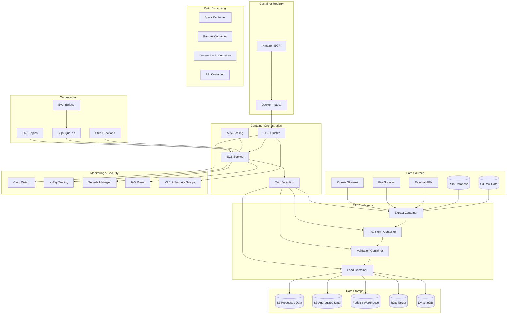
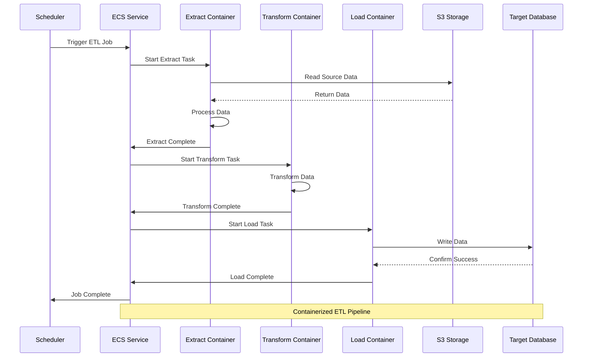
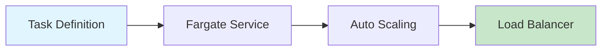
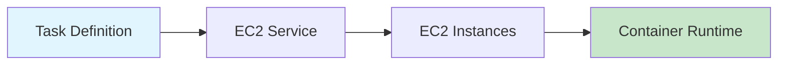
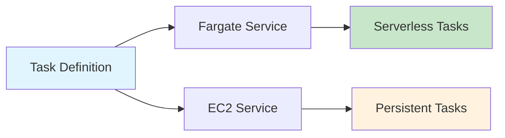
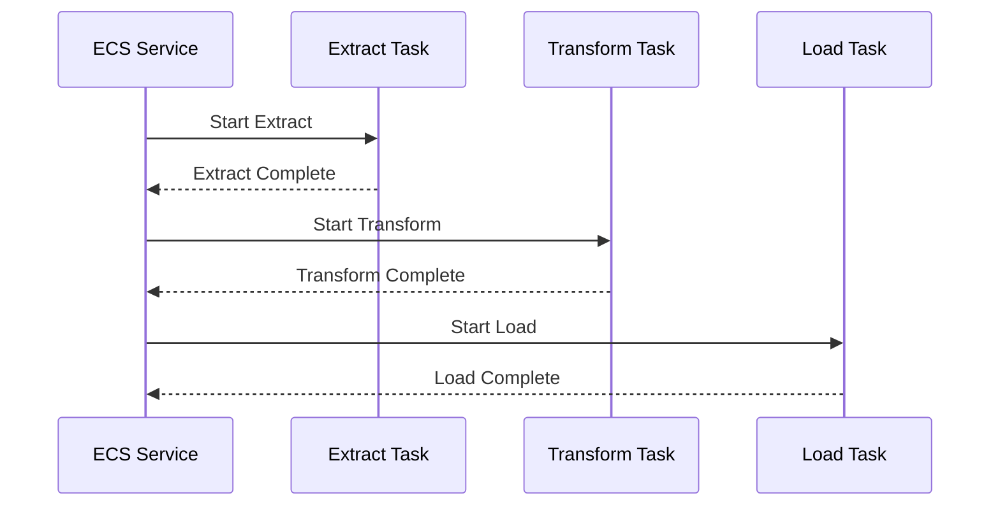
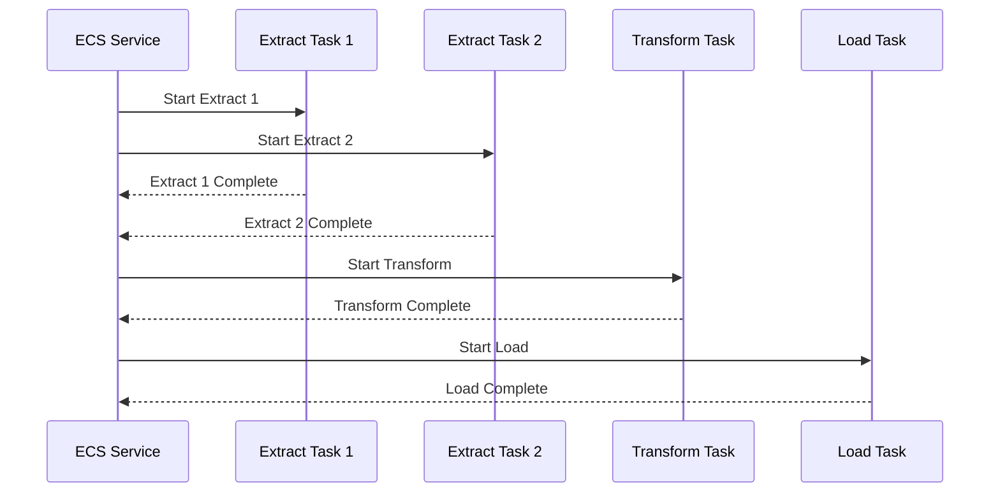
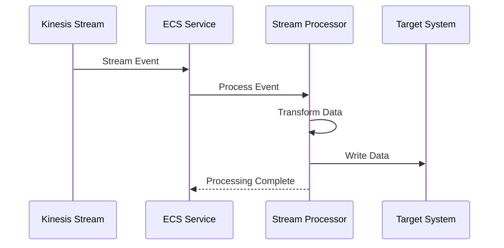

# Architecture 6: Containerized ETL with ECS - Architecture Overview

## High-Level Architecture Diagram



## Containerized ETL Flow



## Component Details

### Container Orchestration
- **Amazon ECS**: Container orchestration service
- **ECS Fargate**: Serverless container compute
- **ECS EC2**: Container compute on EC2 instances
- **Auto Scaling**: Dynamic scaling based on demand

### Container Registry
- **Amazon ECR**: Container image registry
- **Docker Images**: Pre-built ETL containers
- **Image Scanning**: Security vulnerability scanning
- **Image Lifecycle**: Automated image cleanup

### ETL Containers
- **Extract Container**: Data extraction logic
- **Transform Container**: Data transformation logic
- **Load Container**: Data loading logic
- **Validation Container**: Data quality validation

### Processing Engines
- **Apache Spark**: Distributed data processing
- **Pandas**: Python data manipulation
- **Custom Logic**: Business-specific processing
- **Machine Learning**: ML model training and inference

## Container Deployment Patterns

### Pattern 1: Fargate Serverless


### Pattern 2: EC2 Launch Type


### Pattern 3: Mixed Deployment


## ETL Container Architecture

### Extract Container
```dockerfile
FROM python:3.9-slim

WORKDIR /app

COPY requirements.txt .
RUN pip install -r requirements.txt

COPY extract/ .
COPY config/ ./config/

CMD ["python", "extract.py"]
```

### Transform Container
```dockerfile
FROM python:3.9-slim

WORKDIR /app

COPY requirements.txt .
RUN pip install -r requirements.txt

COPY transform/ .
COPY config/ ./config/

CMD ["python", "transform.py"]
```

### Load Container
```dockerfile
FROM python:3.9-slim

WORKDIR /app

COPY requirements.txt .
RUN pip install -r requirements.txt

COPY load/ .
COPY config/ ./config/

CMD ["python", "load.py"]
```

## Auto-Scaling Configuration

### ECS Service Auto-Scaling
```yaml
auto_scaling:
  min_capacity: 1
  max_capacity: 10
  target_capacity: 5
  
scaling_policies:
  - name: "ScaleOutCPU"
    metric_type: "ECSServiceAverageCPUUtilization"
    target_value: 70
    scale_out_cooldown: 300
    scale_in_cooldown: 300
    
  - name: "ScaleOutMemory"
    metric_type: "ECSServiceAverageMemoryUtilization"
    target_value: 80
    scale_out_cooldown: 300
    scale_in_cooldown: 300
```

### Task Definition Auto-Scaling
```json
{
  "family": "etl-task-definition",
  "networkMode": "awsvpc",
  "requiresCompatibilities": ["FARGATE"],
  "cpu": "1024",
  "memory": "2048",
  "executionRoleArn": "arn:aws:iam::account:role/ecsTaskExecutionRole",
  "taskRoleArn": "arn:aws:iam::account:role/ecsTaskRole",
  "containerDefinitions": [
    {
      "name": "etl-container",
      "image": "account.dkr.ecr.region.amazonaws.com/etl:latest",
      "cpu": 1024,
      "memory": 2048,
      "essential": true,
      "logConfiguration": {
        "logDriver": "awslogs",
        "options": {
          "awslogs-group": "/ecs/etl",
          "awslogs-region": "us-east-1",
          "awslogs-stream-prefix": "ecs"
        }
      }
    }
  ]
}
```

## Data Processing Patterns

### Pattern 1: Sequential Processing


### Pattern 2: Parallel Processing


### Pattern 3: Streaming Processing


## Performance Optimization

### Container Resource Optimization
```yaml
# Task definition optimization
task_definition:
  cpu: 1024          # 1 vCPU
  memory: 2048       # 2 GB RAM
  
  # Container resource allocation
  containers:
    - name: "etl-container"
      cpu: 1024
      memory: 2048
      memoryReservation: 1536  # Soft limit
      
  # Placement constraints
  placement_constraints:
    - type: "memberOf"
      expression: "attribute:ecs.instance-type =~ t3.*"
```

### Auto-Scaling Optimization
```python
# Custom scaling logic
def calculate_desired_capacity(current_metrics):
    cpu_utilization = current_metrics['cpu_utilization']
    memory_utilization = current_metrics['memory_utilization']
    queue_depth = current_metrics['queue_depth']
    
    # Scale based on multiple factors
    if cpu_utilization > 80 or memory_utilization > 80:
        return min(current_metrics['current_capacity'] + 2, 10)
    elif queue_depth > 100:
        return min(current_metrics['current_capacity'] + 1, 10)
    elif cpu_utilization < 20 and memory_utilization < 20:
        return max(current_metrics['current_capacity'] - 1, 1)
    else:
        return current_metrics['current_capacity']
```

## Security Configuration

### Container Security
```yaml
# Security configuration
security:
  # Image scanning
  image_scanning: true
  
  # Container security
  container_security:
    - run_as_non_root: true
    - read_only_root_filesystem: true
    - drop_capabilities: ["ALL"]
    - add_capabilities: []
  
  # Network security
  network_security:
    - security_groups: ["sg-xxxxxxxxx"]
    - subnets: ["subnet-xxxxxxxxx"]
    - assign_public_ip: false
```

### IAM Roles and Policies
```json
{
  "Version": "2012-10-17",
  "Statement": [
    {
      "Effect": "Allow",
      "Action": [
        "s3:GetObject",
        "s3:PutObject",
        "s3:DeleteObject",
        "s3:ListBucket"
      ],
      "Resource": [
        "arn:aws:s3:::etl-bucket/*",
        "arn:aws:s3:::etl-bucket"
      ]
    },
    {
      "Effect": "Allow",
      "Action": [
        "rds:DescribeDBInstances",
        "rds:Connect"
      ],
      "Resource": "*"
    },
    {
      "Effect": "Allow",
      "Action": [
        "secretsmanager:GetSecretValue"
      ],
      "Resource": "arn:aws:secretsmanager:*:*:secret:etl/*"
    }
  ]
}
```

## Monitoring and Alerting

### CloudWatch Metrics
```yaml
cloudwatch_metrics:
  - name: "ECSServiceAverageCPUUtilization"
    namespace: "AWS/ECS"
    dimensions:
      - name: "ServiceName"
        value: "etl-service"
      - name: "ClusterName"
        value: "etl-cluster"
  
  - name: "ECSServiceAverageMemoryUtilization"
    namespace: "AWS/ECS"
    dimensions:
      - name: "ServiceName"
        value: "etl-service"
      - name: "ClusterName"
        value: "etl-cluster"
  
  - name: "ECSServiceRunningTaskCount"
    namespace: "AWS/ECS"
    dimensions:
      - name: "ServiceName"
        value: "etl-service"
      - name: "ClusterName"
        value: "etl-cluster"
```

### Custom Metrics
```python
# Custom ETL metrics
import boto3

def send_custom_metrics(metrics):
    cloudwatch = boto3.client('cloudwatch')
    
    cloudwatch.put_metric_data(
        Namespace='ETL/Containers',
        MetricData=[
            {
                'MetricName': 'RecordsProcessed',
                'Value': metrics['records_processed'],
                'Unit': 'Count',
                'Dimensions': [
                    {
                        'Name': 'ServiceName',
                        'Value': 'etl-service'
                    }
                ]
            },
            {
                'MetricName': 'ProcessingTime',
                'Value': metrics['processing_time'],
                'Unit': 'Seconds',
                'Dimensions': [
                    {
                        'Name': 'ServiceName',
                        'Value': 'etl-service'
                    }
                ]
            }
        ]
    )
```

## Cost Optimization

### Fargate vs EC2 Cost Analysis
```yaml
cost_optimization:
  fargate:
    pros:
      - No server management
      - Pay per task
      - Automatic scaling
    cons:
      - Higher cost per vCPU
      - Limited customization
    
  ec2:
    pros:
      - Lower cost per vCPU
      - Full customization
      - Reserved instances
    cons:
      - Server management
      - Fixed costs
    
  recommendation: "Use Fargate for variable workloads, EC2 for consistent workloads"
```

### Resource Right-Sizing
```python
# Resource optimization algorithm
def optimize_resources(workload_metrics):
    cpu_utilization = workload_metrics['cpu_utilization']
    memory_utilization = workload_metrics['memory_utilization']
    
    # Optimize CPU allocation
    if cpu_utilization > 90:
        cpu_allocation = min(2048, workload_metrics['current_cpu'] * 1.5)
    elif cpu_utilization < 30:
        cpu_allocation = max(256, workload_metrics['current_cpu'] * 0.8)
    else:
        cpu_allocation = workload_metrics['current_cpu']
    
    # Optimize memory allocation
    if memory_utilization > 90:
        memory_allocation = min(4096, workload_metrics['current_memory'] * 1.5)
    elif memory_utilization < 30:
        memory_allocation = max(512, workload_metrics['current_memory'] * 0.8)
    else:
        memory_allocation = workload_metrics['current_memory']
    
    return {
        'cpu': cpu_allocation,
        'memory': memory_allocation
    }
```

This comprehensive architecture overview provides the foundation for implementing a robust containerized ETL pipeline with proper scaling, monitoring, security, and cost optimization strategies.
