# Architecture 6: Containerized ETL with ECS - Data Flow Diagram

## Containerized ETL Processing Flow

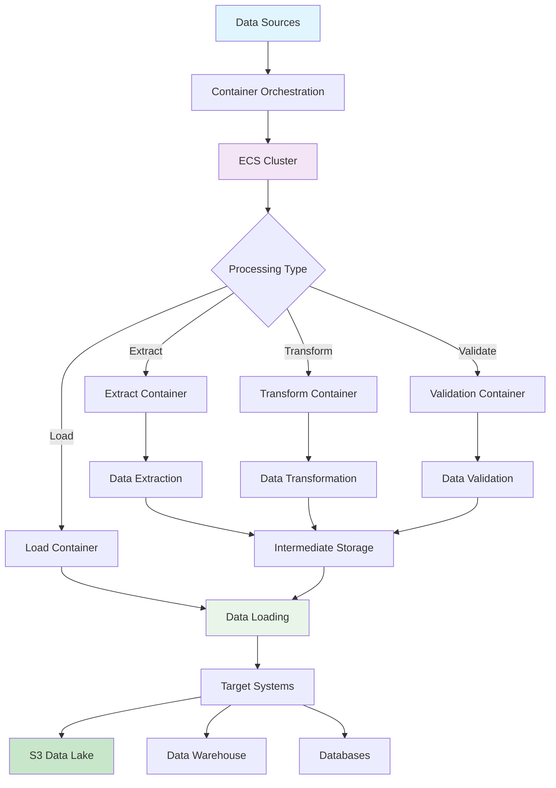
```mermaid
flowchart TD
    A[Data Sources] --> B[Container Orchestration]
    B --> C[ECS Cluster]
    C --> D{Processing Type}
    D -->|Extract| E[Extract Container]
    D -->|Transform| F[Transform Container]
    D -->|Load| G[Load Container]
    D -->|Validate| H[Validation Container]
    
    E --> I[Data Extraction]
    F --> J[Data Transformation]
    G --> K[Data Loading]
    H --> L[Data Validation]
    
    I --> M[Intermediate Storage]
    J --> M
    L --> M
    M --> K
    
    K --> N[Target Systems]
    N --> O[S3 Data Lake]
    N --> P[Data Warehouse]
    N --> Q[Databases]
    
    style A fill:#e1f5fe
    style C fill:#f3e5f5
    style K fill:#e8f5e8
    style O fill:#c8e6c9
```

## ECS Service Orchestration Flow

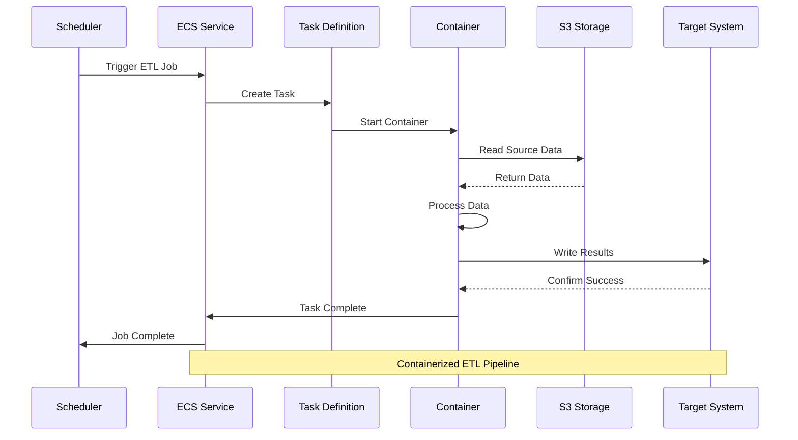
```mermaid
sequenceDiagram
    participant SCHED as Scheduler
    participant ECS as ECS Service
    participant TASK as Task Definition
    participant CONTAINER as Container
    participant S3 as S3 Storage
    participant TARGET as Target System
    
    SCHED->>ECS: Trigger ETL Job
    ECS->>TASK: Create Task
    TASK->>CONTAINER: Start Container
    CONTAINER->>S3: Read Source Data
    S3-->>CONTAINER: Return Data
    CONTAINER->>CONTAINER: Process Data
    CONTAINER->>TARGET: Write Results
    TARGET-->>CONTAINER: Confirm Success
    CONTAINER->>ECS: Task Complete
    ECS->>SCHED: Job Complete
    
    Note over ECS,TARGET: Containerized ETL Pipeline
```

## Auto-Scaling Flow

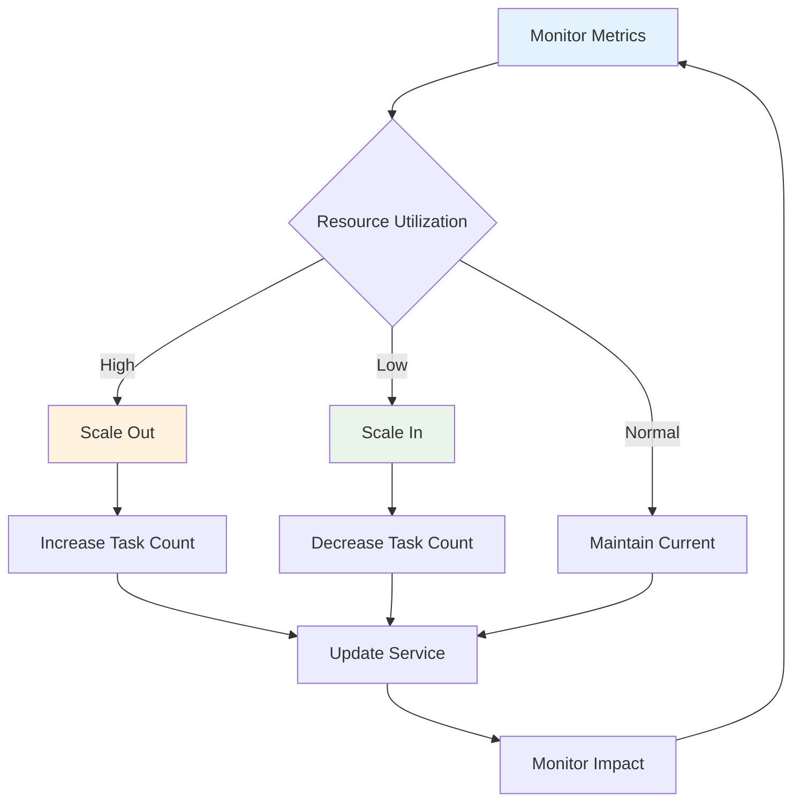
```mermaid
flowchart TD
    A[Monitor Metrics] --> B{Resource Utilization}
    B -->|High| C[Scale Out]
    B -->|Low| D[Scale In]
    B -->|Normal| E[Maintain Current]
    
    C --> F[Increase Task Count]
    D --> G[Decrease Task Count]
    
    F --> H[Update Service]
    G --> H
    E --> H
    
    H --> I[Monitor Impact]
    I --> A
    
    style A fill:#e3f2fd
    style C fill:#fff3e0
    style D fill:#e8f5e8
```

## Container Lifecycle Flow

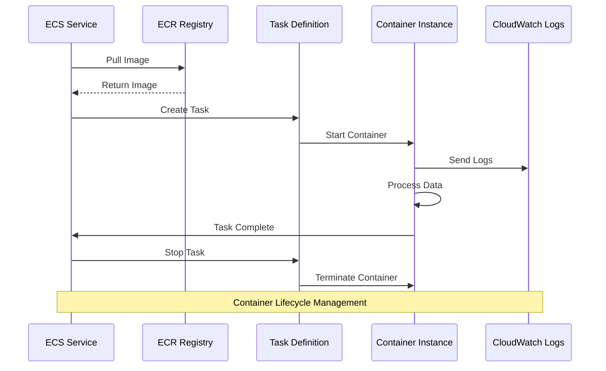
```mermaid
sequenceDiagram
    participant ECS as ECS Service
    participant ECR as ECR Registry
    participant TASK as Task Definition
    participant CONTAINER as Container Instance
    participant LOGS as CloudWatch Logs
    
    ECS->>ECR: Pull Image
    ECR-->>ECS: Return Image
    ECS->>TASK: Create Task
    TASK->>CONTAINER: Start Container
    CONTAINER->>LOGS: Send Logs
    CONTAINER->>CONTAINER: Process Data
    CONTAINER->>ECS: Task Complete
    ECS->>TASK: Stop Task
    TASK->>CONTAINER: Terminate Container
    
    Note over ECS,LOGS: Container Lifecycle Management
```

## Data Processing Patterns

### Pattern 1: Sequential Container Processing
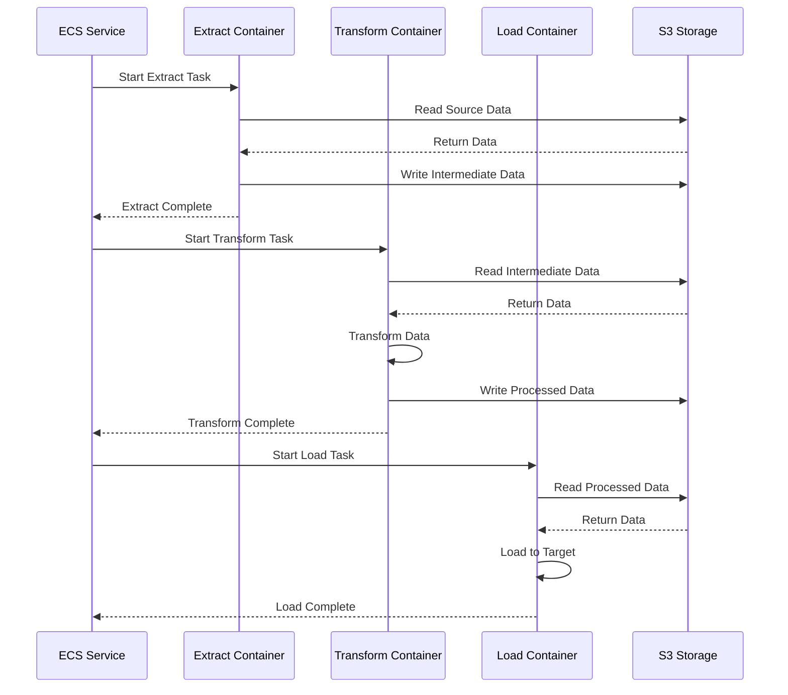
```mermaid
sequenceDiagram
    participant ECS as ECS Service
    participant EXTRACT as Extract Container
    participant TRANSFORM as Transform Container
    participant LOAD as Load Container
    participant S3 as S3 Storage
    
    ECS->>EXTRACT: Start Extract Task
    EXTRACT->>S3: Read Source Data
    S3-->>EXTRACT: Return Data
    EXTRACT->>S3: Write Intermediate Data
    EXTRACT-->>ECS: Extract Complete
    
    ECS->>TRANSFORM: Start Transform Task
    TRANSFORM->>S3: Read Intermediate Data
    S3-->>TRANSFORM: Return Data
    TRANSFORM->>TRANSFORM: Transform Data
    TRANSFORM->>S3: Write Processed Data
    TRANSFORM-->>ECS: Transform Complete
    
    ECS->>LOAD: Start Load Task
    LOAD->>S3: Read Processed Data
    S3-->>LOAD: Return Data
    LOAD->>LOAD: Load to Target
    LOAD-->>ECS: Load Complete
```

### Pattern 2: Parallel Container Processing
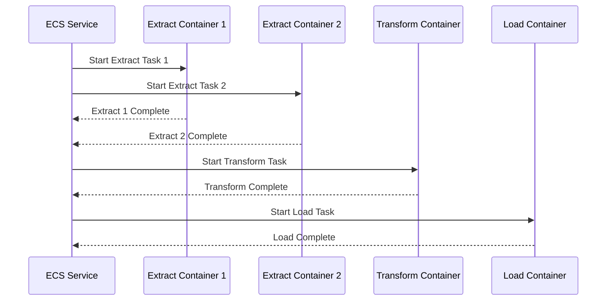
```mermaid
sequenceDiagram
    participant ECS as ECS Service
    participant EXTRACT1 as Extract Container 1
    participant EXTRACT2 as Extract Container 2
    participant TRANSFORM as Transform Container
    participant LOAD as Load Container
    
    ECS->>EXTRACT1: Start Extract Task 1
    ECS->>EXTRACT2: Start Extract Task 2
    EXTRACT1-->>ECS: Extract 1 Complete
    EXTRACT2-->>ECS: Extract 2 Complete
    
    ECS->>TRANSFORM: Start Transform Task
    TRANSFORM-->>ECS: Transform Complete
    
    ECS->>LOAD: Start Load Task
    LOAD-->>ECS: Load Complete
```

### Pattern 3: Streaming Container Processing
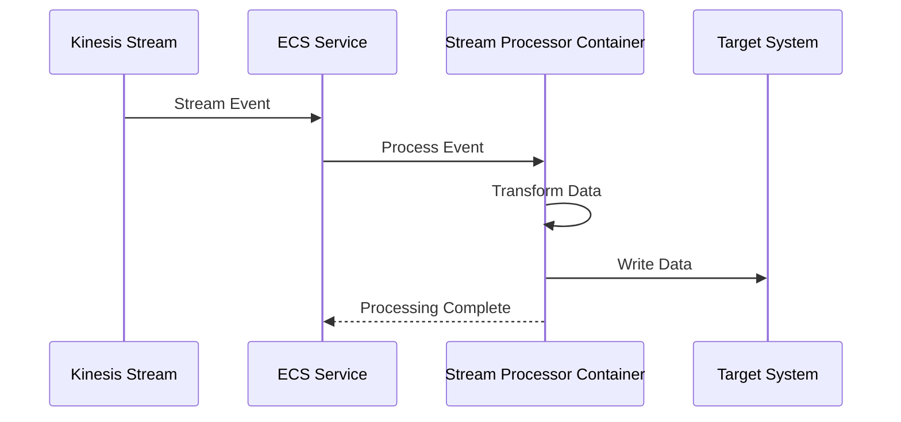
```mermaid
sequenceDiagram
    participant KINESIS as Kinesis Stream
    participant ECS as ECS Service
    participant PROCESSOR as Stream Processor Container
    participant TARGET as Target System
    
    KINESIS->>ECS: Stream Event
    ECS->>PROCESSOR: Process Event
    PROCESSOR->>PROCESSOR: Transform Data
    PROCESSOR->>TARGET: Write Data
    PROCESSOR-->>ECS: Processing Complete
```

## Container Resource Management

### Resource Allocation Flow
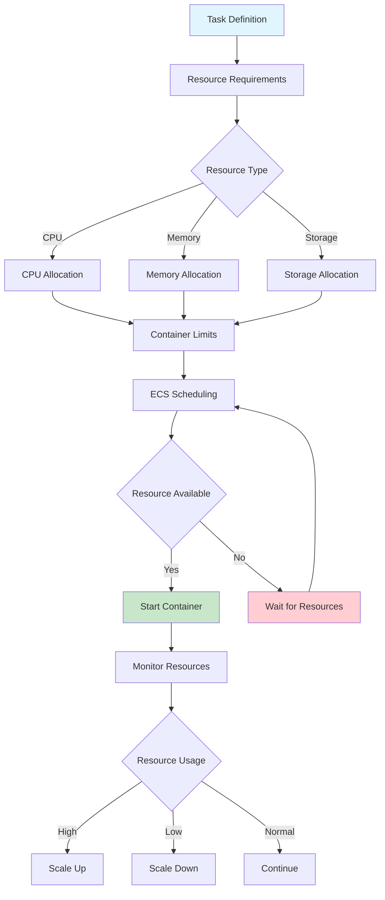
```mermaid
flowchart TD
    A[Task Definition] --> B[Resource Requirements]
    B --> C{Resource Type}
    C -->|CPU| D[CPU Allocation]
    C -->|Memory| E[Memory Allocation]
    C -->|Storage| F[Storage Allocation]
    
    D --> G[Container Limits]
    E --> G
    F --> G
    
    G --> H[ECS Scheduling]
    H --> I{Resource Available}
    I -->|Yes| J[Start Container]
    I -->|No| K[Wait for Resources]
    
    J --> L[Monitor Resources]
    K --> H
    L --> M{Resource Usage}
    M -->|High| N[Scale Up]
    M -->|Low| O[Scale Down]
    M -->|Normal| P[Continue]
    
    style A fill:#e1f5fe
    style J fill:#c8e6c9
    style K fill:#ffcdd2
```

### Auto-Scaling Decision Tree
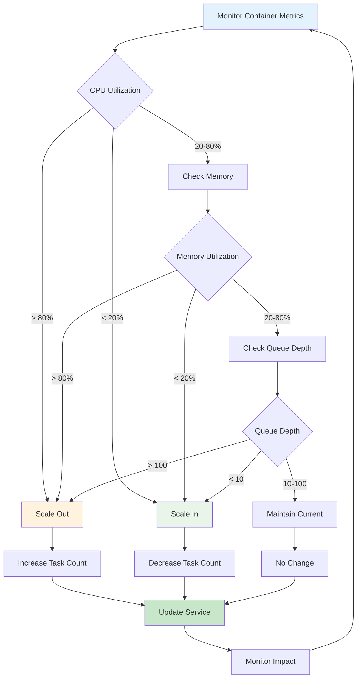
```mermaid
flowchart TD
    A[Monitor Container Metrics] --> B{CPU Utilization}
    B -->|> 80%| C[Scale Out]
    B -->|< 20%| D[Scale In]
    B -->|20-80%| E[Check Memory]
    
    E --> F{Memory Utilization}
    F -->|> 80%| C
    F -->|< 20%| D
    F -->|20-80%| G[Check Queue Depth]
    
    G --> H{Queue Depth}
    H -->|> 100| C
    H -->|< 10| D
    H -->|10-100| I[Maintain Current]
    
    C --> J[Increase Task Count]
    D --> K[Decrease Task Count]
    I --> L[No Change]
    
    J --> M[Update Service]
    K --> M
    L --> M
    
    M --> N[Monitor Impact]
    N --> A
    
    style A fill:#e3f2fd
    style C fill:#fff3e0
    style D fill:#e8f5e8
    style M fill:#c8e6c9
```

## Error Handling and Recovery

### Container Failure Recovery
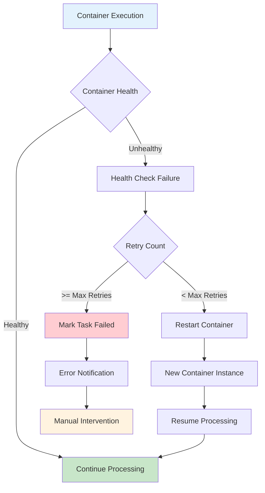
```mermaid
flowchart TD
    A[Container Execution] --> B{Container Health}
    B -->|Healthy| C[Continue Processing]
    B -->|Unhealthy| D[Health Check Failure]
    
    D --> E{Retry Count}
    E -->|< Max Retries| F[Restart Container]
    E -->|>= Max Retries| G[Mark Task Failed]
    
    F --> H[New Container Instance]
    H --> I[Resume Processing]
    I --> C
    
    G --> J[Error Notification]
    J --> K[Manual Intervention]
    
    style A fill:#e3f2fd
    style C fill:#c8e6c9
    style G fill:#ffcdd2
    style K fill:#fff3e0
```

### Task Failure Recovery
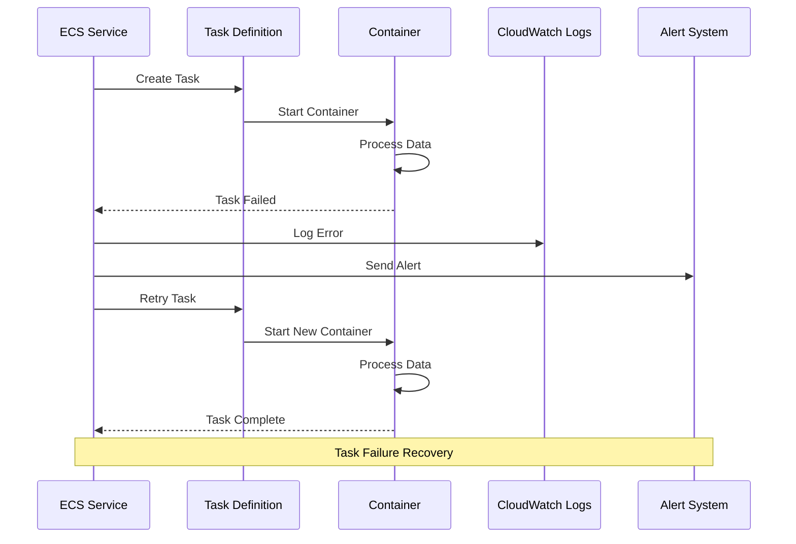
```mermaid
sequenceDiagram
    participant ECS as ECS Service
    participant TASK as Task Definition
    participant CONTAINER as Container
    participant LOGS as CloudWatch Logs
    participant ALERT as Alert System
    
    ECS->>TASK: Create Task
    TASK->>CONTAINER: Start Container
    CONTAINER->>CONTAINER: Process Data
    CONTAINER-->>ECS: Task Failed
    
    ECS->>LOGS: Log Error
    ECS->>ALERT: Send Alert
    ECS->>TASK: Retry Task
    TASK->>CONTAINER: Start New Container
    CONTAINER->>CONTAINER: Process Data
    CONTAINER-->>ECS: Task Complete
    
    Note over ECS,ALERT: Task Failure Recovery
```

## Data Quality and Validation

### Container-Based Data Validation
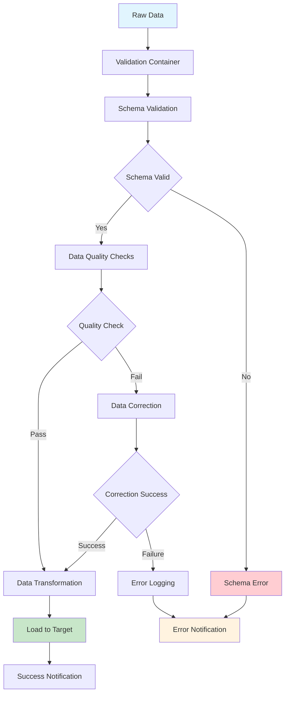
```mermaid
flowchart TD
    A[Raw Data] --> B[Validation Container]
    B --> C[Schema Validation]
    C --> D{Schema Valid}
    D -->|Yes| E[Data Quality Checks]
    D -->|No| F[Schema Error]
    
    E --> G{Quality Check}
    G -->|Pass| H[Data Transformation]
    G -->|Fail| I[Data Correction]
    
    H --> J[Load to Target]
    I --> K{Correction Success}
    K -->|Success| H
    K -->|Failure| L[Error Logging]
    
    F --> M[Error Notification]
    L --> M
    J --> N[Success Notification]
    
    style A fill:#e1f5fe
    style J fill:#c8e6c9
    style F fill:#ffcdd2
    style M fill:#fff3e0
```

### Data Validation Pipeline
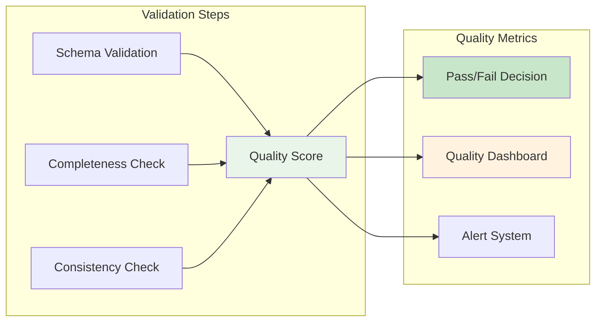
```mermaid
graph LR
    subgraph "Validation Steps"
        A[Schema Validation] --> D[Quality Score]
        B[Completeness Check] --> D
        C[Consistency Check] --> D
    end
    
    subgraph "Quality Metrics"
        D --> E[Pass/Fail Decision]
        D --> F[Quality Dashboard]
        D --> G[Alert System]
    end
    
    style D fill:#e8f5e8
    style E fill:#c8e6c9
    style F fill:#fff3e0
```

## Performance and Scaling

### Container Performance Optimization
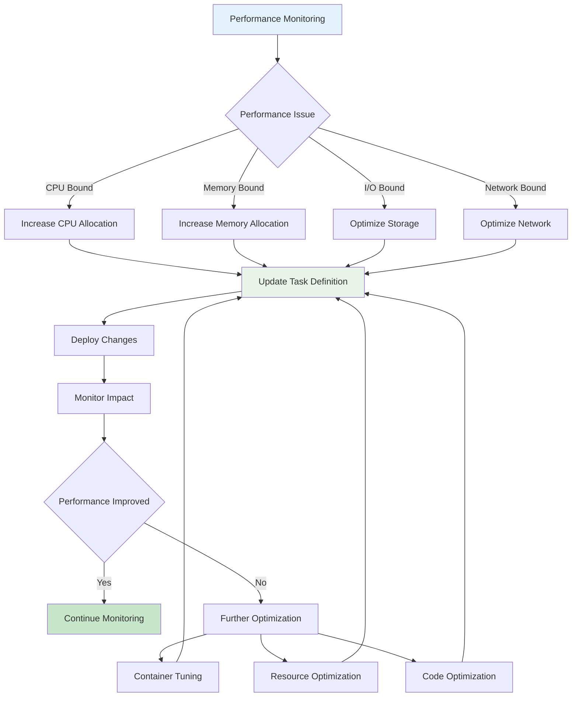
```mermaid
flowchart TD
    A[Performance Monitoring] --> B{Performance Issue}
    B -->|CPU Bound| C[Increase CPU Allocation]
    B -->|Memory Bound| D[Increase Memory Allocation]
    B -->|I/O Bound| E[Optimize Storage]
    B -->|Network Bound| F[Optimize Network]
    
    C --> G[Update Task Definition]
    D --> G
    E --> G
    F --> G
    
    G --> H[Deploy Changes]
    H --> I[Monitor Impact]
    I --> J{Performance Improved}
    J -->|Yes| K[Continue Monitoring]
    J -->|No| L[Further Optimization]
    
    L --> M[Container Tuning]
    L --> N[Resource Optimization]
    L --> O[Code Optimization]
    
    M --> G
    N --> G
    O --> G
    
    style A fill:#e3f2fd
    style G fill:#e8f5e8
    style K fill:#c8e6c9
```

### Load Balancing and Distribution
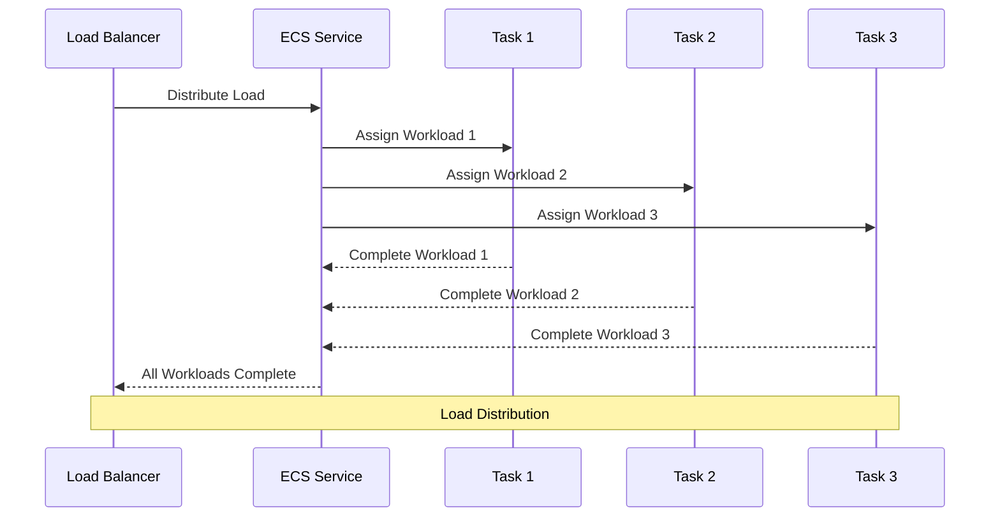
```mermaid
sequenceDiagram
    participant LB as Load Balancer
    participant ECS as ECS Service
    participant TASK1 as Task 1
    participant TASK2 as Task 2
    participant TASK3 as Task 3
    
    LB->>ECS: Distribute Load
    ECS->>TASK1: Assign Workload 1
    ECS->>TASK2: Assign Workload 2
    ECS->>TASK3: Assign Workload 3
    
    TASK1-->>ECS: Complete Workload 1
    TASK2-->>ECS: Complete Workload 2
    TASK3-->>ECS: Complete Workload 3
    
    ECS-->>LB: All Workloads Complete
    
    Note over LB,TASK3: Load Distribution
```

## Security and Compliance

### Container Security Flow
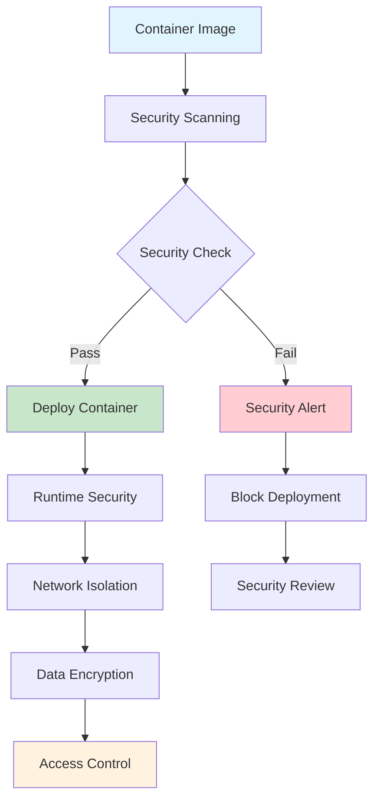
```mermaid
flowchart TD
    A[Container Image] --> B[Security Scanning]
    B --> C{Security Check}
    C -->|Pass| D[Deploy Container]
    C -->|Fail| E[Security Alert]
    
    D --> F[Runtime Security]
    F --> G[Network Isolation]
    G --> H[Data Encryption]
    H --> I[Access Control]
    
    E --> J[Block Deployment]
    J --> K[Security Review]
    
    style A fill:#e1f5fe
    style D fill:#c8e6c9
    style E fill:#ffcdd2
    style I fill:#fff3e0
```

### Access Control Flow
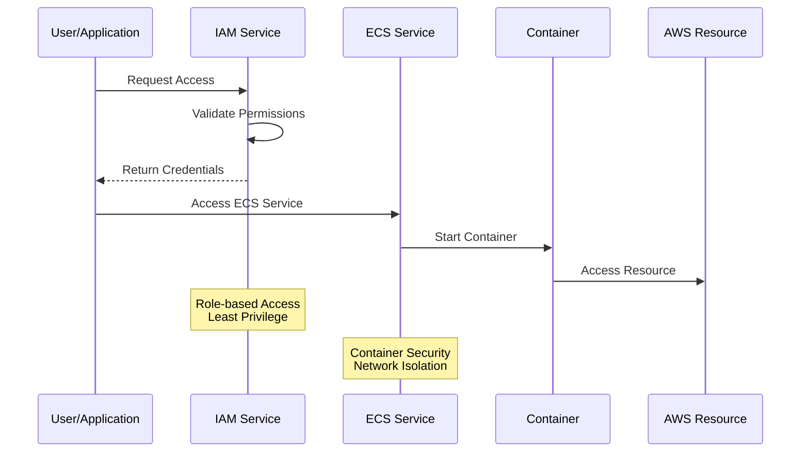
```mermaid
sequenceDiagram
    participant USER as User/Application
    participant IAM as IAM Service
    participant ECS as ECS Service
    participant CONTAINER as Container
    participant RESOURCE as AWS Resource
    
    USER->>IAM: Request Access
    IAM->>IAM: Validate Permissions
    IAM-->>USER: Return Credentials
    USER->>ECS: Access ECS Service
    ECS->>CONTAINER: Start Container
    CONTAINER->>RESOURCE: Access Resource
    
    Note over IAM: Role-based Access<br/>Least Privilege
    Note over ECS: Container Security<br/>Network Isolation
```

## Cost Optimization

### Container Cost Management
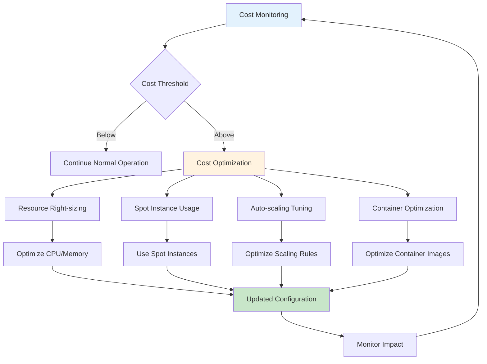
```mermaid
flowchart TD
    A[Cost Monitoring] --> B{Cost Threshold}
    B -->|Below| C[Continue Normal Operation]
    B -->|Above| D[Cost Optimization]
    
    D --> E[Resource Right-sizing]
    D --> F[Spot Instance Usage]
    D --> G[Auto-scaling Tuning]
    D --> H[Container Optimization]
    
    E --> I[Optimize CPU/Memory]
    F --> J[Use Spot Instances]
    G --> K[Optimize Scaling Rules]
    H --> L[Optimize Container Images]
    
    I --> M[Updated Configuration]
    J --> M
    K --> M
    L --> M
    
    M --> N[Monitor Impact]
    N --> A
    
    style A fill:#e3f2fd
    style D fill:#fff3e0
    style M fill:#c8e6c9
```

### Resource Utilization Optimization
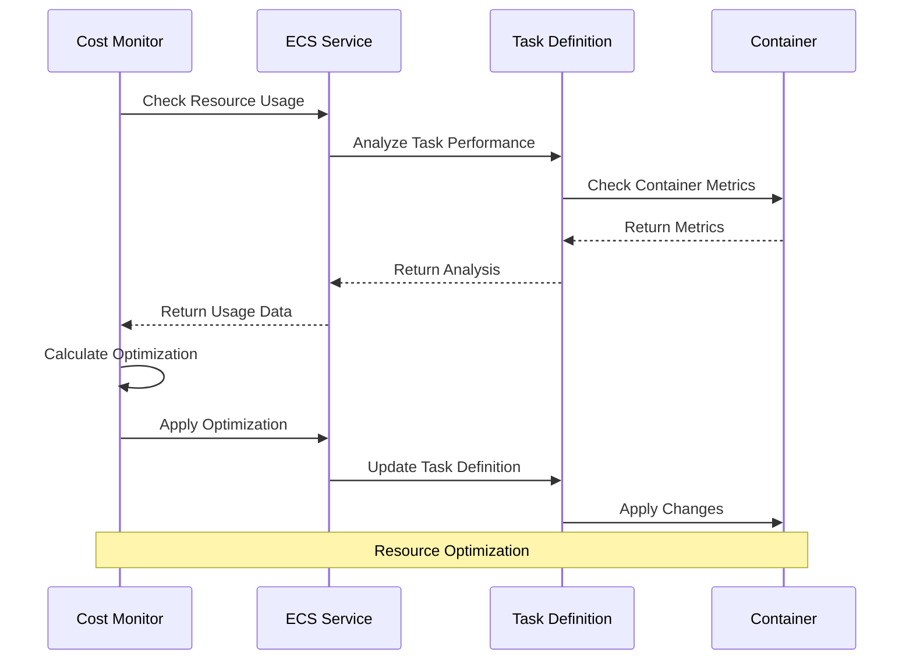
```mermaid
sequenceDiagram
    participant MONITOR as Cost Monitor
    participant ECS as ECS Service
    participant TASK as Task Definition
    participant CONTAINER as Container
    
    MONITOR->>ECS: Check Resource Usage
    ECS->>TASK: Analyze Task Performance
    TASK->>CONTAINER: Check Container Metrics
    CONTAINER-->>TASK: Return Metrics
    TASK-->>ECS: Return Analysis
    ECS-->>MONITOR: Return Usage Data
    
    MONITOR->>MONITOR: Calculate Optimization
    MONITOR->>ECS: Apply Optimization
    ECS->>TASK: Update Task Definition
    TASK->>CONTAINER: Apply Changes
    
    Note over MONITOR,CONTAINER: Resource Optimization
```

This comprehensive data flow documentation covers all aspects of the containerized ETL architecture, including container orchestration, auto-scaling, error handling, data quality, performance optimization, security, and cost management.
