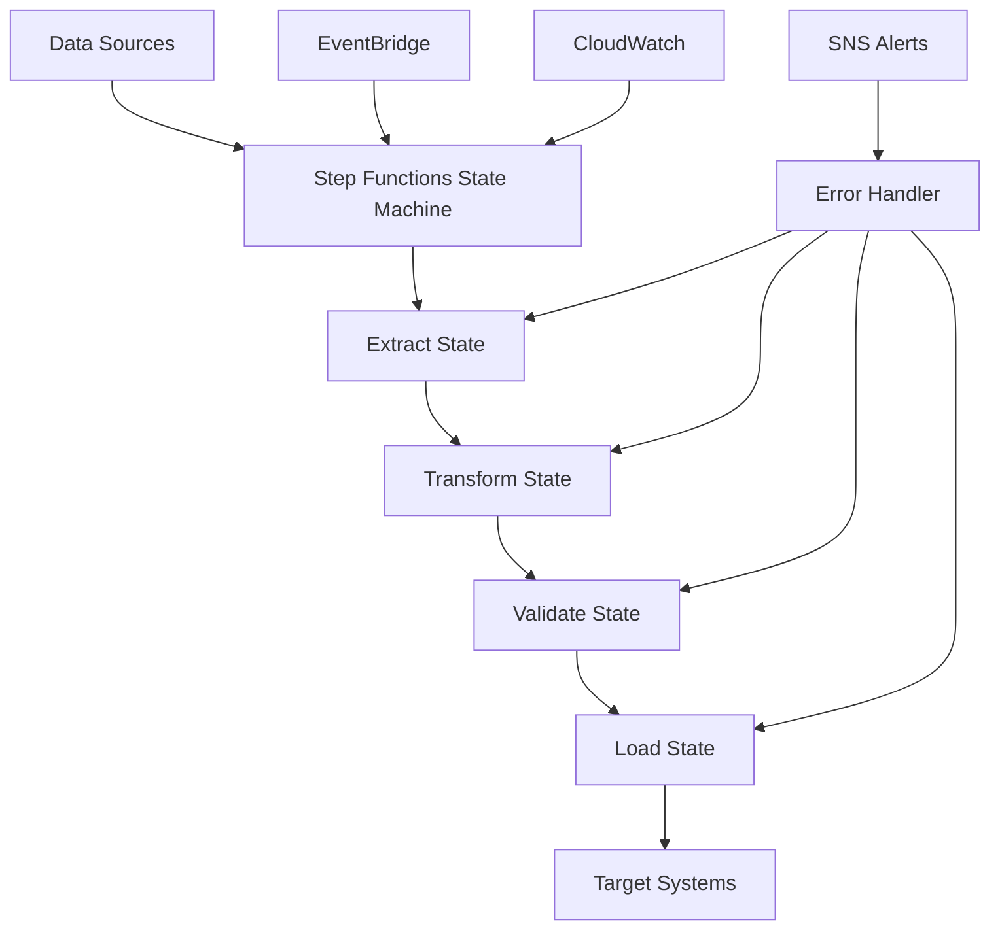

# Architecture 7: Step Functions ETL

## Overview

Architecture 7 implements a **Step Functions ETL Pipeline** using **AWS Step Functions** for serverless workflow orchestration with comprehensive error handling, retry logic, and state management. This architecture is designed for organizations that need robust, scalable ETL workflows with complex orchestration requirements and advanced error handling capabilities.

## Architecture Components

### Core Services
- **AWS Step Functions**: Serverless workflow orchestration
- **AWS Lambda**: Serverless compute for ETL functions
- **AWS Glue**: Managed ETL service for complex transformations
- **Amazon EMR**: Big data processing (optional)
- **Amazon S3**: Data lake for storage
- **Amazon Redshift**: Data warehouse (optional)
- **Amazon SNS**: Notifications and alerting

### Orchestration Features
- **State Machine**: Visual workflow definition
- **Error Handling**: Comprehensive retry and recovery logic
- **Parallel Processing**: Concurrent state execution
- **Conditional Logic**: Dynamic workflow routing
- **Event-Driven**: Triggered by schedules or events

### Processing Engines
- **Lambda Functions**: Lightweight ETL operations
- **Glue Jobs**: Complex data transformations
- **EMR Clusters**: Large-scale data processing
- **Custom Logic**: Business-specific processing

## Architecture Flow



## Key Features

### 🔄 **Workflow Orchestration**
- Visual state machine definition
- Complex workflow logic
- Error handling and recovery
- Retry mechanisms with backoff

### 🚀 **Serverless Processing**
- Lambda functions for lightweight operations
- Glue jobs for complex transformations
- EMR clusters for big data processing
- Pay-per-execution pricing

### 📊 **Data Management**
- Multi-source data extraction
- Complex data transformations
- Data quality validation
- Multiple destination support

### 🔒 **Reliability**
- Comprehensive error handling
- Automatic retry logic
- Dead letter queues
- Monitoring and alerting

## Use Cases

### ✅ **Ideal For**
- **Complex ETL workflows** requiring sophisticated orchestration
- **Error-prone processes** needing robust retry logic
- **Multi-step data pipelines** with conditional logic
- **Event-driven ETL** triggered by schedules or events
- **Data quality validation** with comprehensive error handling
- **Microservices architecture** with workflow orchestration

### ❌ **Not Ideal For**
- **Simple data transformations** that can be handled by single services
- **Real-time processing** with sub-second latency requirements
- **Cost-sensitive** small-scale operations
- **Organizations without workflow orchestration expertise**

## Data Processing Patterns

### 1. **Sequential Processing**
- Extract → Transform → Validate → Load
- Linear workflow execution
- Error handling and retry logic

### 2. **Parallel Processing**
- Multiple extract states
- Concurrent data processing
- Load balancing across states

### 3. **Conditional Processing**
- Dynamic workflow routing
- Data type-based processing
- Error-based branching

### 4. **Error Recovery**
- Automatic retry with backoff
- Dead letter queue handling
- Manual intervention workflows

## Performance Characteristics

### **Throughput**
- **High**: Scalable serverless orchestration
- **Flexible**: Based on state machine complexity
- **Optimized**: For workflow-based processing

### **Latency**
- **Variable**: Depends on workflow complexity
- **Optimizable**: Through parallel states
- **Scheduled**: Typically runs on schedule

### **Cost**
- **Pay-per-execution**: Only pay when workflows run
- **Optimizable**: Express vs Standard workflows
- **Predictable**: Based on state transitions

## Implementation Status

### ✅ **Completed**
- [x] Architecture diagrams and documentation
- [x] Terraform infrastructure code
- [x] Step Functions state machine definition
- [x] Lambda function implementations
- [x] Glue job configurations
- [x] Error handling and retry logic
- [x] Monitoring and alerting setup
- [x] Security configurations
- [x] Cost optimization strategies

### 🔄 **In Progress**
- [ ] Sample data processing workflows
- [ ] Performance benchmarking
- [ ] Advanced error handling patterns
- [ ] Workflow optimization

### 📋 **Planned**
- [ ] Multi-region deployment
- [ ] Advanced monitoring dashboards
- [ ] Workflow versioning
- [ ] Disaster recovery procedures

## Quick Start

### 1. **Prerequisites**
```bash
# Install required tools
brew install terraform awscli

# Configure AWS CLI
aws configure

# Verify installation
terraform version
aws --version
```

### 2. **Deploy Infrastructure**
```bash
cd terraform
terraform init
terraform plan
terraform apply
```

### 3. **Upload Lambda Functions**
```bash
# Create deployment packages
cd src/lambda
zip -r extract.zip extract.py
zip -r transform.zip transform.py
zip -r validate.zip validate.py
zip -r load.zip load.py
zip -r error_handler.zip error_handler.py

# Upload to S3
aws s3 cp *.zip s3://your-logs-bucket/lambda-functions/

# Update Lambda function code
aws lambda update-function-code \
    --function-name "step-functions-etl-dev-etl-extract" \
    --s3-bucket "your-logs-bucket" \
    --s3-key "lambda-functions/extract.zip"
```

### 4. **Run ETL Pipeline**
```bash
# Start Step Functions execution
aws stepfunctions start-execution \
    --state-machine-arn "arn:aws:states:region:account:stateMachine:etl-state-machine" \
    --name "etl-execution-$(date +%Y%m%d-%H%M%S)"
```

### 5. **Monitor Progress**
```bash
# Check execution status
aws stepfunctions describe-execution \
    --execution-arn "arn:aws:states:region:account:execution:etl-state-machine:execution-id"

# View execution history
aws stepfunctions get-execution-history \
    --execution-arn "arn:aws:states:region:account:execution:etl-state-machine:execution-id"
```

## Configuration

### **Step Functions Configuration**
```hcl
# State machine configuration
step_functions_type = "STANDARD"
step_functions_logging_level = "ERROR"
step_functions_tracing_enabled = true

# ETL configuration
etl_schedule_expression = "rate(1 hour)"
etl_batch_size = 1000
etl_max_retries = 3
etl_retry_delay = 5
```

### **Lambda Configuration**
```hcl
# Lambda function settings
lambda_timeout = 300
lambda_memory_size = 1024
lambda_runtime = "python3.9"

# Function-specific settings
extract_function_memory = 1024
transform_function_memory = 1024
validate_function_memory = 512
load_function_memory = 1024
```

### **Glue Configuration**
```hcl
# Glue job settings
glue_max_capacity = 2
glue_timeout = 60
glue_version = "4.0"

# Job-specific settings
transform_job_capacity = 2
transform_job_timeout = 60
```

## Monitoring

### **Key Metrics**
- **Step Functions**: Execution success/failure rates
- **Lambda Functions**: Invocation counts and errors
- **Glue Jobs**: Job run status and duration
- **Data Quality**: Validation metrics

### **CloudWatch Alarms**
- Step Functions execution failures
- Lambda function errors
- Glue job failures
- Data quality threshold breaches

## Cost Estimation

### **Monthly Costs (Estimated)**
- **Step Functions**: $0.025 per 1000 state transitions
- **Lambda Functions**: $20-100 USD
- **Glue Jobs**: $10-50 USD
- **EMR Cluster** (optional): $100-500 USD
- **Redshift** (optional): $180 USD
- **S3 Storage**: $2.30 per 100GB
- **SNS Notifications**: $0.50 per 1000 notifications
- **Total**: ~$50-900 USD per month

### **Cost Optimization**
- Use Express Workflows for high-volume, short-duration workflows
- Optimize Lambda memory allocation
- Use Glue spot instances
- Implement Step Functions cost monitoring

## Security

### **Step Functions Security**
- IAM roles with least privilege
- State machine access control
- Execution role permissions
- VPC integration

### **Access Control**
- IAM policies for state machine access
- Lambda execution roles
- Glue job roles
- S3 bucket policies

### **Data Protection**
- Encryption at rest and in transit
- Secrets Manager integration
- VPC network isolation
- Audit logging

## Troubleshooting

### **Common Issues**
1. **Step Functions Execution Failures**
   - Check state machine definition
   - Review IAM permissions
   - Check Lambda function logs

2. **Lambda Function Errors**
   - Check function logs
   - Verify environment variables
   - Review timeout settings

3. **Glue Job Failures**
   - Check job run logs
   - Verify S3 permissions
   - Review job parameters

### **Debugging Commands**
```bash
# Check Step Functions execution
aws stepfunctions describe-execution --execution-arn "execution-arn"

# Check Lambda function logs
aws logs get-log-events --log-group-name "/aws/lambda/function-name"

# Check Glue job runs
aws glue get-job-runs --job-name "job-name"
```

## Documentation

- [Deployment Guide](docs/deployment-guide.md)
- [Architecture Overview](diagrams/architecture-overview.md)
- [Data Flow Diagram](diagrams/data-flow.md)
- [Troubleshooting Guide](docs/troubleshooting.md)
- [Performance Optimization](docs/performance-optimization.md)
- [Cost Analysis](docs/cost-analysis.md)

## Support

For issues and questions:
1. Check the troubleshooting guide
2. Review AWS Step Functions documentation
3. Consult the deployment guide
4. Check CloudWatch logs and metrics

## Next Steps

1. **Deploy the infrastructure** using Terraform
2. **Configure data sources** and destinations
3. **Set up monitoring** and alerting
4. **Optimize performance** based on your workload
5. **Implement security** best practices
6. **Set up disaster recovery** procedures
7. **Monitor costs** and optimize usage

---

**Architecture 7: Step Functions ETL** provides a robust, scalable solution for complex ETL workflows with comprehensive error handling, monitoring, security, and cost optimization features.
