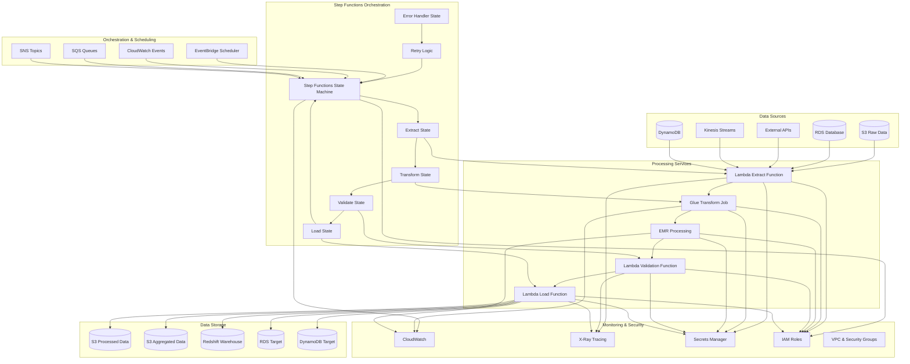
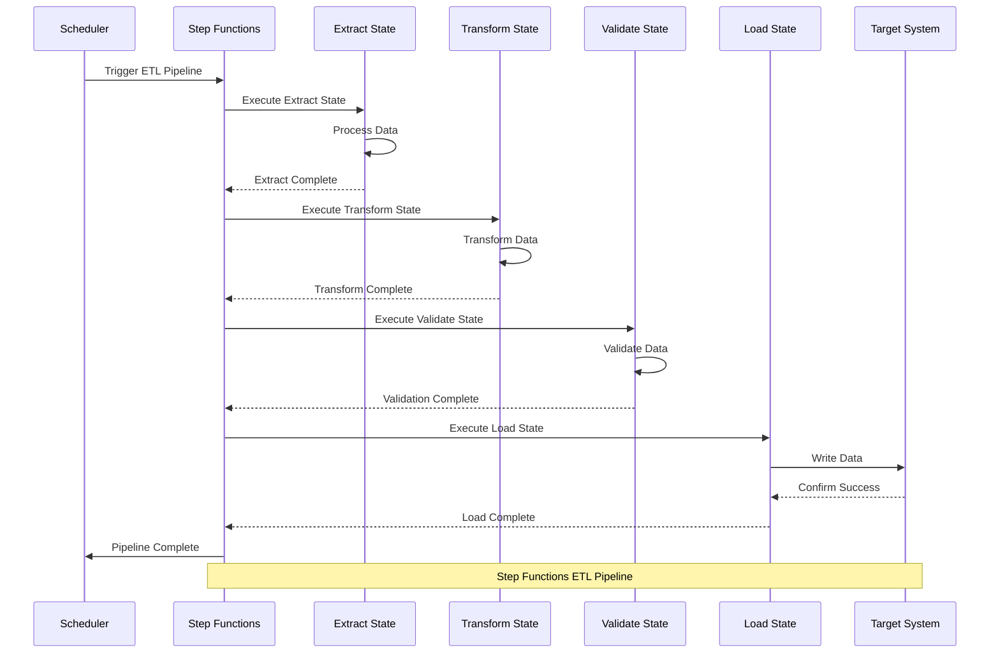
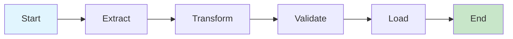
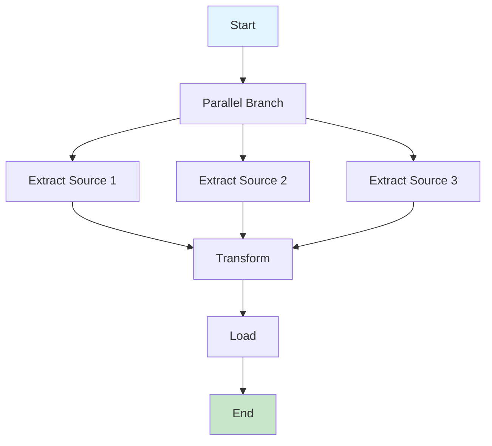
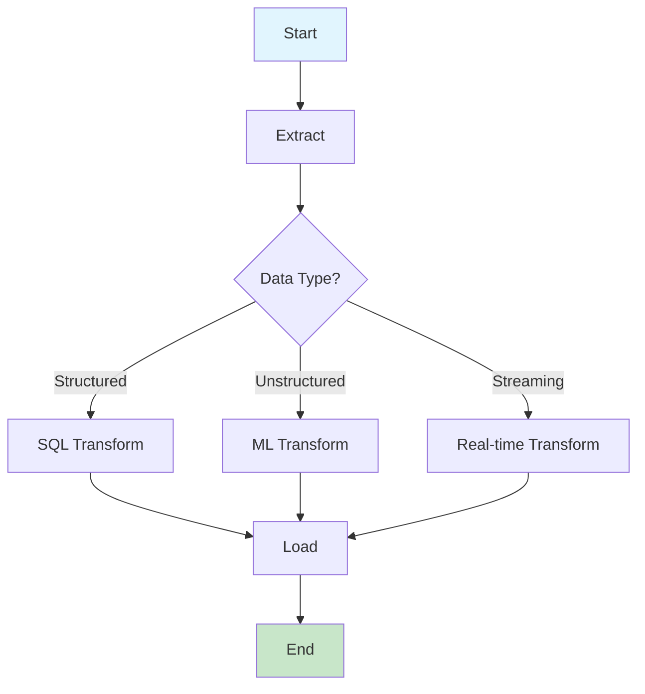
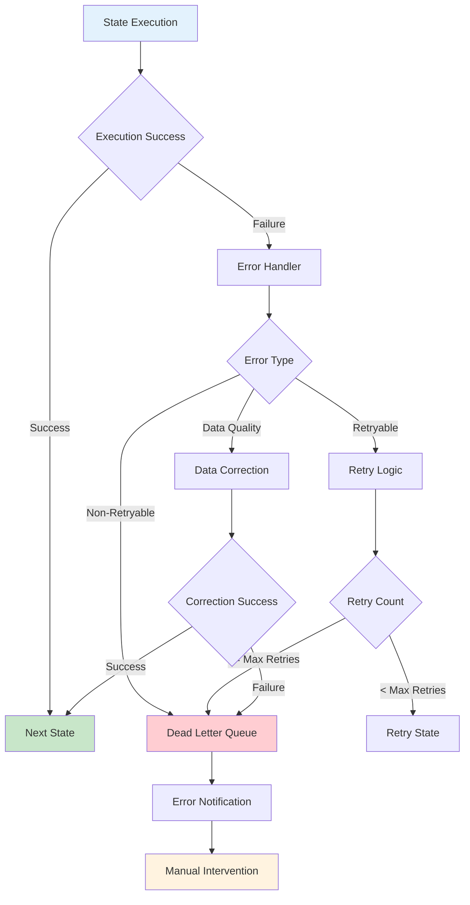

# Architecture 7: Step Functions ETL - Architecture Overview

## High-Level Architecture Diagram



## Step Functions ETL Flow



## Component Details

### Step Functions Orchestration
- **AWS Step Functions**: Serverless workflow orchestration
- **State Machine**: Visual workflow definition
- **State Types**: Task, Choice, Parallel, Wait, Pass, Fail
- **Error Handling**: Retry logic and error recovery

### Processing Services
- **AWS Lambda**: Serverless compute for lightweight processing
- **AWS Glue**: Managed ETL service for complex transformations
- **Amazon EMR**: Big data processing for large datasets
- **Custom Logic**: Business-specific processing functions

### Data Storage
- **Amazon S3**: Data lake for processed data
- **Amazon Redshift**: Data warehouse for analytics
- **Amazon RDS**: Relational database for structured data
- **Amazon DynamoDB**: NoSQL database for key-value data

### Orchestration Patterns
- **Sequential Processing**: Linear workflow execution
- **Parallel Processing**: Concurrent state execution
- **Conditional Logic**: Dynamic workflow routing
- **Error Recovery**: Automatic retry and fallback

## Step Functions State Machine Patterns

### Pattern 1: Sequential ETL Pipeline


### Pattern 2: Parallel Processing


### Pattern 3: Conditional Processing


## Error Handling and Recovery

### Error Handling Flow


### Retry Configuration
```json
{
  "Retry": [
    {
      "ErrorEquals": ["States.ALL"],
      "IntervalSeconds": 2,
      "MaxAttempts": 3,
      "BackoffRate": 2.0
    },
    {
      "ErrorEquals": ["States.TaskFailed"],
      "IntervalSeconds": 5,
      "MaxAttempts": 5,
      "BackoffRate": 1.5
    }
  ]
}
```

## State Machine Definition

### Complete ETL State Machine
```json
{
  "Comment": "ETL Pipeline State Machine",
  "StartAt": "ExtractData",
  "States": {
    "ExtractData": {
      "Type": "Task",
      "Resource": "arn:aws:lambda:region:account:function:extract-function",
      "Next": "TransformData",
      "Retry": [
        {
          "ErrorEquals": ["States.ALL"],
          "IntervalSeconds": 2,
          "MaxAttempts": 3,
          "BackoffRate": 2.0
        }
      ],
      "Catch": [
        {
          "ErrorEquals": ["States.ALL"],
          "Next": "HandleExtractError",
          "ResultPath": "$.error"
        }
      ]
    },
    "TransformData": {
      "Type": "Task",
      "Resource": "arn:aws:glue:region:account:job/transform-job",
      "Next": "ValidateData",
      "Retry": [
        {
          "ErrorEquals": ["States.ALL"],
          "IntervalSeconds": 5,
          "MaxAttempts": 3,
          "BackoffRate": 2.0
        }
      ],
      "Catch": [
        {
          "ErrorEquals": ["States.ALL"],
          "Next": "HandleTransformError",
          "ResultPath": "$.error"
        }
      ]
    },
    "ValidateData": {
      "Type": "Task",
      "Resource": "arn:aws:lambda:region:account:function:validate-function",
      "Next": "LoadData",
      "Retry": [
        {
          "ErrorEquals": ["States.ALL"],
          "IntervalSeconds": 2,
          "MaxAttempts": 3,
          "BackoffRate": 2.0
        }
      ],
      "Catch": [
        {
          "ErrorEquals": ["States.ALL"],
          "Next": "HandleValidationError",
          "ResultPath": "$.error"
        }
      ]
    },
    "LoadData": {
      "Type": "Task",
      "Resource": "arn:aws:lambda:region:account:function:load-function",
      "End": true,
      "Retry": [
        {
          "ErrorEquals": ["States.ALL"],
          "IntervalSeconds": 2,
          "MaxAttempts": 3,
          "BackoffRate": 2.0
        }
      ],
      "Catch": [
        {
          "ErrorEquals": ["States.ALL"],
          "Next": "HandleLoadError",
          "ResultPath": "$.error"
        }
      ]
    },
    "HandleExtractError": {
      "Type": "Task",
      "Resource": "arn:aws:lambda:region:account:function:error-handler",
      "Next": "ExtractData",
      "Parameters": {
        "error": "$.error",
        "retry_count": "$.retry_count"
      }
    },
    "HandleTransformError": {
      "Type": "Task",
      "Resource": "arn:aws:lambda:region:account:function:error-handler",
      "Next": "TransformData",
      "Parameters": {
        "error": "$.error",
        "retry_count": "$.retry_count"
      }
    },
    "HandleValidationError": {
      "Type": "Task",
      "Resource": "arn:aws:lambda:region:account:function:error-handler",
      "Next": "ValidateData",
      "Parameters": {
        "error": "$.error",
        "retry_count": "$.retry_count"
      }
    },
    "HandleLoadError": {
      "Type": "Task",
      "Resource": "arn:aws:lambda:region:account:function:error-handler",
      "Next": "LoadData",
      "Parameters": {
        "error": "$.error",
        "retry_count": "$.retry_count"
      }
    }
  }
}
```

## Performance Optimization

### State Machine Optimization
```json
{
  "Comment": "Optimized ETL Pipeline",
  "StartAt": "ParallelExtract",
  "States": {
    "ParallelExtract": {
      "Type": "Parallel",
      "Branches": [
        {
          "StartAt": "ExtractSource1",
          "States": {
            "ExtractSource1": {
              "Type": "Task",
              "Resource": "arn:aws:lambda:region:account:function:extract-source1",
              "End": true
            }
          }
        },
        {
          "StartAt": "ExtractSource2",
          "States": {
            "ExtractSource2": {
              "Type": "Task",
              "Resource": "arn:aws:lambda:region:account:function:extract-source2",
              "End": true
            }
          }
        }
      ],
      "Next": "TransformData"
    },
    "TransformData": {
      "Type": "Task",
      "Resource": "arn:aws:glue:region:account:job/transform-job",
      "Next": "LoadData"
    },
    "LoadData": {
      "Type": "Task",
      "Resource": "arn:aws:lambda:region:account:function:load-function",
      "End": true
    }
  }
}
```

### Resource Optimization
```yaml
# Lambda function optimization
lambda_optimization:
  memory_size: 1024
  timeout: 300
  reserved_concurrency: 10
  
# Glue job optimization
glue_optimization:
  max_capacity: 2
  timeout: 60
  glue_version: "4.0"
  
# EMR optimization
emr_optimization:
  instance_type: "m5.xlarge"
  instance_count: 3
  auto_scaling: true
```

## Security Configuration

### IAM Roles and Policies
```json
{
  "Version": "2012-10-17",
  "Statement": [
    {
      "Effect": "Allow",
      "Action": [
        "states:StartExecution",
        "states:StopExecution",
        "states:DescribeExecution",
        "states:GetExecutionHistory"
      ],
      "Resource": "arn:aws:states:region:account:stateMachine:etl-pipeline"
    },
    {
      "Effect": "Allow",
      "Action": [
        "lambda:InvokeFunction"
      ],
      "Resource": "arn:aws:lambda:region:account:function:etl-*"
    },
    {
      "Effect": "Allow",
      "Action": [
        "glue:StartJobRun",
        "glue:GetJobRun",
        "glue:GetJobRuns"
      ],
      "Resource": "arn:aws:glue:region:account:job/etl-*"
    }
  ]
}
```

### VPC and Network Security
```yaml
# VPC configuration
vpc_security:
  vpc_id: "vpc-xxxxxxxxx"
  subnet_ids:
    - "subnet-xxxxxxxxx"
    - "subnet-yyyyyyyyy"
  security_groups:
    - "sg-xxxxxxxxx"
  
# Network isolation
network_isolation:
  private_subnets: true
  nat_gateway: true
  vpc_endpoints: true
```

## Monitoring and Alerting

### CloudWatch Metrics
```yaml
cloudwatch_metrics:
  - name: "ExecutionsStarted"
    namespace: "AWS/States"
    dimensions:
      - name: "StateMachineArn"
        value: "arn:aws:states:region:account:stateMachine:etl-pipeline"
  
  - name: "ExecutionsSucceeded"
    namespace: "AWS/States"
    dimensions:
      - name: "StateMachineArn"
        value: "arn:aws:states:region:account:stateMachine:etl-pipeline"
  
  - name: "ExecutionsFailed"
    namespace: "AWS/States"
    dimensions:
      - name: "StateMachineArn"
        value: "arn:aws:states:region:account:stateMachine:etl-pipeline"
```

### Custom Metrics
```python
# Custom ETL metrics
import boto3

def send_custom_metrics(metrics):
    cloudwatch = boto3.client('cloudwatch')
    
    cloudwatch.put_metric_data(
        Namespace='ETL/StepFunctions',
        MetricData=[
            {
                'MetricName': 'RecordsProcessed',
                'Value': metrics['records_processed'],
                'Unit': 'Count',
                'Dimensions': [
                    {
                        'Name': 'StateMachineName',
                        'Value': 'etl-pipeline'
                    }
                ]
            },
            {
                'MetricName': 'ProcessingTime',
                'Value': metrics['processing_time'],
                'Unit': 'Seconds',
                'Dimensions': [
                    {
                        'Name': 'StateMachineName',
                        'Value': 'etl-pipeline'
                    }
                ]
            }
        ]
    )
```

## Cost Optimization

### Step Functions Cost Optimization
```yaml
cost_optimization:
  step_functions:
    - use_express_workflows: true
    - optimize_state_transitions: true
    - use_parallel_execution: true
    
  lambda:
    - use_provisioned_concurrency: false
    - optimize_memory_allocation: true
    - use_reserved_capacity: true
    
  glue:
    - use_spot_instances: true
    - optimize_job_parameters: true
    - schedule_off_peak: true
```

### Resource Right-Sizing
```python
# Resource optimization algorithm
def optimize_resources(workload_metrics):
    execution_time = workload_metrics['execution_time']
    memory_usage = workload_metrics['memory_usage']
    
    # Optimize Lambda memory
    if memory_usage > 80:
        lambda_memory = min(3008, workload_metrics['current_memory'] * 1.5)
    elif memory_usage < 30:
        lambda_memory = max(128, workload_metrics['current_memory'] * 0.8)
    else:
        lambda_memory = workload_metrics['current_memory']
    
    # Optimize Glue capacity
    if execution_time > 300:  # 5 minutes
        glue_capacity = min(10, workload_metrics['current_capacity'] * 1.5)
    elif execution_time < 60:  # 1 minute
        glue_capacity = max(2, workload_metrics['current_capacity'] * 0.8)
    else:
        glue_capacity = workload_metrics['current_capacity']
    
    return {
        'lambda_memory': lambda_memory,
        'glue_capacity': glue_capacity
    }
```

This comprehensive architecture overview provides the foundation for implementing a robust Step Functions ETL pipeline with proper orchestration, error handling, monitoring, security, and cost optimization strategies.
