# Architecture 7: Step Functions ETL - Data Flow Diagram

## Step Functions ETL Processing Flow

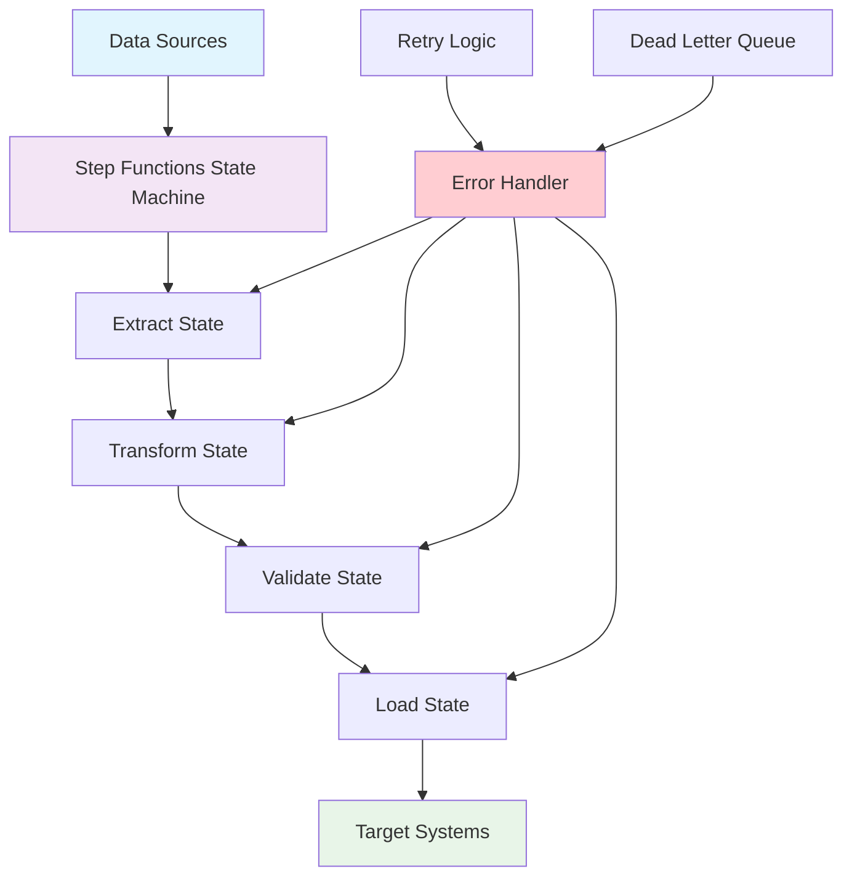

## State Machine Execution Flow

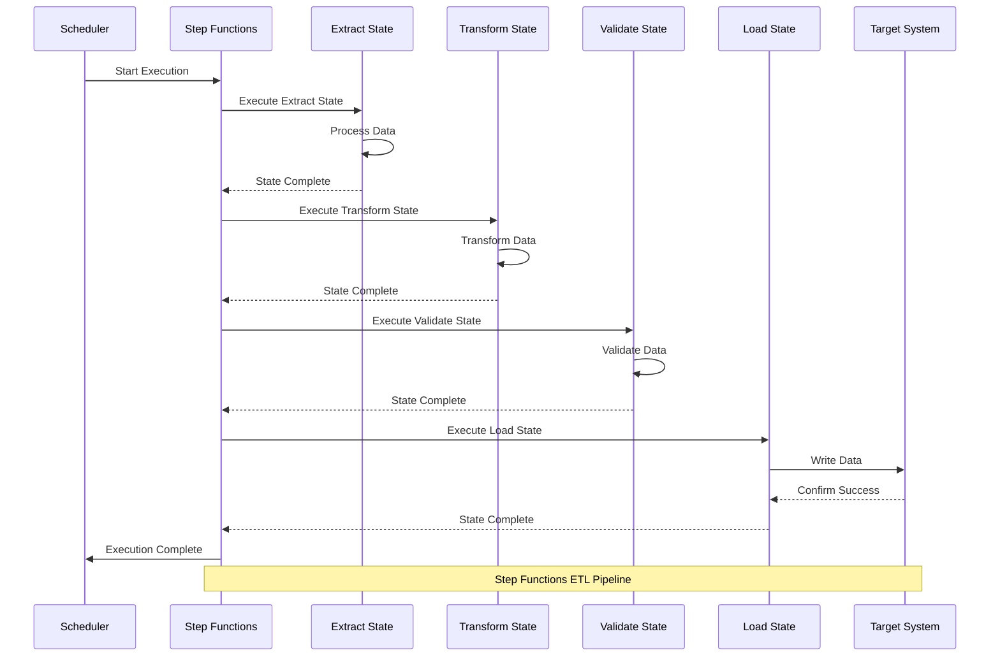

## Parallel Processing Flow

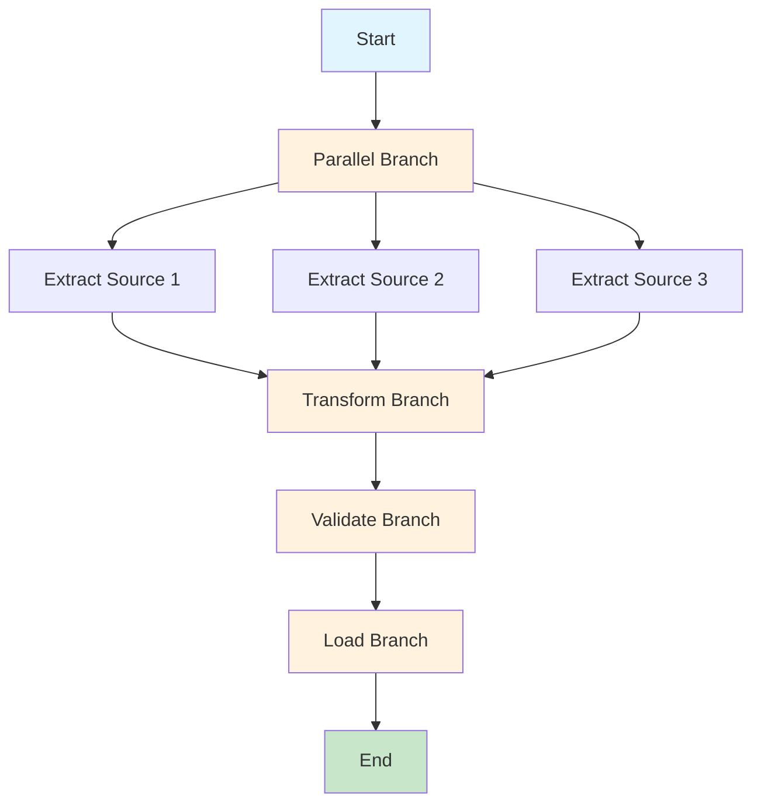

## Error Handling and Recovery Flow

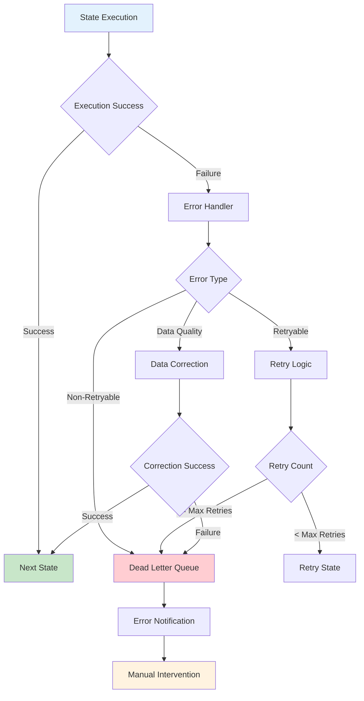

## Conditional Processing Flow

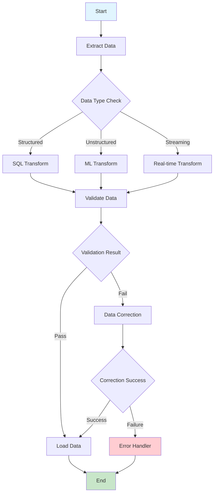

## State Machine Lifecycle Flow

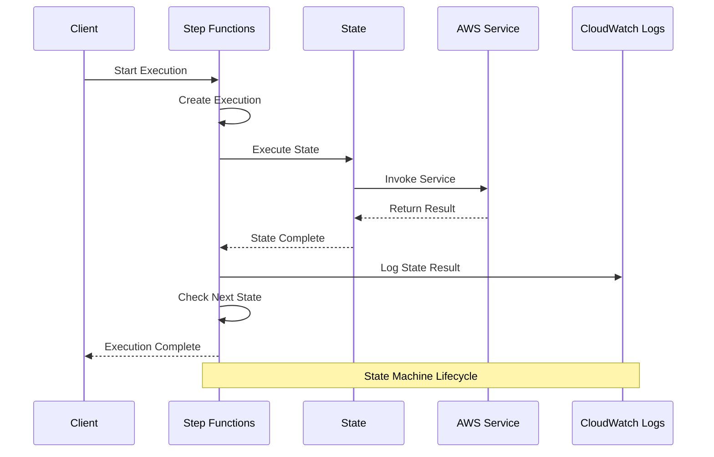

## Data Quality Validation Flow

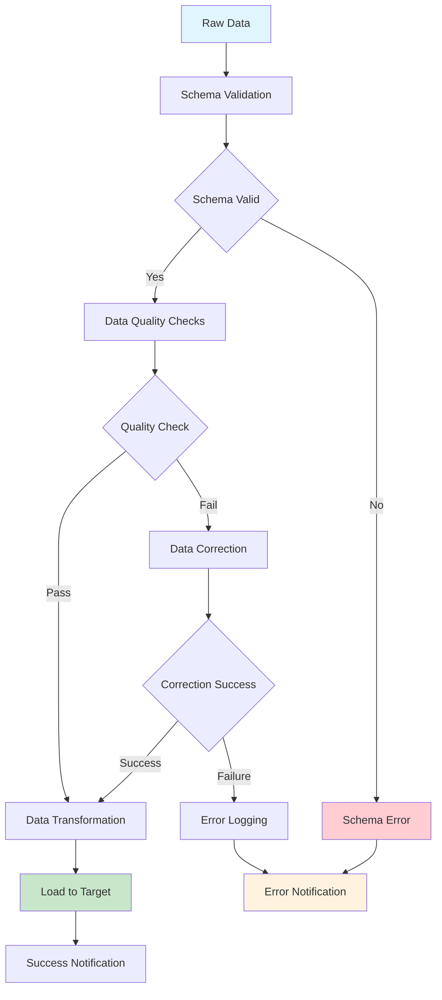

## Retry and Backoff Flow

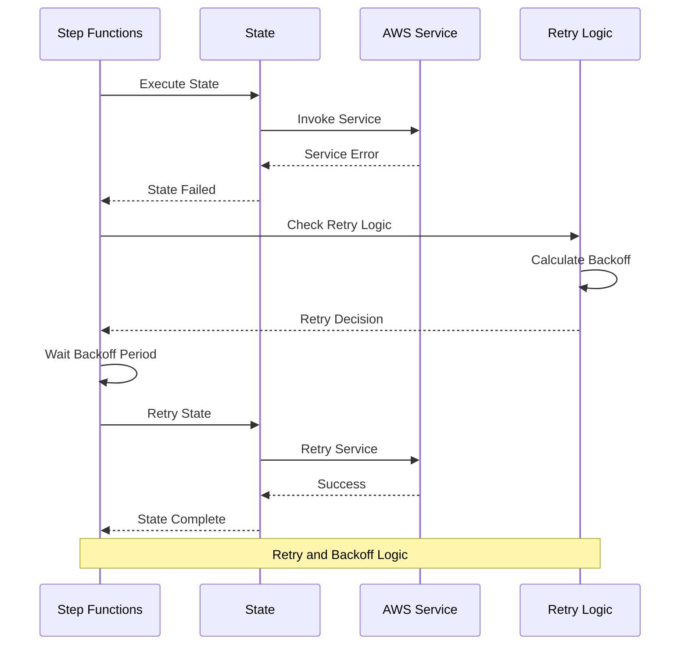

## Monitoring and Alerting Flow

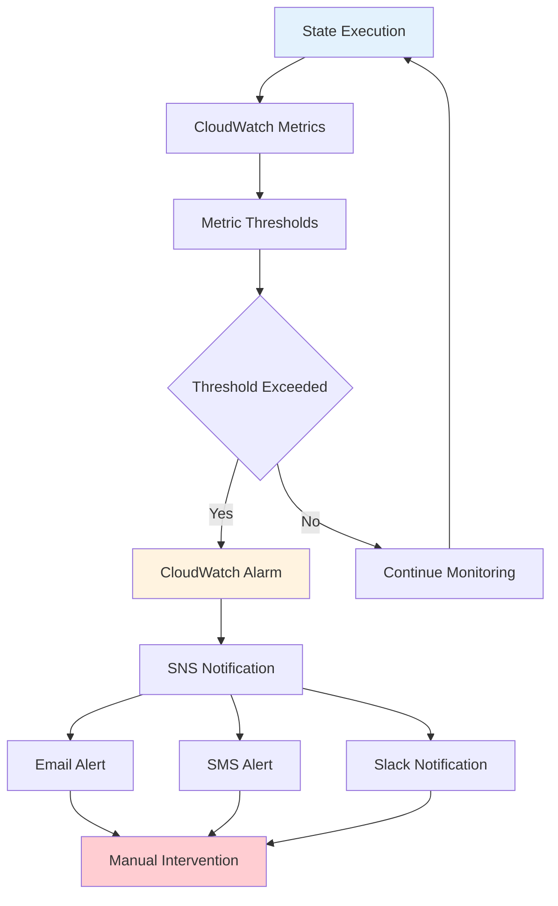

## Cost Optimization Flow

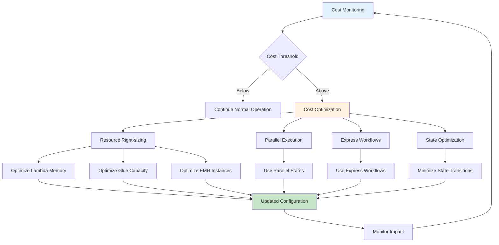

## Security and Compliance Flow

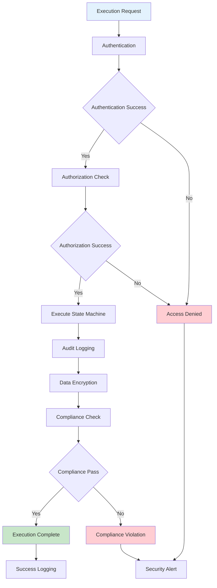

## Disaster Recovery Flow

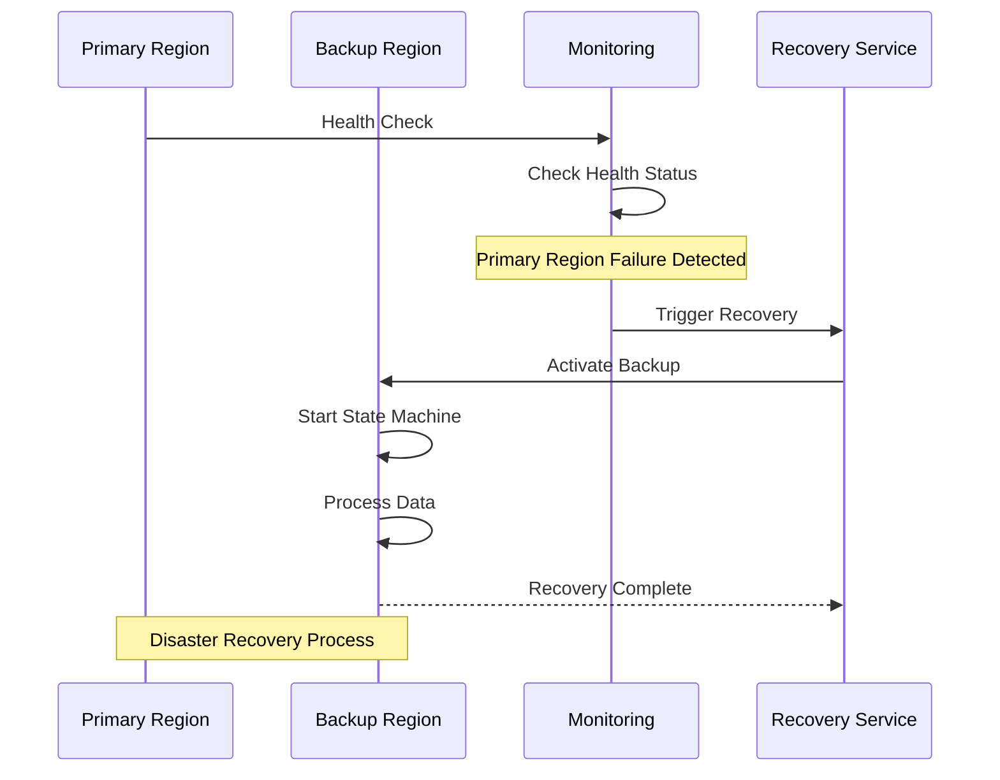

## Performance Optimization Flow

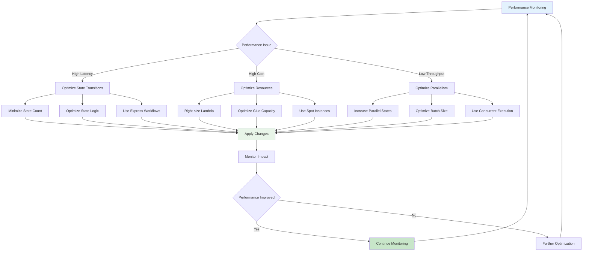

## Data Lineage and Tracking Flow

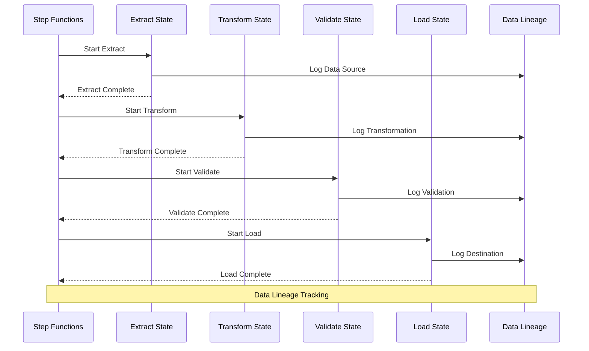

This comprehensive data flow documentation covers all aspects of the Step Functions ETL architecture, including state machine execution, error handling, parallel processing, monitoring, security, cost optimization, disaster recovery, and performance optimization.
